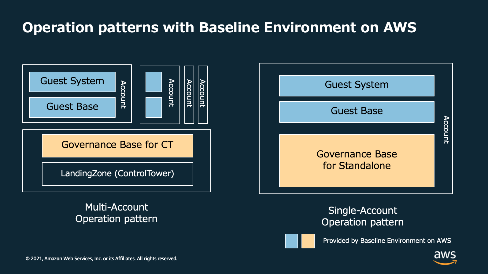
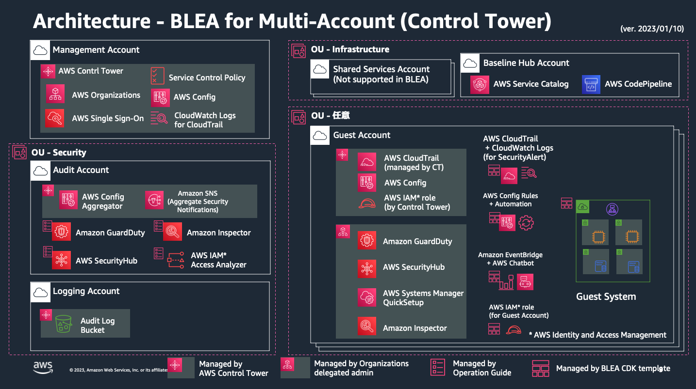

# Baseline Environment on AWS

[](https://github.com/aws-samples/baseline-environment-on-aws/releases)
[](https://github.com/aws-samples/baseline-environment-on-aws/actions?query=workflow%3A"build")

[View this page in Japanese (日本語)](README_ja.md)

Baseline Environment on AWS(BLEA) is a set of reference CDK template to establish secure baseline on standalone-account or ControlTower based multi-account AWS environment. This solution provides basic and extensible guardrail with AWS security services and end-to-end sample CDK code for typical system architecture. This template is also useful to learn more about AWS architecting best practices and how to customize CDK code as we incorporated comments in detail so that users can know why and how to customize.

Jump to | [Changelog](CHANGELOG.md) | [HowTo](doc/HowTo.md) | [Deploy to Multiaccount environment](/doc/DeployToControlTower.md) | [Standalone to ControlTower](doc/Standalone2ControlTower.md) | [Deployment Pipeline](doc/PipelineDeployment.md) |

## Governance Architecture

### Operation patterns



### Multi-Account Governance (with ControlTower)


### Standalone Governance (with Individual account)


## Baseline Architecture

### Multi-Account (With ControlTower)



### Standalone (With Individual account)


### Stack Architecture (Standalone)


## Governance baselines

| Use Cases                                         | Folders                    |
| ------------------------------------------------- | -------------------------- |
| Standalone Governance Base                        | `usecases/base-standalone` |
| ControlTower governance base (for guest accounts) | `usecases/base-ct-guest`   |
| ControlTower governance base for Audit accounts   | `usecases/base-ct-audit`   |

## Sample applications for Guest systems

| Use Cases              | Folders                        |
| ---------------------- | ------------------------------ |
| Web Application Sample | `usecases/guest-webapp-sample` |
| API Application Sample | `usecases/guest-apiapp-sample` |

- The web application sample provides four different options

  - Sample web application with ECS (default)
  - Option: SSL-enabled sample of ECS web application
  - Option: Sample web application with AutoScaling
  - Option: Sample web application with EC2

- The API application sample provides two different options
  - Sample serverless API application with NodeJS (default)
  - Option: Python implementation of the same application

> NOTE: Each use case can be deployed independently, but other options within the same use case may share some resources. Please check the dependencies when deleting or changing them.

## Deployment flow

Describe the steps to deploy. When deploying only, it is not necessary to build a development environment, but it is recommended to have a development environment that includes an editor because it is easier to change the code and reduces mistakes.

### Prerequisites

#### a. Runtime

Use the following runtimes: Follow the instructions for each OS to install.

- [Node.js](https://nodejs.org/) (>= `14.0.0`)
  - `npm` (>= `8.1.0`)
- [Git](https://git-scm.com/)

npm requires 8.1.0 or higher because it uses workspaces. Please install the latest version as follows.

```sh
npm install -g npm
```

#### b. Development environment

We recommend that you set up a development environment, even if you are not doing serious development, to ensure safe editing of CDK code. The following are the steps to set up VisualStudioCode.

- [Instructions]: [VisualStudioCode Setup Instructions](doc/HowTo.md#VisualStudioCode-Setup-Instructions)

### Typical deployment steps

The most typical deployment steps for using BLEA are as follows: Here are the steps for deploying a governance base and guest applications in a single account.

1. Install related libraries and build code

2. Configuring AWS CLI Credentials

3. Create an account for deployment

4. Deploy a governance base

5. Deploy guest application samples

> NOTE:
> Here we will introduce the standalone governance base and the ECS version of the web application sample in a single account.
> For instructions on deploying a multi-account version using ControlTower, see [Deploy to ControlTower environment](doc/DeployToControlTower.md).

## Implementation steps

Here is the simplest example of deploying the Standalone version to a single account.

### 1. Checkout a repository and initializing a project

#### 1-1. Checkout a repository

```sh
git clone https://github.com/aws-samples/baseline-environment-on-aws.git
cd baseline-environment-on-aws
```

#### 1-2. Initializing a project

```sh
# install dependencies
npm ci
```

#### 1-3. Setting up a pre-commit hook for Git

Registers a hook to perform checks by Linter, Formatter, and Git-Secrets when committing to Git. Follow the steps below to set it up. It is not required if you are just deploying, but we recommend a setup for more secure development.

- [Instructions]: [Git pre-commit hook setup](doc/HowTo.md#Git-pre-commit-hook-setup)

### 2. Set credentials for the AWS CLI

You need your AWS credentials (API key) to deploy the CDK. Here's the simplest way to use permanent credentials.

This method is mainly used for development environments. Consider using two accounts, `prof_dev` and `prof_prod`, as an example of a profile in the AWS CLI.

~/.aws/credentials

```text
[prof_dev]
aws_access_key_id = XXXXXXXXXXXXXXX
aws_secret_access_key = YYYYYYYYYYYYYYY
region = ap-northeast-1

[prof_prod]
aws_access_key_id = ZZZZZZZZZZZZZZZZ
aws_secret_access_key = PPPPPPPPPPPPPPPP
region = ap-northeast-1
```

### 3. Create an account for deployment

#### 3-1. Create a new account

Create a new account using Organizations.
It is possible to use a single account that does not use Organizations, but members under Organizations to make it easier to migrate to a multi-account management environment later It is recommended to use an account.

#### 3-2. Set up Slack to prepare for using AWS Chatbot

BLEA uses Slack channels for notification of security and monitoring events, respectively. Create two channels on Slack and follow the steps below to set up the default AWS Chatbot.
When you are done, make a note of the ID of one workspace and the ID of two channels you want to notify for later settings.

- [Instructions]: [Set up Slack for AWS ChatBot](doc/HowTo.md#set-up-slack-for-aws-chatbot)

### 4. Deploy a governance base

#### 4-1. Set deployment information (Context)

You must specify parameters in the CDK Context (cdk.json) for each use case for deployment. Here is the configuration file for the Standalone version of the governance base.

```sh
usecases/base-standalone/cdk.json
```

This example shows an example of defining a Context called `dev`. To verify the same configuration and deploy it to a production account, prepare a Context such as `staging` or `prod`. The Context name can be any alphabet.

usecases/base-standalone/cdk.json

```json
{
  "app": "npx ts-node --prefer-ts-exts bin/blea-base-sa.ts",
  "context": {
    "dev": {
      "description": "Environment variables for Governance base ",
      "envName": "Development",
      "securityNotifyEmail": "notify-security@example.com",
      "slackNotifier": {
        "workspaceId": "T8XXXXXXX",
        "channelIdSec": "C01XXXXXXXX"
      }
    }
  }
}
```

The contents of this setting are as follows.

| key                        | value                                                                                               |
| -------------------------- | --------------------------------------------------------------------------------------------------- |
| description                | Comment on settings                                                                                 |
| envName                    | Environment name. This will be set for each resource tag                                            |
| securityNotifyEmail        | The email address to which security notifications will be sent. The content is similar to Slack     |
| SlackNotifier.WorkspaceID  | ID of Slack workspace set on AWS Chatbot                                                            |
| SlackNotifier.channelIDSec | The ID of the Slack channel that you configured on AWS Chatbot. You will be notified about security |

> NOTE: See the following explanation for how to use Context
>
> - [Manage personal environment by cdk.context.json](doc/HowTo.md#Manage-personal-environment-by-cdkcontextjson)
>
> - [Accessing context in application](doc/HowTo.md#accessing-context-in-application)

#### 4-2. Deploy a governance base

If you are running a CDK for the first time, navigate to the target use case directory and bootstrap the CDK. This is required when you run the CDK for the first time with that account and region combination.

```sh
cd usecases/base-standalone
npx cdk bootstrap -c environment=dev --profile prof_dev
```

> NOTE:
>
> - Here we are using `npx` to use a local cdk installed in the BLEA environment. If you start the command directly from `cdk`, the globally installed cdk will be used.
>
> - There are options that are useful when using the cdk command. See [Skip Deployment Approvals and Don't Roll Back](doc/HowTo.md#skip-deployment-approvals-and-dont-roll-back).

Deploy a governance baseline.

```sh
npx cdk deploy --all -c environment=dev --profile prof_dev
```

This will set up the following features

- API logging with CloudTrail
- Recording configuration changes with AWS Config
- Detect abnormal behavior with GuardDuty
- Detecting Deviations from Best Practices with SecurityHub (AWS Foundational Security Best Practice, CIS benchmark)
- Default security group blockage (auto repair in case of deviation)
- Notifications for AWS Health events
- Some notifications of security-impacting change actions
- Slack notifies you of security events

#### 4-3. (Optional) Set up other baseline setups manually

In addition to setting up a governance base, AWS provides several operational baseline services. Set up these services as needed.

##### a. Enabling Inspector and Detecting Vaulnerability

Inspector automatically checks vulnerability. You can detect software vulnerability and unintended network exposure with continuous scanning by Inspector. You can view the detected vulnerabilities on your dashboard and prioritize them based on your calculated risk score, giving you greater visibility into your results. When enabled in conjunction with Security Hub, it would be automatically integrated and send the results to Security Hub.

See: [https://docs.aws.amazon.com/inspector/latest/user/getting_started_tutorial.html]

##### b. Perform AWS Systems Manager Quick Setup for EC2 Management

If you use EC2, we recommend that you use SystemsManager to manage it. You can use AWS Systems Manager Quick Setup to automate the basic setup required to manage EC2.
See: [https://docs.aws.amazon.com/systems-manager/latest/userguide/quick-setup-host-management.html]

Quick Setup provides the following features:

- Configure AWS Identity and Access Management (IAM) Instance Profile Roles Required by Systems Manager
- Auto-update of SSM Agent every other week
- Collect inventory metadata every 30 minutes
- Daily scans to detect instances that are out of patch
- Installing and configuring Amazon CloudWatch Agent for the first time only
- Monthly automatic updates of the CloudWatch agent

##### c. Trusted Advisor Detection Results Report

TrustedAdvisor provides advice for following AWS best practices. It is possible to receive the contents of the report regularly by e-mail. Please refer to the following document for details.

- See: [https://docs.aws.amazon.com/awssupport/latest/user/get-started-with-aws-trusted-advisor.html#preferences-trusted-advisor-console]

### 5. Deploy a sample guest application

Once the governance base is set up, deploy guest applications on top of it.
As an example of a guest application, this section provides instructions for deploying an ECS-based web application sample.

#### 5-1. Set the Context for the guest application

Configure guest applications before deploying.
Navigate to `usecases/guest-webapp-sample` where the web application sample is located and edit cdk.json.

usecases/guest-webapp-sample/cdk.json

```json
{
  "app": "npx ts-node --prefer-ts-exts bin/blea-guest-ecsapp-sample.ts",
  "context": {
    "dev": {
      "description": "Context samples for Dev - Anonymous account & region",
      "envName": "Development",
      "vpcCidr": "10.100.0.0/16",
      "monitoringNotifyEmail": "notify-monitoring@example.com",
      "dbUser": "dbadmin",
      "slackNotifier": {
        "workspaceId": "T8XXXXXXX",
        "channelIdMon": "C01YYYYYYYY"
      },
      "domainName": "example.com",
      "hostedZoneId": "Z0123456789",
      "hostName": "www"
    }
  }
}
```

The settings are as follows:

| key                        | value                                                                                                                                                                         |
| -------------------------- | ----------------------------------------------------------------------------------------------------------------------------------------------------------------------------- |
| description                | Comment on settings                                                                                                                                                           |
| envName                    | Environment name. This is set for each resource tag.                                                                                                                          |
| vpcCidr                    | CIDR of the VPC you want to create                                                                                                                                            |
| monitoringNotifyEmail      | Email address to which notifications about system monitoring are sent. The content is similar to Slack.                                                                       |
| dbuser                     | Login username to AuroraDB                                                                                                                                                    |
| SlackNotifier.WorkspaceID  | ID of Slack workspace set on AWS Chatbot                                                                                                                                      |
| SlackNotifier.channelIdMon | The ID of the Slack channel that you configured for AWS Chatbot. You will be notified about system monitoring. Specify a channel that is different from the security channel. |

#### 5-2. Deploy a guest application

```sh
cd usecases/guest-webapp-sample
npx cdk deploy --all -c environment=dev --profile prof_dev
```

This completes the baseline and sample application deployment for a single account.

> NOTE:
>
> It takes about 30 minutes to complete the deployment of all resources, including Aurora. If you want to deploy only some resources, specify the target stack name explicitly. The stack name is expressed in the application code (here bin/blea-guest-ecsapp-sample.ts) as `$ {pjPrefix} -ecsApp` .
>
> ```sh
> cd usecases/guest-webapp-sample
> npx cdk deploy "BLEA-ECSApp" --app "npx ts-node --prefer-ts-exts bin/blea-guest-ecsapp-sample.ts" -c environment=dev --profile prof_dev
> ```
>
> NOTE:
> guest-webapp-sample provides several variations under the bin directory. By default, the application specified in `app` in cdk.json (blea-guest-ecsapp-sample.ts) is deployed. If you want to deploy another application, you can do so by explicitly specifying `—app` in the cdk argument as follows: All contexts in cdk.json work with the same content within the same use case.
>
> ```sh
> cd usecases/guest-webapp-sample
> npx cdk deploy --all --app "npx ts-node --prefer-ts-exts bin/blea-guest-asgapp-sample.ts" -c environment=dev --profile prof_dev
> ```
>
> NOTE:
> When deploying a guest ECS application, one of the Security Hub standards, [CodeBuild.5](https://docs.aws.amazon.com/securityhub/latest/userguide/securityhub-standards-fsbp-controls.html#fsbp-codebuild-5), may raise an alert. You can suppress the alert by referring to [Changing the status of notifications about CodeBuild's privileged mode](doc/HowTo.md#remediate-security-issues).

#### 5-3. Develop your own applications

From now on, you will use this sample code as a starting point to develop applications tailored to your use case. Indicates information necessary for general development.

- [Development process](doc/HowTo.md#development-process)
- [Update package dependencies](doc/HowTo.md#update-package-dependencies)

#### 5-4. Remediation of security issues

Even after deploying a governance base, there are detections that are reported at a critical or high severity level in Security Hub benchmark reports . You will need to take action on these manually. If necessary, perform remediation.

- [Remediate Security Issues](doc/HowTo.md#remediate-security-issues)

## Security

See [CONTRIBUTING](CONTRIBUTING.md#security-issue-notifications) for more information.

## License

This library is licensed under the MIT-0 License. See the LICENSE file.
