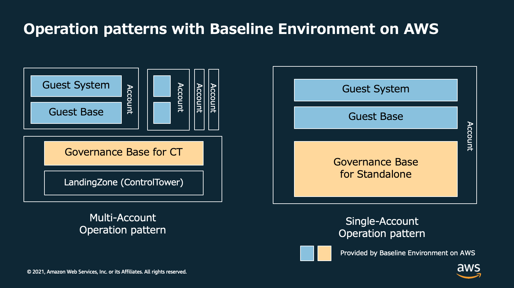
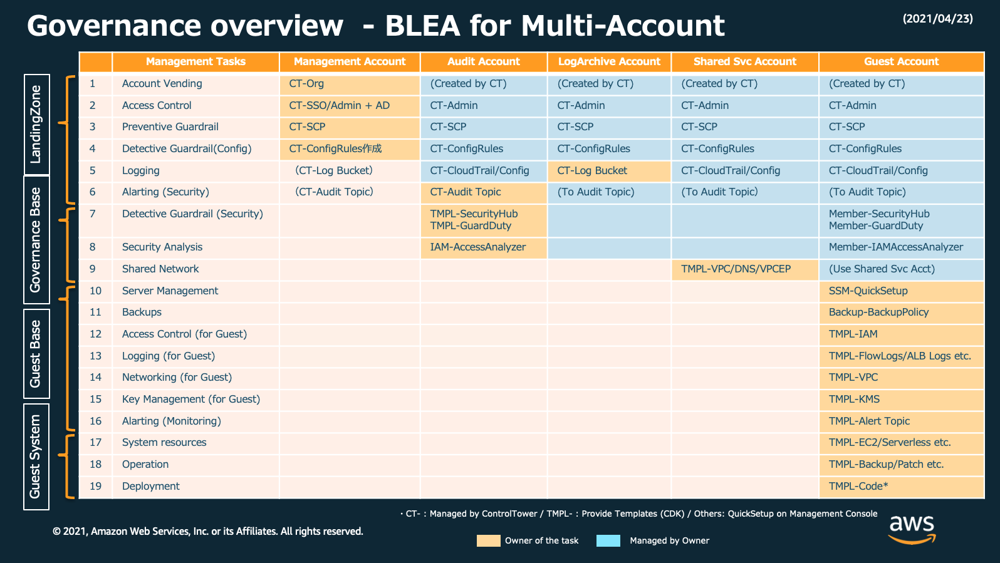
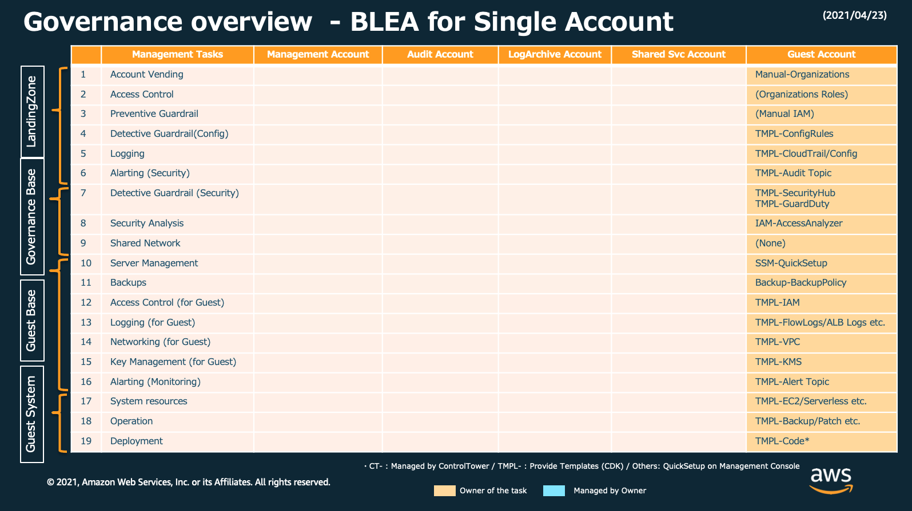
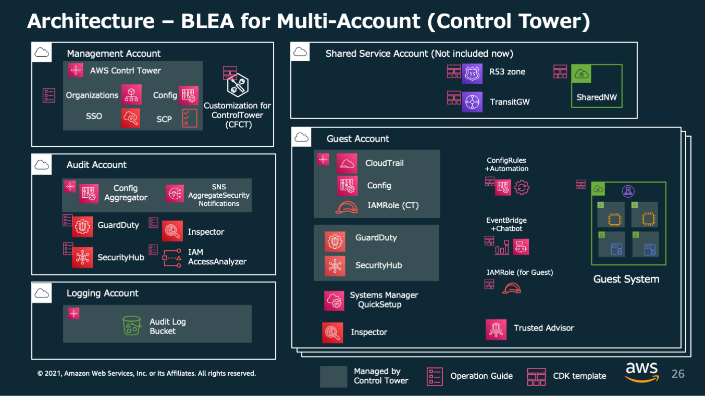
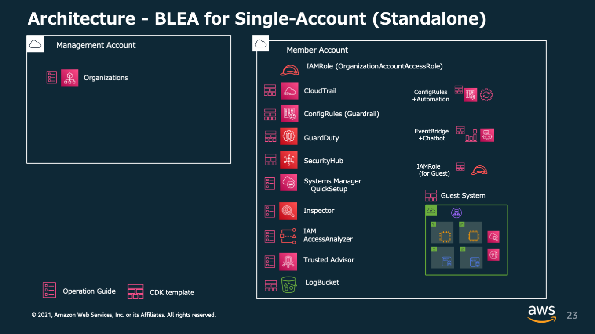
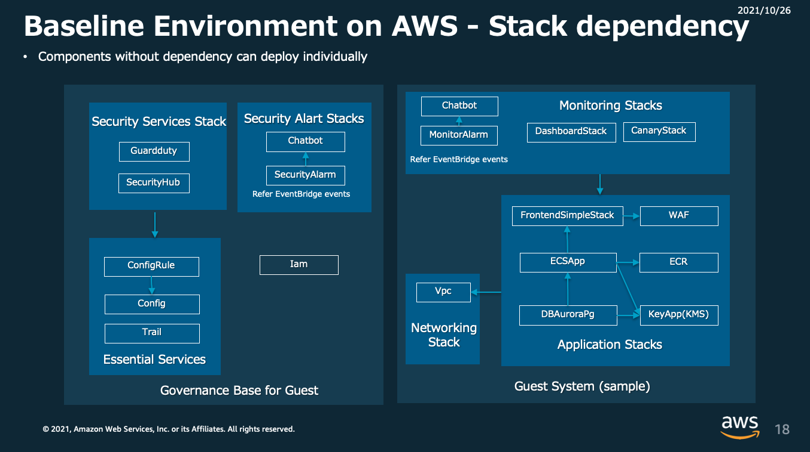

# Baseline Environment on AWS

[](https://github.com/aws-samples/baseline-environment-on-aws/releases)
[](https://github.com/aws-samples/baseline-environment-on-aws/actions?query=workflow%3A"build")

[In English](README.md)

Baseline Environment on AWS (BLEA) は 単独の AWS アカウントまたは AWS Control Tower で管理されたマルチアカウント環境で、セキュアなベースラインを確立するための リファレンス AWS CDK テンプレート群です。このテンプレート群は AWS のセキュリティサービスを活用して基本的かつ拡張可能なガードレールを提供します。また典型的なシステムアーキテクチャを実現するエンドツーエンドの AWS CDK サンプルコードを提供します。この AWS CDK テンプレートは用途に合わせてユーザが拡張して使うことを前提としており、拡張の参考となるコードやコメントを多く含んでいます。これによって AWS のアーキテクチャベストプラクティスや AWS CDK コードのカスタマイズを習得しやすくすることを目的としています。

Jump to | [Changelog](CHANGELOG.md) | [HowTo](doc/HowTo_ja.md) | [マルチアカウント環境へのデプロイ](/doc/DeployToControlTower_ja.md) | [Standalone 版からマルチアカウント版への移行](doc/Standalone2ControlTower_ja.md) | [パイプラインによるデプロイ](doc/PipelineDeployment_ja.md) |

## ガバナンスアーキテクチャ

### オペレーションパターン



### マルチアカウント版 (AWS Control Tower 利用)



### Standalone 版 (単一アカウント利用)



## ベースライン アーキテクチャ

### マルチアカウント版



### Standalone 版



### CloudFormation スタック構成 (Standalone 版)



## ガバナンスベース一覧

| ユースケース                                           | フォルダ                            |
| ------------------------------------------------------ | ----------------------------------- |
| スタンドアローン版ガバナンスベース                     | `usecases/blea-gov-base-standalone` |
| Control Tower 版ガバナンスベース（ゲストアカウント用） | `usecases/blea-gov-base-ct`         |

- Control Tower 版ガバナンスベースサンプルでは異なる 3 つのデプロイメントオプションを提供しています

  - 手元環境からの直接デプロイメント (blea-gov-base-ct.ts) （デフォルト）
  - CDKPipeline を使ったデプロイメント (blea-gov-base-ct-via-cdk-pipelines.ts)
  - Control Tower の Account Factory Customization を使ったデプロイメント (blea-gov-base-ct-via-cdk-pipelines.ts)

## ゲストシステムのサンプルアーキテクチャ一覧

| ユースケース                              | フォルダ                                    |
| ----------------------------------------- | ------------------------------------------- |
| ECS による Web アプリケーションサンプル   | `usecases/blea-guest-ecs-app-sample`        |
| EC2 による Web アプリケーションサンプル   | `usecases/blea-guest-ec2-app-sample`        |
| サーバーレス API アプリケーションサンプル | `usecases/blea-guest-serverless-api-sample` |

- ECS による Web アプリケーションサンプルでは異なる 2 つのデプロイメントオプションを提供しています

  - 手元環境からの直接デプロイメント (blea-guest-ecs-app-sample.ts) （デフォルト）
  - CDKPipeline を使ったデプロイメント (blea-guest-ecs-app-sample-via-cdk-pipelines.ts)

> NOTE: 各々のユースケースは独立してデプロイ可能です

## デプロイの流れ

デプロイするステップについて記載します。デプロイだけ行う場合はエディタ環境の構築は必ずしも必要ありませんが、コードの変更が容易になりミスを減らすことができるため、エディタも含めた開発環境を用意することをお勧めします。

### 前提条件

#### a. ランタイム

以下のランタイムを使用します。各 OS ごとの手順に従いインストールしてください。

- [Node.js](https://nodejs.org/) (>= `14.0.0`)
  - `npm` (>= `8.1.0`)
- [Git](https://git-scm.com/)

npm は workspaces を使用するため 8.1.0 以上が必要です。最新バージョンは以下のようにしてインストールしてください。

```sh
npm install -g npm
```

#### b. 開発環境

CDK コードを安全に編集するため、本格的な開発を行わない場合であっても開発環境のセットアップを推奨します。以下に VisualStudioCode のセットアップ手順を示します。

- [手順]: [VisualStudioCode のセットアップ手順](doc/HowTo_ja.md#VisualStudioCode-のセットアップ)

### 典型的な導入手順

BLEA を使う場合の、もっとも典型的な導入手順は次の通りです。ここでは単独のアカウントにガバナンスベースとゲストアプリケーションを導入する手順を示します。

1. 関連ライブラリのインストールとコードのビルド
2. AWS CLI の認証情報の設定
3. デプロイ対象のアカウント作成
4. ガバナンスベースをデプロイ
5. ゲストアプリケーションサンプルをデプロイ

> NOTE:
> ここでは 単独アカウントに Standalone 版ガバナンスベースと サーバーレス API アプリケーションサンプルを導入します。
> Control Tower を使ったマルチアカウント版の導入手順については、[Deploy to Control Tower environment](/doc/DeployToControlTower_ja.md)を参照してください。

## 導入手順

ここでは最もシンプルな、単一アカウントへの Standalone 版導入を例にとって解説します。

### 1. リポジトリの取得とプロジェクトの初期化

#### 1-1. リポジトリの取得

```sh
git clone https://github.com/aws-samples/baseline-environment-on-aws.git
cd baseline-environment-on-aws
```

#### 1-2. プロジェクトの初期化

Node.js の必要なライブラリをインストールします。

```sh
# install dependencies
npm ci
```

#### 1-3. Git の pre-commit hook のセットアップ

Git に Commit する際に Linter, Formatter, git-secrets によるチェックを行うための Hook を登録します。以下の手順に従ってセットアップしてください。デプロイするだけの場合は必須ではありませんが、よりセキュアに開発するためにセットアップを推奨します。

- [手順] [Git の pre-commit hook のセットアップ](doc/HowTo_ja.md#Git-の-pre-commit-hook-のセットアップ)

### 2. AWS CLI の認証情報を設定する

CDK をデプロイするために AWS 認証情報（API キー）が必要です。ここでは最もシンプルな、恒久的な認証情報を使用する方法を紹介します。

これは主に開発環境用として利用する方式です。ここでは AWS CLI のプロファイルの例として、`prof_dev` と `prof_prod` の二つのアカウントを使う場合を考えます。

~/.aws/credentials

```text
[prof_dev]
aws_access_key_id = XXXXXXXXXXXXXXX
aws_secret_access_key = YYYYYYYYYYYYYYY
region = ap-northeast-1

[prof_prod]
aws_access_key_id = ZZZZZZZZZZZZZZZZ
aws_secret_access_key = PPPPPPPPPPPPPPPP
region = ap-northeast-1
```

### 3. デプロイ対象のアカウントを作成する

#### 3-1. 新しいアカウントを作成する

Organizations を使って新しいアカウントを作成します。
Organizations を使用しない単一のアカウントを利用することも可能ですが、後にマルチアカウント管理の環境に移行しやすくするため Organizations 配下のメンバーアカウント使用を推奨します。

#### 3-2. AWS Chatbot 利用の事前準備として Slack を設定する

BLEA ではセキュリティイベントおよびモニタリングイベントを通知のためにそれぞれ Slack チャネルを使用します。Slack 上にチャネルを 2 つ作成し、以下の手順を参照して AWS Chatbot の初期設定を行ってください。
設定が終わったら後の設定のため、ワークスペースの ID（1 つ）、通知先のチャネルの ID（2 つ）をメモしておきます。

- [手順] [AWS Chatbot 用に Slack を設定する](doc/HowTo_ja.md#AWSChatbot-用に-Slack-を設定する)

### 4. ガバナンスベースをデプロイする

#### 4-1. デプロイパラメータを設定する

デプロイの際に必要となる デプロイ先アカウントや通知先メールアドレスなど、各ユースケース固有のパラメータを指定する必要があります。 BLEA では `parameter.ts` というファイルでパラメータを管理します。書式は TypeScript です。

シングルアカウント用ベースラインのパラメータはこちらで指定します。

```sh
usecases/blea-gov-base-standalone/parameter.ts
```

このサンプルは `devParameter` というパラメータセットを定義する例です。同様の設定を検証、本番アカウントにもデプロイできるようにするには、`stagingParameter`や`prodParameter`といったパラメータセットを定義し、App （ここでは `bin/blea-gov-base-standalone.ts`）でそれぞれの環境のスタックを作成します。

usecases/blea-gov-base-standalone/parameter.ts

```typescript
// Example for Development
export const devParameter: AppParameter = {
  envName: 'Development',
  securityNotifyEmail: 'notify-security@example.com',
  securitySlackWorkspaceId: 'T8XXXXXXX',
  securitySlackChannelId: 'C00XXXXXXXX',
  // env: { account: '123456789012', region: 'ap-northeast-1' },
};
```

この設定内容は以下の通りです。

| key                      | value                                                                                                    |
| ------------------------ | -------------------------------------------------------------------------------------------------------- |
| envName                  | 環境名。これが各々のリソースタグに設定されます                                                           |
| securityNotifyEmail      | セキュリティに関する通知が送られるメールアドレス。内容は Slack と同様です                                |
| securitySlackWorkspaceId | AWS Chatbot に設定した Slack workspace の ID                                                             |
| securitySlackChannelId   | AWS Chatbot に設定した Slack channel の ID。ガバナンスベースによってセキュリティに関する通知が行われます |
| env                      | デプロイ対象のアカウントとリージョン（指定しない場合は CLI の認証情報に従います）                        |

> NOTE: BLEA v2.x までは パラメータの設定に Context (cdk.json) を使っていましたが、v3.0 以降は parameter.ts を使用します。

#### 4-2. ガバナンスベースをデプロイする

初めて CDK を実行する場合は、対象のユースケースディレクトリへ移動し、CDK を bootstrap します。これは対象のアカウントとリージョンの組み合わせで初めて CDK を実行するときに必要です。

```sh
cd usecases/blea-gov-base-standalone
npx aws-cdk bootstrap --profile prof_dev
```

> NOTE:
>
> - ここでは BLEA 環境にインストールしたローカルの cdk を利用するため、`npx aws-cdk` を使用しています。`npx` を使わず直接 `cdk` からコマンドを始めた場合は、グローバルインストールされた cdk が利用されます。
> - cdk を実行するときに便利なオプションがあります。[デプロイ時の承認をスキップしロールバックさせない](doc/HowTo_ja.md#デプロイ時の承認をスキップしロールバックさせない)を参照してください。

ガバナンスベースをデプロイします。

```sh
npx aws-cdk deploy --all --profile prof_dev
```

これによって以下の機能がセットアップされます

- CloudTrail による API のロギング
- AWS Config による構成変更の記録
- GuardDuty による異常なふるまいの検知
- SecurityHub によるベストプラクティスからの逸脱検知 (AWS Foundational Security Best Practice, CIS benchmark)
- デフォルトセキュリティグループの閉塞 （逸脱した場合自動修復）
- AWS Health イベントの通知
- セキュリティに影響する変更操作の通知（一部）
- セキュリティイベントを通知する SNS トピック (SecurityAlarmTopic) の作成
- 上記 SNS トピックを経由した、メールの送信と Slack のセキュリティチャネルへの通知

#### 4-3. (オプション) 他のベースラインセットアップを手動でセットアップする

ガバナンスベースでセットアップする他に AWS はいくつかの運用上のベースラインサービスを提供しています。必要に応じてこれらのサービスのセットアップを行なってください。

##### a. Amazon Inspector を有効化

Amazon Inspector は、ワークロードをスキャンして、脆弱性を管理します。EC2 と ECR を継続的にスキャンすることで、ソフトウェアの脆弱性や意図しないネットワークの露出を検出します。検出された脆弱性は、算出されたリスクスコアに基づき優先順位づけされて表示されるため、可視性高く結果を取得できます。また、Security Hub とは自動で統合され、一元的に検出結果を確認できます。

セットアップ手順：https://docs.aws.amazon.com/inspector/latest/user/getting_started_tutorial.html

##### b. EC2 管理のため AWS Systems Manager Quick Setup を実施する

EC2 を利用する場合は SystemsManager を利用して管理することをお勧めします。AWS Systems Manager Quick Setup を使うことで、EC2 の管理に必要な基本的なセットアップを自動化できます。
セットアップ手順: https://docs.aws.amazon.com/systems-manager/latest/userguide/quick-setup-host-management.html

Quick Setup は以下の機能を提供します:

- Systems Manager で必要となる AWS Identity and Access Management (IAM) インスタンスプロファイルロールの設定
- SSM Agent の隔週自動アップデート
- 30 分ごとのインベントリメタデータの収集
- インスタンスのパッチ不足を検出するための日次スキャン
- 初回のみの、Amazon CloudWatch agent のインストールと設定
- CloudWatch agent の月次自動アップデート

##### c. Trusted Advisor の検知結果レポート

TrustedAdvisor は AWS のベストプラクティスをフォローするためのアドバイスを提供します。レポート内容を定期的にメールで受け取ることが可能です。詳細は下記ドキュメントを参照してください。

- See: [https://docs.aws.amazon.com/awssupport/latest/user/get-started-with-aws-trusted-advisor.html#preferences-trusted-advisor-console]

### 5. ゲストアプリケーションのサンプルをデプロイする

ガバナンスベースの設定が完了したら、その上にゲストアプリケーションを導入します。
ここではゲストアプリケーションの例として、サーバーレス API アプリケーションサンプルをデプロイする手順を示します。

#### 5-1. ゲストアプリケーションのパラメータを設定する

デプロイする前にゲストアプリケーションの設定を行います。
サーバーレス API アプリケーションのサンプルが配置された `usecases/blea-guest-serverless-api-sample` に移動して parameter.ts を編集します。

usecases/blea-guest-serverless-api-sample/parameter.ts

```typescript
// Example
export const devParameter: AppParameter = {
  envName: 'Development',
  monitoringNotifyEmail: 'notify-security@example.com',
  monitoringSlackWorkspaceId: 'TXXXXXXXXXX',
  monitoringSlackChannelId: 'CYYYYYYYYYY',
  // env: { account: '123456789012', region: 'ap-northeast-1' },
};
```

設定内容は以下の通りです:

| key                        |                                                                                                                                                |
| -------------------------- | ---------------------------------------------------------------------------------------------------------------------------------------------- |
| envName                    | 環境名。これが各々のリソースタグに設定されます。                                                                                               |
| monitoringNotifyEmail      | システム監視についての通知が送られるメールアドレス。                                                                                           |
| slackNotifier.workspaceId  | AWS Chatbot に設定した Slack workspace の ID                                                                                                   |
| slackNotifier.channelIdMon | AWS Chatbot に設定した Slack channel の ID。システム監視についての通知が行われます。セキュリティのチャネルとは別のチャネルを指定してください。 |
| env                        | デプロイ対象のアカウントとリージョン（指定しない場合は CLI の認証情報に従います）                                                              |

#### 5-2. ゲストアプリケーションをデプロイする

```sh
cd usecases/blea-guest-serverless-api-sample
npx aws-cdk deploy --all --profile prof_dev
```

以上で単一アカウントに対するベースラインおよびサンプルアプリケーションのデプロイが完了します。

#### 5-3. 独自のアプリケーションを開発する

以後はこのサンプルコードを起点にして、自分のユースケースに合わせたアプリケーションを開発していくことになります。一般的な開発に必要な情報を示します。

- [通常の開発の流れ](doc/HowTo_ja.md#通常の開発の流れ)
- [依存パッケージの最新化](doc/HowTo_ja.md#依存パッケージの最新化)

#### 5-4. セキュリティ指摘事項の修復

ガバナンスベースをデプロイした後でも、Security Hub のベンチマークレポートで 重要度が CRITICAL あるいは HIGH のレベルでレポートされる検出項目があります。これらに対しては手動で対応が必要です。必要に応じて修復(Remediation)を実施してください。

- [セキュリティ指摘事項の修復](doc/HowTo_ja.md#セキュリティ指摘事項の修復)

## Versioning Policy

BLEA はガバナンスベース (blea-gov-base-ct, blea-gov-base-standalone) を対象として Semantic Versioning を採用しています。ガバナンスベースはメジャーバージョンの変更がない限り後方互換性が保たれます。メジャーバージョンが変更される場合にはマイグレーションガイドが提供されます。

ゲストシステムサンプルは Semantic Versioning の対象外です。これらはサンプルコードを提供することが目的であり、破壊的変更がいつでも起こりえます。メジャーバージョンが変更される場合も、マイグレーションガイドは提供されません。

## Security

See [CONTRIBUTING](CONTRIBUTING.md#security-issue-notifications) for more information.

## License

This library is licensed under the MIT-0 License. See the LICENSE file.
