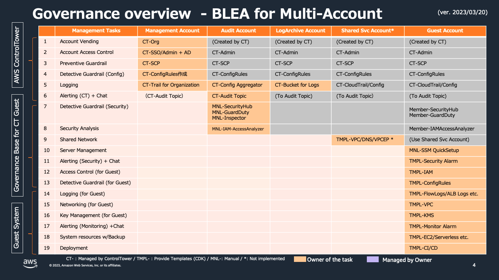
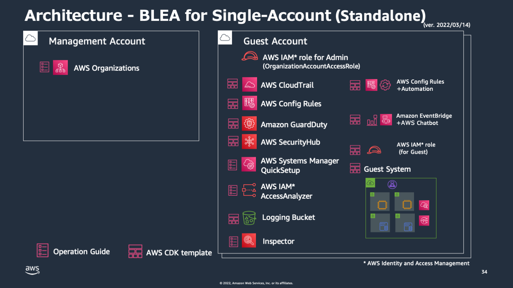

# Baseline Environment on AWS

[](https://github.com/aws-samples/baseline-environment-on-aws/releases)
[](https://github.com/aws-samples/baseline-environment-on-aws/actions?query=workflow%3A"build")

[In English](README.md)

Baseline Environment on AWS(BLEA) は 単独の AWS アカウントまたは ControlTower で管理されたマルチアカウント環境で、セキュアなベースラインを確立するための リファレンス CDK テンプレート群です。このテンプレート群は AWS のセキュリティサービスを活用して基本的かつ拡張可能なガードレールを提供します。また典型的なシステムアーキテクチャを実現するエンドツーエンドの CDK サンプルコードを提供します。この CDK テンプレートは用途に合わせてユーザが拡張して使うことを前提としており、拡張の参考となるコードやコメントを多く含んでいます。これによって AWS のアーキテクチャベストプラクティスや CDK コードのカスタマイズを習得しやすくすることを目的としています。

Jump to | [Changelog](CHANGELOG.md) | [HowTo](doc/HowTo_ja.md) | [マルチアカウント環境へのデプロイ](/doc/DeployToControlTower_ja.md) | [Standalone 版からマルチアカウント版への移行](doc/Standalone2ControlTower_ja.md) | [パイプラインによるデプロイ](doc/PipelineDeployment_ja.md) |

## ガバナンスアーキテクチャ

### オペレーションパターン


### マルチアカウント版 (ControlTower 利用)



### Standalone 版 (単一アカウント利用)


## ベースライン アーキテクチャ

### マルチアカウント版


### Standalone 版



### CloudFormation スタック構成 (Standalone 版)


## ガバナンスベース一覧

| ユースケース                                           | フォルダ                   |
| ------------------------------------------------------ | -------------------------- |
| スタンドアローン版ガバナンスベース                     | `usecases/base-standalone` |
| ControlTower 版ガバナンスベース（ゲストアカウント用）  | `usecases/base-ct-guest`   |
| ControlTower 版 ガバナンスベース（Audit アカウント用） | `usecases/base-ct-audit`   |

## ゲストシステムのサンプルアーキテクチャ一覧

| ユースケース                 | フォルダ                       |
| ---------------------------- | ------------------------------ |
| Web アプリケーションサンプル | `usecases/guest-webapp-sample` |
| API アプリケーションサンプル | `usecases/guest-apiapp-sample` |

- Web アプリケーションサンプルでは異なる 4 つのオプションを提供しています

  - ECS による Web アプリケーションのサンプル（デフォルト）
  - Option: ECS Web アプリケーションの SSL 対応版サンプル
  - Option: AutoScaling による Web アプリケーションのサンプル
  - Option: EC2 による Web アプリケーションのサンプル

- API アプリケーションサンプルでは異なる 2 つのオプションを提供しています
  - NodeJS によるサーバーレスな API アプリケーションのサンプル（デフォルト）
  - Option: 同アプリケーションの Python による実装

> NOTE: 各々のユースケースは独立してデプロイ可能ですが、同一ユースケース内の別オプションは一部のリソースを共用している場合があります。削除、変更時は依存関係をご確認ください。

## デプロイの流れ

デプロイするステップについて記載します。デプロイだけ行う場合はエディタ環境の構築は必ずしも必要ありませんが、コードの変更が容易になりミスを減らすことができるため、エディタも含めた開発環境を用意することをお勧めします。

### 前提条件

#### a. ランタイム

以下のランタイムを使用します。各 OS ごとの手順に従いインストールしてください。

- [Node.js](https://nodejs.org/) (>= `14.0.0`)
  - `npm` (>= `8.1.0`)
- [Git](https://git-scm.com/)

npm は workspaces を使用するため 8.1.0 以上が必要です。最新バージョンは以下のようにしてインストールしてください。

```sh
npm install -g npm
```

#### b. 開発環境

CDK コードを安全に編集するため、本格的な開発を行わない場合であっても開発環境のセットアップを推奨します。以下に VisualStudioCode のセットアップ手順を示します。

- [手順]: [VisualStudioCode のセットアップ手順](doc/HowTo_ja.md#VisualStudioCode-のセットアップ)

### 典型的な導入手順

BLEA を使う場合の最も典型的な導入手順は次の通りです。ここでは単独のアカウントにガバナンスベースとゲストアプリケーションを導入する手順を示します。

1. 関連ライブラリのインストールとコードのビルド

2. AWS CLI の認証情報の設定

3. デプロイ対象のアカウント作成

4. ガバナンスベースをデプロイ

5. ゲストアプリケーションサンプルをデプロイ

> NOTE:
> ここでは 単独アカウントに Standalone 版ガバナンスベースと Web アプリケーションサンプルの ECS 版を導入します。
> ControlTower を使ったマルチアカウント版の導入手順については、[Deploy to ControlTower environment](/doc/DeployToControlTower_ja.md)を参照してください。

## 導入手順

ここでは最もシンプルな、単一アカウントへの Standalone 版導入を例にとって解説します。

### 1. リポジトリの取得とプロジェクトの初期化

#### 1-1. リポジトリの取得

```sh
git clone https://github.com/aws-samples/baseline-environment-on-aws.git
cd baseline-environment-on-aws
```

#### 1-2. プロジェクトの初期化

```sh
# install dependencies
npm ci
```

#### 1-3. Git の pre-commit hook のセットアップ

Git に Commit する際に Linter, Formatter, git-secrets によるチェックを行うための Hook を登録します。以下の手順に従ってセットアップしてください。デプロイするだけの場合は必須ではありませんが、よりセキュアに開発するためにセットアップを推奨します。

- [手順] [Git の pre-commit hook のセットアップ](doc/HowTo_ja.md#Git-の-pre-commit-hook-のセットアップ)

### 2. AWS CLI の認証情報を設定する

CDK をデプロイするために AWS 認証情報（API キー）が必要です。ここでは最もシンプルな、恒久的な認証情報を使用する方法を紹介します。

これは主に開発環境用として利用する方式です。ここでは AWS CLI のプロファイルの例として、`prof_dev` と `prof_prod` の二つのアカウントを使う場合を考えます。

~/.aws/credentials

```text
[prof_dev]
aws_access_key_id = XXXXXXXXXXXXXXX
aws_secret_access_key = YYYYYYYYYYYYYYY
region = ap-northeast-1

[prof_prod]
aws_access_key_id = ZZZZZZZZZZZZZZZZ
aws_secret_access_key = PPPPPPPPPPPPPPPP
region = ap-northeast-1
```

### 3. デプロイ対象のアカウントを作成する

#### 3-1. 新しいアカウントを作成する

Organizations を使って新しいアカウントを作成します。
Organizations を使用しない単一のアカウントを利用することも可能ですが、後にマルチアカウント管理の環境に移行しやすくするため Organizations 配下のメンバーアカウント使用を推奨します。

#### 3-2. AWS Chatbot 利用の事前準備として Slack を設定する

BLEA ではセキュリティイベントおよびモニタリングイベントを通知のためにそれぞれ Slack チャネルを使用します。Slack 上にチャネルを 2 つ作成し、以下の手順を参照して AWS Chatbot の初期設定を行ってください。
設定が終わったら後の設定のため、ワークスペースの ID（1 つ）、通知先のチャネルの ID（2 つ）をメモしておきます。

- [手順] [AWSChatbot 用に Slack を設定する](doc/HowTo_ja.md#AWSChatbot-用に-Slack-を設定する)

### 4. ガバナンスベースをデプロイする

#### 4-1. デプロイ情報(Context)を設定する

デプロイのため 各ユースケースの CDK Context (cdk.json) にパラメータを指定する必要があります。 Standalone 版のガバナンスベース用の設定ファイルはこちらです。

```sh
usecases/base-standalone/cdk.json
```

このサンプルは `dev` という Context を定義する例です。同様の設定を検証、本番アカウントにもデプロイできるようにするには、`staging`や`prod`といった Context を用意します。Context 名は任意のアルファベットが利用可能です。

usecases/base-standalone/cdk.json

```json
{
  "app": "npx ts-node --prefer-ts-exts bin/blea-base-sa.ts",
  "context": {
    "dev": {
      "description": "Environment variables for Governance base ",
      "envName": "Development",
      "securityNotifyEmail": "notify-security@example.com",
      "slackNotifier": {
        "workspaceId": "T8XXXXXXX",
        "channelIdSec": "C01XXXXXXXX"
      }
    }
  }
}
```

この設定内容は以下の通りです。

| key                        | value                                                                            |
| -------------------------- | -------------------------------------------------------------------------------- |
| description                | 設定についてのコメント                                                           |
| envName                    | 環境名。これが各々のリソースタグに設定されます                                   |
| securityNotifyEmail        | セキュリティに関する通知が送られるメールアドレス。内容は Slack と同様です        |
| slackNotifier.workspaceId  | AWS Chatbot に設定した Slack workspace の ID                                     |
| slackNotifier.channelIdSec | AWS Chatbot に設定した Slack channel の ID。セキュリティに関する通知が行われます |

> NOTE: Context の使い方については以下の解説を参照してください
>
> - [cdk.context.json による個人環境の管理](doc/HowTo_ja.md#cdkcontextjson-による個人環境の管理)
> - [アプリケーション内で Context にアクセスする仕組み](doc/HowTo_ja.md#アプリケーション内で-Context-にアクセスする仕組み)

#### 4-2. ガバナンスベースをデプロイする

初めて CDK を実行する場合は、対象のユースケースディレクトリへ移動し、CDK を bootstrap します。これは対象のアカウントとリージョンの組み合わせで初めて CDK を実行するときに必要です。

```sh
cd usecases/base-standalone
npx cdk bootstrap -c environment=dev --profile prof_dev
```

> NOTE:
>
> - ここでは BLEA 環境にインストールしたローカルの cdk を利用するため、`npx`を使用しています。直接`cdk`からコマンドを始めた場合は、グローバルインストールされた cdk が利用されます。
> - cdk コマンドを利用するときに便利なオプションがあります。[デプロイ時の承認をスキップしロールバックさせない](doc/HowTo_ja.md#デプロイ時の承認をスキップしロールバックさせない)を参照してください。

ガバナンスベースをデプロイします。

```sh
npx cdk deploy --all -c environment=dev --profile prof_dev
```

これによって以下の機能がセットアップされます

- CloudTrail による API のロギング
- AWS Config による構成変更の記録
- GuardDuty による異常なふるまいの検知
- SecurityHub によるベストプラクティスからの逸脱検知 (AWS Foundational Security Best Practice, CIS benchmark)
- デフォルトセキュリティグループの閉塞 （逸脱した場合自動修復）
- AWS Health イベントの通知
- セキュリティに影響する変更操作の通知（一部）
- Slack によるセキュリティイベントの通知

#### 4-3. (オプション) 他のベースラインセットアップを手動でセットアップする

ガバナンスベースでセットアップする他に AWS はいくつかの運用上のベースラインサービスを提供しています。必要に応じてこれらのサービスのセットアップを行なってください。

##### a. Inspector を有効化

Inspector は、ワークロードをスキャンして、脆弱性を管理します。EC2 とECR を継続的にスキャンすることで、ソフトウェアの脆弱性や意図しないネットワークのエクスポージャーを検出します。検出された脆弱性は、算出されたリスクスコアに基づき優先順位づけされて表示されるため、可視性高く結果を取得できます。また、Scurity Hub とは自動で統合され、一元的に検出結果を確認できます。

セットアップ手順：[https://docs.aws.amazon.com/inspector/latest/user/getting_started_tutorial.html]


##### b. EC2 管理のため AWS Systems Manager Quick Setup を実施する

EC2 を利用する場合は SystemsManager を利用して管理することをお勧めします。AWS Systems Manager Quick Setup を使うことで、EC2 の管理に必要な基本的なセットアップを自動化できます。
セットアップ手順: [https://docs.aws.amazon.com/systems-manager/latest/userguide/quick-setup-host-management.html]

Quick Setup は以下の機能を提供します:

- Systems Manager で必要となる AWS Identity and Access Management (IAM) インスタンスプロファイルロールの設定
- SSM Agent の隔週自動アップデート
- 30 分ごとのインベントリメタデータの収集
- インスタンスのパッチ不足を検出するための日次スキャン
- 初回のみの、Amazon CloudWatch agent のインストールと設定
- CloudWatch agent の月次自動アップデート

##### c. Trusted Advisor の検知結果レポート

TrustedAdvisor は AWS のベストプラクティスをフォローするためのアドバイスを提供します。レポート内容を定期的にメールで受け取ることが可能です。詳細は下記ドキュメントを参照してください。

- See: [https://docs.aws.amazon.com/awssupport/latest/user/get-started-with-aws-trusted-advisor.html#preferences-trusted-advisor-console]

### 5. ゲストアプリケーションのサンプルをデプロイする

ガバナンスベースの設定が完了したら、その上にゲストアプリケーションを導入します。
ここではゲストアプリケーションの例として、ECS ベースの Web アプリケーションサンプルをデプロイする手順を示します。

#### 5-1. ゲストアプリケーションの Context を設定する

デプロイする前にゲストアプリケーションの設定を行います。
Web アプリケーションのサンプルが配置された `usecases/guest-webapp-sample` に移動して cdk.json を編集します。

usecases/guest-webapp-sample/cdk.json

```json
{
  "app": "npx ts-node --prefer-ts-exts bin/blea-guest-ecsapp-sample.ts",
  "context": {
    "dev": {
      "description": "Context samples for Dev - Anonymous account & region",
      "envName": "Development",
      "vpcCidr": "10.100.0.0/16",
      "monitoringNotifyEmail": "notify-monitoring@example.com",
      "dbUser": "dbadmin",
      "slackNotifier": {
        "workspaceId": "T8XXXXXXX",
        "channelIdMon": "C01YYYYYYYY"
      },
      "domainName": "example.com",
      "hostedZoneId": "Z0123456789",
      "hostName": "www"
    }
  }
}
```

設定内容は以下の通りです:

| key                        | value                                                                                                                                          |
| -------------------------- | ---------------------------------------------------------------------------------------------------------------------------------------------- |
| description                | 設定についてのコメント                                                                                                                         |
| envName                    | 環境名。これが各々のリソースタグに設定されます。                                                                                               |
| vpcCidr                    | 作成する VPC の CIDR                                                                                                                           |
| monitoringNotifyEmail      | システム監視についての通知が送られるメールアドレス。内容は Slack と同様です。                                                                  |
| dbUser                     | AuroraDB へのログインユーザ名                                                                                                                  |
| slackNotifier.workspaceId  | AWS Chatbot に設定した Slack workspace の ID                                                                                                   |
| slackNotifier.channelIdMon | AWS Chatbot に設定した Slack channel の ID。システム監視についての通知が行われます。セキュリティのチャネルとは別のチャネルを指定してください。 |

#### 5-2. ゲストアプリケーションをデプロイする

```sh
cd usecases/guest-webapp-sample
npx cdk deploy --all -c environment=dev --profile prof_dev
```

以上で単一アカウントに対するベースラインおよびサンプルアプリケーションのデプロイが完了します。

> NOTE:
>
> Aurora を含めた全てのリソースをデプロイ完了するまでには 30 分程度かかります。一部のリソースだけをデプロイしたい場合は対象のスタック名を明示的に指定してください。スタック名はアプリケーションコード(ここでは bin/blea-guest-ecsapp-sample.ts)の中で`${pjPrefix}-ECSApp`のように表現されています。
>
> ```sh
> cd usecases/guest-webapp-sample
> npx cdk deploy "BLEA-ECSApp" --app "npx ts-node --prefer-ts-exts bin/blea-guest-ecsapp-sample.ts" -c environment=dev --profile prof_dev
> ```
>
> NOTE:
> guest-webapp-sample は bin ディレクトリ配下に複数のバリエーションを用意しています。デフォルトでは cdk.json の `app` に指定されたアプリケーション(blea-guest-ecsapp-sample.ts)がデプロイされます。 別のアプリケーションをデプロイしたい場合は、以下のように cdk の引数で明示的に `--app` を指定することで対応可能です。同一ユースケース内であれば cdk.json の Context はいずれも同じ内容で動作します。
>
> ```sh
> cd usecases/guest-webapp-sample
> npx cdk deploy --all --app "npx ts-node --prefer-ts-exts bin/blea-guest-asgapp-sample.ts" -c environment=dev --profile prof_dev
> ```
>
> NOTE:
> ECS のゲストアプリケーションをデプロイした際に Security Hub のスタンダードの１つである[CodeBuild.5](https://docs.aws.amazon.com/securityhub/latest/userguide/securityhub-standards-fsbp-controls.html#fsbp-codebuild-5)が警告を上げる可能性があります。[CodeBuild の特権モードに関する通知のステータスを変更する](doc/HowTo_ja.md#修復方法)を参照してこの警告を抑制することができます。

#### 5-3. 独自のアプリケーションを開発する

以後はこのサンプルコードを起点にして、自分のユースケースに合わせたアプリケーションを開発していくことになります。一般的な開発に必要な情報を示します。

- [通常の開発の流れ](doc/HowTo_ja.md#通常の開発の流れ)
- [依存パッケージの最新化](doc/HowTo_ja.md#依存パッケージの最新化)

#### 5-4. セキュリティ指摘事項の修復

ガバナンスベースをデプロイした後でも、Security Hub のベンチマークレポートで 重要度が CRITICAL あるいは HIGH のレベルでレポートされる検出項目があります。これらに対しては手動で対応が必要です。必要に応じて修復(Remediation)を実施してください。

- [セキュリティ指摘事項の修復](doc/HowTo_ja.md#セキュリティ指摘事項の修復)

## Security

See [CONTRIBUTING](CONTRIBUTING.md#security-issue-notifications) for more information.

## License

This library is licensed under the MIT-0 License. See the LICENSE file.
