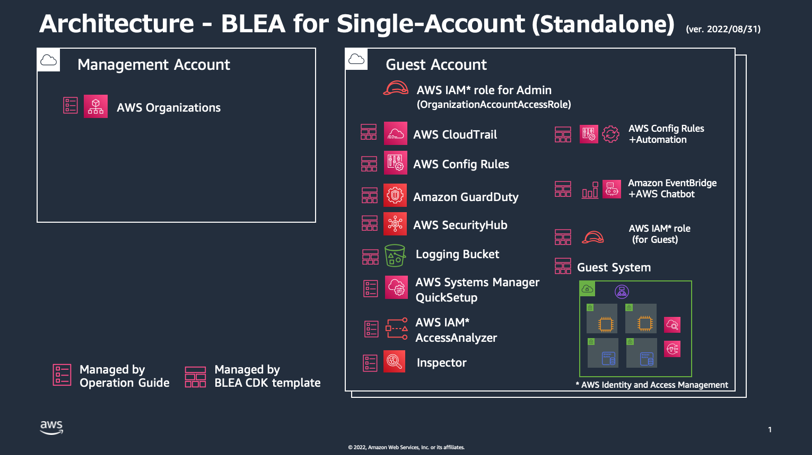

# Baseline Environment on AWS

[In English](README.md)

Baseline Environment on AWS(BLEA) は 単独の AWS アカウントまたは ControlTower で管理されたマルチアカウント環境で、セキュアなベースラインを確立するための リファレンス CDK テンプレート群です。このテンプレート群は AWS のセキュリティサービスを活用して基本的かつ拡張可能なガードレールを提供します。また典型的なシステムアーキテクチャを実現するエンドツーエンドの CDK サンプルコードを提供します。この CDK テンプレートは用途に合わせてユーザが拡張して使うことを前提としており、拡張の参考となるコードやコメントを多く含んでいます。これによって AWS のアーキテクチャベストプラクティスや CDK コードのカスタマイズを習得しやすくすることを目的としています。

Jump to | [Changelog](CHANGELOG.md) | [デプロイメントパイプライン](tools/cicd/README_ja.md) | [Standalone 版からマルチアカウント版への移行](doc/Standalone2ControlTower_ja.md) |

# ガバナンスアーキテクチャ

## オペレーションパターン


## マルチアカウント版 (ControlTower 利用)


## Standalone 版 (単一アカウント利用)


# ベースライン アーキテクチャ

## マルチアカウント版


## Standalone 版



## CloudFormation スタック構成 (Standalone 版)


# ゲストシステムのサンプルアーキテクチャ

## ECS システムサンプル


## AutoSacling システムサンプル


## EC2 システムサンプル


# デプロイ

> Information: \
> このデプロイ手順は AWS 認証情報（アクセスキー/シークレットキー）を手元の PC/Mac に保存します。認証情報を手元に保存しないために CloudShell を使う方法があります。詳しくはこのドキュメントの下部にある `Appendix A` を参照してください。

# 1. CDK 実行環境のセットアップとコードのビルド

参照: https://docs.aws.amazon.com/ja_jp/cdk/latest/guide/getting_started.html

- TypeScript 2.7 or later のインストール

```
npm -g install typescript
```

- CDK 1.100.0 or later のインストール

```
npm install -g aws-cdk
```

- ビルド

```
cd path-to-source
npm ci
npm run build
```

## (オプション) 最新の CDK を使う場合

CDK のインストール後、ビルド工程で `npm ci` ではなく以下のコマンドを実行します。

- ncu のインストール

```
npm install -g npm-check-updates
```

- モジュールのアップデート

```
cd path-to-source
rm -rf package-lock.json node_modules/
ncu -u
npm install
```

- ビルド

```
npm run build
```

# 3. AWS CLI および CDK の設定

CDK をデプロイするために AWS 認証情報（API キー）が必要です。恒久的な認証情報を使用する方法と、AWS SSO を使用して一時的な認証情報を取得して使用する方法を紹介します。

## オプション 1. AWS 認証情報を設定する (恒久的な認証情報を使用する場合)

主に開発環境用として、デプロイ対象アカウントの IAM ユーザの認証情報を使うことができます。ここでは AWS CLI のプロファイルの例として、`prof_dev` と `prof_prod` の二つのアカウントを使う場合を考えます。

~/.aws/credentials

```
[prof_dev]
aws_access_key_id = XXXXXXXXXXXXXXX
aws_secret_access_key = YYYYYYYYYYYYYYY
rgion = ap-northeast-1

[prof_prod]
aws_access_key_id = ZZZZZZZZZZZZZZZZ
aws_secret_access_key = PPPPPPPPPPPPPPPP
region = ap-northeast-1
```

## オプション 2. AWS 認証情報を設定する (AWS SSO を使用する場合)

通常は AWS SSO の利用を推奨します。マネジメントコンソールへのログインおよび AWS CLI - AWS SSO 統合による CLI の実行が可能です。

> Notes: AWS CLI - AWS SSO 統合を使うためには、AWS CLIv2 を使う必要があります \
> See: https://docs.aws.amazon.com/cli/latest/userguide/cli-configure-sso.html

1. AWS CLI - AWS SSO 統合を CDK から使用する場合は、オープンソースのツールである aws2-wrap (https://github.com/linaro-its/aws2-wrap) を CDK を実行する環境にインストールする必要があります。

```
pip3 install aws2-wrap
```

2. Control Tower の Audit アカウントにデプロイするための CLI プロファイルを設定します。ここではマネジメントアカウントの ID を `1111111111111`, Audit アカウントの ID を `222222222222` としています。

> Notes: ControlTower の仕様により、Audit アカウントにデプロイするためには、マネジメントアカウントの `AWSAdministratorAccess` ロールでログインし、Audit アカウントの`AWSControlTowerExecution`ロールにスイッチして処理を実行する必要があります。

~/.aws/config

```
# for Management Account
[profile ct-management-sso]
sso_start_url = https://d-90xxxxxxxx.awsapps.com/start#/
sso_region = ap-northeast-1
sso_account_id = 1111111111111
sso_role_name = AWSAdministratorAccess
region = ap-northeast-1

# for AWSControlTowerExecution Role on Audit Account
[profile ct-audit-exec-role]
role_arn = arn:aws:iam::222222222222:role/AWSControlTowerExecution
source_profile = ct-management-sso
region = ap-northeast-1

# for CDK access to ct-audit-exec-role
[profile ct-audit-exec]
credential_process = aws2-wrap --process --profile ct-audit-exec-role
region = ap-northeast-1
```

3. ゲストアカウントにデプロイするための CLI プロファイルを設定します。ここではゲストアカウントの ID を`123456789012`としています。

~/.aws/config

```
# for Guest Account
[profile ct-guest-sso]
sso_start_url = https://d-90xxxxxxxx.awsapps.com/start#/
sso_region = ap-northeast-1
sso_account_id = 123456789012
sso_role_name = AWSAdministratorAccess
region = ap-northeast-1

# for CDK access to ct-guest-sso
[profile ct-guest]
credential_process = aws2-wrap --process --profile ct-guest-sso
region = ap-northeast-1
```

4. AWS SSO を使った CLI ログイン

次のコマンドで AWS SSO にログインします。ここでは`ct-guest-sso`プロファイルでログインする例を示します。

```
aws sso login --profile ct-guest-sso
```

このコマンドによって ブラウザが起動し、AWS SSO のログイン画面が表示されます。ゲストアカウントの管理者ユーザー名（メールアドレス）とパスワードを正しく入力すると画面がターミナルに戻り、 AWS CLI で ゲストアカウントでの作業が可能になります。

> Notes: `ct-guest`プロファイルは aws2-warp を経由した認証を行なっており、CDK を実行する場合に使用します。

# 4. CDK Context にパラメータを指定する

デプロイのために CDK Context にパラメータを指定する必要があります。Context の値は cdk.json ファイルまたは cdk.context.json ファイルで指定します。（Context は CDK コマンドラインで -c オプションで指定することも可能ですが、 このソリューションでは -c に `environment` というパラメータのみを指定することとしています）

- See: https://docs.aws.amazon.com/ja_jp/cdk/latest/guide/context.html
- See: https://docs.aws.amazon.com/ja_jp/cdk/latest/guide/get_context_var.html

## 1. サンプルの cdk.json と cdk.context.json:

このサンプルでは `dev`, `prod`, `ctaudit`, `my` という Context を定義しています。cdk.json ファイルは Git で管理されますが、cdk.context.json は Git の管理外としています(.gitignore に指定)。これによってチームで共有管理する本番環境などの定義は cdk.json に定義し、個人で使用する開発環境の定義は cdk.context.json に定義するといった使い分けが可能です。

Context の中で`env`プロパティはデプロイ対象となるアカウント ID やリージョンを指定します。これは CDK でスタックを作成する際に渡されます。`env`プロパティが指定されていない場合は、実行時点の CLI プロファイルで指定されているアカウントおよびリージョンの組み合わせにデプロイしますが、これは開発用途での利用に留めてください。誤った環境へのデプロイメントを防ぐため、本番環境のスタックは cdk.json で明示的に`env`プロパティを指定することを推奨します。

cdk.json

```
{
  "app": "npx ts-node bin/blea-base-sa.ts",
  "context": {
    "dev": {
      "description": "Environment variables for blea-guest-*-samples.ts",
      "envName": "Development",
      "vpcCidr": "10.100.0.0/16",
      "securityNotifyEmail": "notify-security@example.com",
      "monitoringNotifyEmail": "notify-monitoring@example.com",
      "dbUser": "dbadmin",
      "slackNotifier": {
        "workspaceId": "T8XXXXXXX",
        "channelIdSec": "C01XXXXXXXX",
        "channelIdMon": "C01YYYYYYYY"
      }
    },
    "prod": {
      "description": "Environment variables for blea-guest-*-samples.ts",
      "env": {
        "account": "111111111111",
        "region": "ap-northeast-1"
      },
      "envName": "Production",
      "vpcCidr": "10.110.0.0/16",
      "securityNotifyEmail": "notify-security@example.com",
      "monitoringNotifyEmail": "notify-monitoring@example.com",
      "dbUser": "dbadmin",
      "slackNotifier": {
        "workspaceId": "T8XXXXXXX",
        "channelIdSec": "C01XXXXXXXX",
        "channelIdMon": "C01YYYYYYYY"
      }
    },
    "ctaudit": {
      "description": "Environment variables for blea-base-ct-audit.ts",
      "env": {
        "account": "222222222222",
        "region": "ap-northeast-1"
      },
      "slackNotifier": {
        "workspaceId": "T8XXXXXXX",
        "channelIdAgg": "C01ZZZZZZZZ"
      }
    }
  }
}
```

cdk.context.json は自分のための開発環境のパラメータを指定するために有用です。このファイルは CDK によって自動的に作成されている場合があります。その場合は既存の設定を残したまま自分自身の Context 定義を追加してください。

cdk.context.json

```
{
  "@aws-cdk/core:enableStackNameDuplicates": "true",
  "aws-cdk:enableDiffNoFail": "true",
  "@aws-cdk/core:stackRelativeExports": "true",
  "my": {
    "description": "Personal Environment variables for blea-guest-*-samples.ts",
    "envName": "Personal",
    "vpcCidr": "10.100.0.0/16",
    "securityNotifyEmail": "xxx@example.com",
    "monitoringNotifyEmail": "zzz@example.com",
    "dbUser": "personaluser",
    "slackNotifier": {
      "workspaceId": "T8XXXXXXXXX",
      "channelIdSec": "C01YYYYYYYY",
      "channelIdMon": "C02YYYYYYYY"
    }
  },
  "myaudit": {
    "description": "Personal Environment variables for blea-base-ct-audit.ts",
    "env": {
      "account": "222222222222",
      "region": "ap-northeast-1"
    },
    "slackNotifier": {
      "workspaceId": "T8XXXXXXX",
      "channelIdAgg": "C01ZZZZZZZZ"
    }
  }
}
```

> Information: Context は CDK コード（bin/\*.ts）の中で次のようにアクセスします。
>
> ```
> const envKey = app.node.tryGetContext('environment');
> const valArray = app.node.tryGetContext(envKey);
> const environment_name = valArray['envName'];
> ```

> Tips: Context パラメータを使ったデプロイメントの方法の例。（--app を指定しない場合は`bin/blea-base-sa.ts`がデプロイされます。対象の Application は cdk.json の `app` で指定しています)
> デプロイする際のプロファイル（認証情報）を指定するには `--profile xxxxx` を指定します。また、cdk.json で定義した Context パラメータを指定するには `-c envrionment=xxxx` を指定します。通常、profile で指定する認証情報と Context（の env）で指定するアカウント、リージョンは一致している必要があります。
>
> ```
> cdk deploy "*" --profile prof_dev  -c environment=dev
> cdk deploy "*" --profile prof_prod -c environment=prod
> ```

> Tips: 通常、CDK によるデプロイは承認を求めるプロンプトが表示されますが、 `--require-approval never` をコマンドに指定することで確認のプロンプトが表示されなくなります（ただし利用にはご注意ください！）。 \
>  以下のような設定を cdk.json に追加することで、コマンドで都度設定する必要が無くなります。
>
> > ```
> > "requireApproval": "never",
> > ```

# 6. ベースラインとサンプルテンプレート

このテンプレートで提供する、ガバナンスベーステンプレートと、サンプルアプリケーションのテンプレートを紹介します。これらのコードは`bin/`ディレクトリにあります。

## ガバナンスベース（ControlTower 版）

- blea-base-ct-audit.ts

  - ControlTower の Audit アカウントに対するガバナンスベース.

- blea-base-ct-guest.ts
  - ControlTower の各ゲストアカウントに設定するガバナンスベース。指定したアカウントに対してログバケット、IAM ユーザ、モニタリング用 Chatbot をセットアップする

## ガバナンスベース（Santdalone 版）

- blea-base-sa.ts
  - 単一アカウントに対して、ガバナンスベースをセットアップする。

## ゲストシステムサンプル

- blea-guest-ecsapp-sample.ts
  - ECS/Fargate+AuroraPostgreSQL を使ったサンプルシステム
- blea-guest-asgapp-sample.ts
  - EC2 Autoscaling Group+AuroraPostgreSQL を使ったサンプルシステム
- blea-guest-ec2app-sample.ts
  - EC2+AuroraPostgreSQL を使ったサンプルシステム

> これらのサンプルコードをデプロイする場合は一度に 1 つのサンプルだけを使用してください。各サンプルは VPC、Chatbot、Log、AuroraDB などで同じ名前のスタックを定義しているため、複数のサンプルを同時にデプロイした場合は後から実行した設定で上書きされます。スタックの名前を変えることで並列にデプロイすることも可能です。詳しくはそれぞれのサンプルのコードをご覧ください。

# 7. 単一アカウントへのデプロイ（Standalone 版）

（マルチアカウント版のセットアップを行う場合は Step8 を参照してください）

## 7.1. 新しいアカウントを作成する

Orgnizations を使って新しいアカウントを作成する。（Organizations を使用しない単一のアカウントを利用することも可能ですが、後にマルチアカウント管理の環境に移行することが想定される場合は Organizations 配下のメンバーアカウント使用を推奨します）

## 7.2. AWS Chatbot の事前準備として Slack workspaces の設定を行う

参照: `Appendix B`

## 7.3. ガバナンスベース（Standalone 版)をデプロイする

対象のアカウントとリージョンの組み合わせで、初めて CDK を実行する場合、以下のように CDK を bootstrap する必要があります。

```
cdk bootstrap --app "npx ts-node bin/blea-base-sa.ts" -c environment=dev --profile prof_dev
```

ガバナンスベースをデプロイします。

```
cdk deploy "*" --app "npx ts-node bin/blea-base-sa.ts" -c environment=dev --profile prof_dev
```

## 7.4. (オプション) 他のベースラインセットアップ

AWS はいくつかの運用上のベースラインサービスを提供しています。必要に応じてこれらのサービスのセットアップを行なってください。

### EC2 管理のため AWS Systems Manager Quick Setup を実施する

AWS Systems Manager Quick Setup を使うことで、EC2 の管理に必要な基本的なセットアップを自動化できます。
セットアップ手順: https://docs.aws.amazon.com/systems-manager/latest/userguide/quick-setup-host-management.html

Quick Setup は以下の機能を提供します:

- Systems Manager で必要となる AWS Identity and Access Management (IAM) インスタンスプロファイルロールの設定
- SSM Agent の隔週自動アップデート
- 30 分ごとのインベントリメタデータの収集
- インスタンスのパッチ不足を検出するための日次スキャン
- 初回のみの、Amazon CloudWatch agent のインストールと設定
- CloudWatch agent の月次自動アップデート

## 7.5. サンプルアプリケーションのデプロイ

サンプルアプリケーションのデプロイ（--app の指定を変更することで AutoScalingGroup や EC2 のデプロイも可能）

```
cdk deploy "*" --app "npx ts-node bin/blea-guest-ecsapp-sample.ts" -c environment=dev --profile prof_dev

```

以上で単一アカウントに対するベースラインおよびサンプルアプリケーションのデプロイが完了しました。

# 8. マルチアカウント環境へのデプロイ

## 8.1. ControlTower のセットアップ

ControlTower をセットアップします。
See: https://docs.aws.amazon.com/controltower/latest/userguide/setting-up.html

## 8.2. セキュリティサービスのセットアップ

Organizations 全体に対し、SecurityHub, GuardDuty そして IAM Access Analyzer を有効化します。ここでは委任アカウントとして Audit アカウントを指定します。

1. SecurityHub

- https://docs.aws.amazon.com/securityhub/latest/userguide/designate-orgs-admin-account.html
- https://docs.aws.amazon.com/securityhub/latest/userguide/accounts-orgs-auto-enable.html

2. GuardDuty

- https://docs.aws.amazon.com/guardduty/latest/ug/guardduty_organizations.html

3. IAM Access Analyzer

- https://docs.aws.amazon.com/IAM/latest/UserGuide/access-analyzer-settings.html#access-analyzer-delegated-administrator

## 8.3. ガバナンスベースのデプロイ(Audit アカウントに対して)

### AWS Chatbot 用の Slack セットアップ

Audit account の AWS Chatbot に Slack Workspace をセットアップする。 \
`Appendix B` を参照。

### デプロイ

AWS SSO を使ってマネジメントアカウントにログインする。

> Audit アカウントは マネジメントアカウントの `AWSControlTowerExecution` ロールでのみセットアップが可能です（ControlTower の仕様）

```
aws sso login --profile ct-management-sso
```

CDK 用バケットのブートストラップ(初回のみ)

```
cdk bootstrap  --app "npx ts-node bin/blea-base-ct-audit.ts" -c environment=ctaudit --profile ct-audit-exec
```

Audit アカウントのガバナンスベースをデプロイ

```
cdk deploy "*" --app "npx ts-node bin/blea-base-ct-audit.ts" -c environment=ctaudit --profile ct-audit-exec
```

## 8.4. 新規ゲストアカウントの作成

ControlTower の Account Vending Machine を使ってゲストアカウントを新規に作成する。

## 8.5. ゲストカウントのガバナンスベースをデプロイ

AWS SSO を使ってゲストアカウントにログイン

```
aws sso login --profile ct-guest-sso
```

CDK 用バケットのブートストラップ(初回のみ)

```
cdk bootstrap --app "npx ts-node bin/blea-base-ct-guest.ts" -c environment=dev --profile ct-guest # First time only
```

ゲストアカウントのガバナンスベースをデプロイ

```
cdk deploy "*" --app "npx ts-node bin/blea-base-ct-guest.ts" -c environment=dev --profile ct-guest
```

## 8.6. (オプション) 他のベースラインのセットアップ（ゲストアカウント）

AWS はいくつかの運用上のベースラインサービスを提供しています。必要に応じてこれらのサービスのセットアップを行なってください。

### EC2 管理のため AWS Systems Manager Quick Setup を実施する

AWS Systems Manager Quick Setup を使うことで、EC2 の管理に必要な基本的なセットアップを自動化できます。
セットアップ手順: https://docs.aws.amazon.com/systems-manager/latest/userguide/quick-setup-host-management.html

Quick Setup は以下の機能を提供します:

- Systems Manager で必要となる AWS Identity and Access Management (IAM) インスタンスプロファイルロールの設定
- SSM Agent の隔週自動アップデート
- 30 分ごとのインベントリメタデータの収集
- インスタンスのパッチ不足を検出するための日次スキャン
- 初回のみの、Amazon CloudWatch agent のインストールと設定
- CloudWatch agent の月次自動アップデート

## 8.7. サンプルアプリケーションのデプロイ

サンプルアプリケーションのデプロイ（--app の指定を変更することで AutoScalingGroup や EC2 のデプロイも可能）

```
cdk deploy "*" --app "npx ts-node bin/blea-guest-ecsapp-sample.ts" -c environment=dev --profile ct-guest
```

以上でマルチアカウントに対するベースラインおよびサンプルアプリケーションのデプロイが完了しました。

# 9. 修復

ガバナンスベースをデプロイした後でも、Security Hub のベンチマークレポートで 重要度が CRITICAL あるいは HIGH のレベルでレポートされる問題(Issues)があります。これらに対して手動で対応が必要です。

> オプション: Security Hub の 検出項目を無効化することもできます（推奨しません。無効化する場合はセキュリティリスクを十分に評価した上で実施して下さい）。

- https://docs.aws.amazon.com/securityhub/latest/userguide/securityhub-standards-enable-disable-controls.html

## 9.1. ルートユーザに対して MFA を有効化する

ルートユーザに対する MFA の設定は手動で実施する必要があります。ルートユーザとはマネジメントコンソールにログインする際に、E メールアドレスを使ってログインするユーザのことです。

MFA に関連する Security Hub コントロール（CRITICAL レベル）

- [CIS.1.13] Ensure MFA is enabled for the "root" account
  - https://docs.aws.amazon.com/securityhub/latest/userguide/securityhub-cis-controls.html#securityhub-cis-controls-1.13
- [CIS.1.14] Ensure hardware MFA is enabled for the "root" account
  - https://docs.aws.amazon.com/securityhub/latest/userguide/securityhub-cis-controls.html#securityhub-cis-controls-1.14
- [IAM.6] Hardware MFA should be enabled for the root user
  - https://docs.aws.amazon.com/securityhub/latest/userguide/securityhub-standards-fsbp-controls.html#fsbp-iam-6

修復方法:

1. Organizations メンバアカウントのルートユーザにアクセスする

- https://docs.aws.amazon.com/organizations/latest/userguide/orgs_manage_accounts_access.html#orgs_manage_accounts_access-as-root

2. ルートユーザに対してハードウェア MFA を有効化する

- https://docs.aws.amazon.com/IAM/latest/UserGuide/id_credentials_mfa_enable_physical.html#enable-hw-mfa-for-root

## 9.2. EC2 のメタデータアクセスに IMDSv2 を使う

EC2 インスタンスのメタデータアクセスには IDMSv2 のみを使用することが推奨されています。修復については以下のドキュメントを参照してください。

- [EC2.8] EC2 instances should use IMDSv2
  - https://docs.aws.amazon.com/securityhub/latest/userguide/securityhub-standards-fsbp-controls.html#fsbp-ec2-8

# Appendix. A: CloudShell によるデプロイメント

CloudShell を使い、マネジメントコンソールからこのテンプレートをデプロイすることが可能です。
ただし ClouShell は 120 日間使用しないとセットアップした環境のデータを削除することに注意してください。

see: https://docs.aws.amazon.com/cloudshell/latest/userguide/limits.html

## A.1. CloudShell を起動する

- AWS マネジメントコンソールの [>_] アイコンをクリックして CloudShell を起動する (画面右上のアカウント名の隣)
  

## A.2. CDK の実行環境をセットアップする

See: https://docs.aws.amazon.com/ja_jp/cdk/latest/guide/getting_started.html

- npm をアップデートする

```
sudo npm -g install npm
```

- TypeScript 2.7 or later をインストールする

```
sudo npm -g install typescript
```

- CDK 1.100.0 or later をインストールする

```
sudo npm install -g aws-cdk
```

## A.3. CDK コードをアップロードする

1. デプロイ対象の CDK コードをダウンロードし、zip 等でアーカイブする。
2. CloudShell の画面から [Action]-[Upload File] をクリックし、アーカイブしたファイルをアップロードする
   

3. アップロードしたファイルを展開する

- CloudShell で git clone して CDK コードを取得してもよい

## A.4. ビルド

```
cd path-to-source
npm ci
npm run build
```

# Appendix.B AWS Chatbot 用に Slack を設定する

アラームを Slack に送るためには BLEA-ChatbotSecurity および BLEA-ChatbotMonitor stack をデプロイします。これらのスタックをデプロイする前に、AWS Chatbot に対してチャットクライアントのセットアップが必要です。この作業を行なっていないとスタックのデプロイは櫛比します。
AWS Chatbot の設定手順は以下の通りです。

## B.1. Slack に workspace と channel を作る

(この手順は Slack での操作です) workspace を作り、メッセージを受信したい Slack channel を作ります。Slack channel ID をメモしてください(channel ID はチャネル名を右クリックして"Copy Link"でコピーできます). このリンクは次のようになります。 https://your-work-space.slack.com/archives/C01XXXXXXXX. ここで、 `C01XXXXXXXX` が
そのチャネルの channel ID です。

## B.2. AWS Chatbot でチャットクライアントをセットアップする

- 以下の手順の "Setting up AWS Chatbot with Slack" の 1〜4 にしたがって、Slack workspace を AWS Chatbot に作成してください。
  - https://docs.aws.amazon.com/chatbot/latest/adminguide/getting-started.html

## B.3. Context file に workspace ID と channel ID を設定する

cdk.json または cdk.context.json に次のように Slack workspace ID と Channel ID を設定します。セキュリティ用とモニタリング用で Channel は異なるものを指定してください:

```
      "slackNotifier": {
        "workspaceId": "T8XXXXXXX",
        "channelIdSec": "C01XXXXXXXX",
        "channelIdMon": "C01YYYYYYYY"
      }
```

- workspaceId: AWS Chatbot の Workspace details からコピー
- channelIdSec: Slack App からコピー - セキュリティアラーム用
- channelIdMon: Slack App からコピー - モニタリングアラーム用

# Security

See [CONTRIBUTING](CONTRIBUTING.md#security-issue-notifications) for more information.

# License

This library is licensed under the MIT-0 License. See the LICENSE file.
