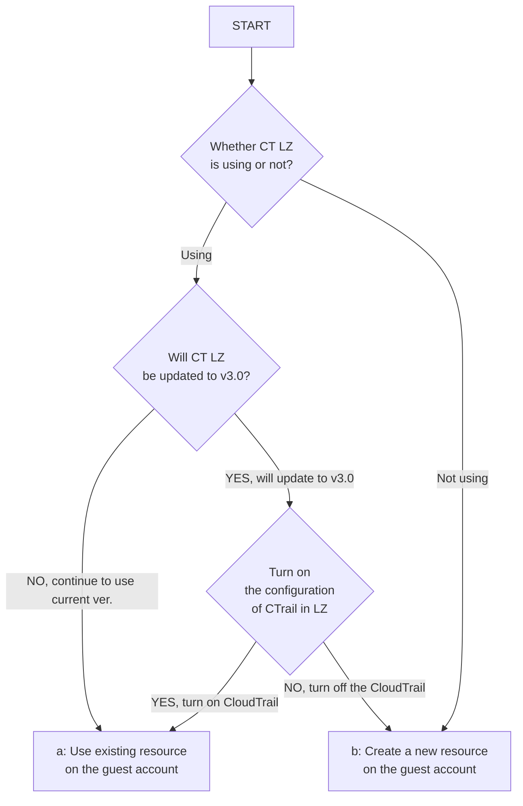

# Deploy to Control Tower environment

[View this page in Japanese (日本語)](DeployToControlTower_ja.md) | [Back to Repository README](../README.md)

This section describes the procedure for deploying BLEA to Control Tower-managed accounts.

## Deployment procedure

The steps to deploy are as follows: If you're just deploying, you don't need to build a build environment, but it's a good idea to have a development environment that includes an editor to make code changes easier.

### Prerequisites

#### a. runtime

- Runtime and other prerequisites are the same as in the Standalone version. [README](../README.md)
- Prerequisites for using AWS SSO
  - Requires [Python3](https://www.python.org/) (>= `3.8`) to use `aws2-wrap`.
  - For integration with AWS SSO, you need [AWS CLI version2](https://docs.aws.amazon.com/cli/latest/userguide/install-cliv2.html).

#### b. Development environment

We recommend that you set up a development environment, even if you are not doing serious development, to ensure safe editing of CDK code. The following are the steps to set up VisualStudioCode.

- [Instructions]: [VisualStudioCode Setup Instructions](HowTo.md#VisualStudioCode-Setup-Instructions)

### Implementation procedure under Control Tower

I will explain the procedure for introducing a multi-account governance base under Control Tower and introducing a sample application as a guest system as an example. Here, `MC` indicates work in the management console, and `Local' indicates work in the local environment.

1. Control Tower and Security Services Setup (MC)

2. Create a guest account for deployment in Control Tower (MC)

3. Installing dependent packages and building code (Local)

4. Set AWS CLI credentials for AWS SSO (Local)

5. Deploy a governance base for guest accounts (Local)

6. Deploy the guest application sample (Local)

## Implementation Procedure

### 1. Control Tower and Security Services Setup (MC)

By using Control Tower, some governance-based functions are set up automatically. Security services that Control Tower does not support can be enabled in bulk for Organizations and will be set automatically when new accounts are created thereafter.

Here are the steps to set up Control Tower and enable SecurityHub, GuardDuty, Inspector, and IAM Access Analyzer for the entire organization. Specify the Audit account as these delegated accounts.

#### 1-1. Control Tower Setup

Set up Control Tower.
See: [https://docs.aws.amazon.com/controltower/latest/userguide/setting-up.html]

> NOTE:
> In AWS Control Tower, it is now possible to set up an organization trail from Landing Zone ver.3.0 (LZ3.0). This is the recommended setting for Control Tower, which aggregates CloudTrail logs under Organizations into the ManagementAccount's AWS CloudWatch Logs.
>
> Refer: https://docs.aws.amazon.com/controltower/latest/userguide/2022-all.html#version-3.0
>
> BLEA assumes an LZ3.0 or later environment by default, but since Cloud Trail is required to perform CloudTrail log monitoring on guest accounts, it will duplicate Organization Trail and create CloudTrail for each guest account as well.
>
> Prerequisites:
>
> - Use Control Tower from Landing Zone ver. 3.0 or later (not ver. 2.x or earlier) and enable Organization CloudTrail

#### 1-2. Set up SecurityHub

- [https://docs.aws.amazon.com/securityhub/latest/userguide/designate-orgs-admin-account.html]
- [https://docs.aws.amazon.com/securityhub/latest/userguide/accounts-orgs-auto-enable.html]

#### 1-3. Set up GuardDuty

- [https://docs.aws.amazon.com/guardduty/latest/ug/guardduty_organizations.html]

#### 1-4. Set up Amazon Inspector

Designating a delegated administrator

- [https://docs.aws.amazon.com/inspector/latest/user/designating-admin.html]

Enabling for member accounts

- [https://docs.aws.amazon.com/inspector/latest/user/adding-member-accounts.html]

#### 1-5. Setting Up the IAM Access Analyzer

- [https://docs.aws.amazon.com/IAM/latest/UserGuide/access-analyzer-settings.html#access-analyzer-delegated-administrator]

#### 1-6. Set up Trusted Advisor

- [https://docs.aws.amazon.com/awssupport/latest/user/organizational-view.html]

### 2. Create a guest account for deployment in Control Tower (MC)

#### 2-1. Create a guest account

Create a new account (guest account) using Control Tower.

> See: [https://docs.aws.amazon.com/controltower/latest/userguide/account-factory.html#quick-account-provisioning]

#### 2-2. Set up Slack workspaces in advance for AWS Chatbot

Configure Slack integration settings for security and monitoring event notifications for guest accounts. Create a channel in Slack for security notifications, and a channel for system monitoring notifications, and follow these steps to configure Chatbot. When you are done, make a note of the ID of the workspace (1) and the ID of the channel you want to notify (2) for later settings.

- [Instructions]: [Set up Slack for AWS ChatBot](HowTo.md#set-up-slack-for-aws-chatbot)

### 3. Install Dependencies and Build Code (Local)

#### 3-1. Checkout repository

```sh
git clone https://github.com/aws-samples/baseline-environment-on-aws.git
cd baseline-environment-on-aws
```

#### 3-2. Installing Dependent NPM Packages

```sh
# install dependencies
npm ci
```

#### 3-3. Setting Up Git-Secrets

Registers a hook to perform checks by Linter, Formatter, and Git-Secrets when committing to Git. Follow the steps below to set it up. It is not required if you are just deploying, but we recommend a setup for more secure development.

- [Instructions]: [Git pre-commit hook setup](HowTo.md#Git-pre-commit-hook-setup)

### 4. Configure AWS CLI credentials for AWS SSO (Local)

Permanent credentials are also available, but AWS SSO is recommended for Control Tower environments. AWS SSO allows you to log in to the Management Console and run the AWS CLI with SSO authentication.

> NOTE:
>
> Starting with CDK v2.18.0, you can use AWS SSO profiles to deploy the CDK directly, eliminating the need to use wrapping in the authentication process within the profile.

#### 4-1. Check the version of the AWS CLI

AWS CLI - To use the AWS SSO integration, you must use AWS CLIv2.

- See: [https://docs.aws.amazon.com/cli/latest/userguide/cli-configure-sso.html]

Check the CLI version as follows:

```sh
aws --version
```

Verify that the output is version 2 or higher

```sh
aws-cli/2.3.0 Python/3.8.8 Darwin/20.6.0 exe/x86_64 prompt/off
```

#### 4-2. Set up an AWS CLI profile for guest account deployment

Set up an AWS CLI profile for deployment to guest accounts. Here, the guest account ID is `123456789012`.

~/.aws/config

```text
# For Guest Account
[profile ct-guest]
sso_start_url = https://d-90xxxxxxxx.awsapps.com/start#/
sso_region = ap-northeast-1
sso_account_id = 123456789012
sso_role_name = AWSAdministratorAccess
region = ap-northeast-1
```

#### 4-3. CLI login using AWS SSO

Log in to AWS SSO with the following command. Here is an example of logging in with the `ct-guest` profile.

```sh
aws sso login --profile ct-guest
```

This command will launch a browser and display the AWS SSO login screen. If you have correctly entered the guest account's administrator username (email address) and password, the screen returns to the terminal, and you can work with the guest account using the AWS CLI.

### 5. Deploy a governance base for guest accounts (Local)

#### 5-1. Set deployment parameters

You must specify parameters specific to each use case, such as the deployment account and notification email address required during deployment. BLEA manages parameters in a file called `parameter.ts`. The format is TypeScript.

The parameters for the Control Tower baseline are specified here.

```sh
usecases/blea-gov-base-ct/parameter.ts
```

This example defines a parameter set called `devParameter`. To verify similar settings so that they can be deployed to production accounts, define parameter sets such as `stagingParameter' and `prodParameter', and create stacks for each environment with an App (here `bin/blea-gov-base-standalone.ts`).

usecases/blea-gov-base-ct/parameter.ts

```typescript
//Example for Development
export const devParameter: AppParameter = {
  envName: 'Development',
  securityNotifyEmail: 'notify-security@example.com',
  securitySlackWorkspaceID: 'T8XXXXXXX',
  securitySlackChannelID: 'C00XXXXXXXX',
  //env: {account: '123456789012', region: 'ap-northeast-1'},
};

//Example for Staging
export const stagingParameter: AppParameter = {
  envName: 'Staging',
  securityNotifyEmail: 'notify-security@example.com',
  securitySlackWorkspaceID: 'T8XXXXXXX',
  securitySlackChannelID: 'C00XXXXXYYY',
  env: { account: '123456789012', region: 'ap-northeast-1' },
};
```

The details of this setting are as follows.

| key                      | value                                                                                                       |
| ------------------------ | ----------------------------------------------------------------------------------------------------------- |
| envName                  | Environment name. This will be set to each resource tag                                                     |
| securityNotifyEmail      | The email address to which security notifications will be sent. The content is similar to Slack             |
| securitySlackWorkspaceID | Slack Workspace ID set to AWS Chatbot                                                                       |
| securitySlackChannelID   | The ID of the Slack channel set to AWS Chatbot. Security notifications are made through the governance base |
| env                      | The account and region to be deployed (if not specified, it will follow CLI credentials)                    |

> NOTE:
>
> > If you want to explicitly specify the account to be deployed, specify `env`. As a result, deployment will not be possible unless the account-region specified in the CLI Profile matches the one specified in `env`. You can ensure that you control the parameters you set for your account and prevent you from deploying to the wrong account. We recommend that you also specify `env` when possible.

> NOTE: BLEA used Context (cdk.json) to set parameters until v2.x, but after v3.0, parameter.ts is used.

#### 5-2. Governance-based deployment to guest accounts

Log in to your guest account using AWS SSO.

```sh
aws sso login --profile ct-guest
```

Bootstrap the CDK bucket (first time only).

```sh
cd usecases/blea-kov-base-ct
npx aws-cdk bootstrap --profile ct-guest
```

> NOTE:
>
> > - Here, `npx aws-cdk` is used to use the local cdk installed in the BLEA environment. If you start a command directly from `cdk` without using `npx`, the globally installed cdk will be used.

- There are options that are useful when using the cdk command. See [Skip Deployment Approvals and Don't Roll Back](HowTo.md#skip-deployment-approvals-and-dont-roll-back).

Deploy a governance base for guest accounts.

```sh
cd usecases/blea-kov-base-ct
npx aws-cdk deploy --all --profile ct-guest
```

This sets up the following features

- Default security group blocked (automatically repaired if deviated)
- AWS Health event notifications
- Notification of change actions that affect security (partial)
- Create an SNS topic (SecurityAlarmTopic) to notify security events
- Send emails and send notifications to Slack's secure channels via the above SNS topics

The following content, which was set up in the standalone version, is configured by Control Tower and the security service's Organization support. Therefore, both the multi-account version of BLEA and the standalone version of BLEA are designed to have the same set of security services.

- API logging with CloudTrail
- Record configuration changes with AWS Config
- Vulnerability detected by Inspector
- Detecting unusual behavior with GuardDuty
- Deviation detection from best practices by SecurityHub (AWS Foundational Security Best Practice, CIS Benchmark)

#### 5-3. (Optional) Set up other baseline setups manually

In addition to setting up on a governance basis
AWS offers several operational baseline services. Please set up these services as needed.

##### a. Activate Amazon Inspector

Amazon Inspector scans workloads and manages vulnerabilities. We continuously scan EC2 and ECR to detect software vulnerabilities and unintended network exposure. Detected vulnerabilities are prioritized and displayed based on calculated risk scores, so results can be obtained with high visibility. Additionally, it is automatically integrated with Security Hub, and detection results can be checked centrally.

Setup instructions: [https://docs.aws.amazon.com/inspector/latest/user/getting_started_tutorial.html]

##### b. Perform AWS Systems Manager Quick Setup for EC2 management

If you use EC2, we recommend managing it using SystemsManager. By using the AWS Systems Manager Quick Setup, you can automate the basic setup required to manage EC2.
Setup Instructions: [https://docs.aws.amazon.com/systems-manager/latest/userguide/quick-setup-host-management.html]

Quick Setup provides the following features:

- Configure the AWS Identity and Access Management (IAM) instance profile roles required by Systems Manager
- SSM Agent automatic updates every other week
- Inventory metadata collection every 30 minutes
- Daily scans to detect instances running out of patches
- First-time Amazon CloudWatch agent installation and configuration
- Automatic monthly CloudWatch agent updates

##### c. Trusted Advisor Detection Results Report

TrustedAdvisor provides advice for following AWS best practices. Report details can be received by email on a regular basis. See the documentation below for more details.

- See: [https://docs.aws.amazon.com/awssupport/latest/user/get-started-with-aws-trusted-advisor.html#preferences-trusted-advisor-console]

### 6. Deploy the guest application sample (Local)

Once the governance base has been set up, the standalone and Control Tower versions can deploy the same guest application samples using the same steps.

The procedure for deploying a serverless API application sample from SSO authentication to a guest account is shown.

#### 6-1. Set guest application parameters

Follow the same steps to set parameters as in the standalone version.

#### 7-2. Deploy a guest application

(If you're not already signed in) Sign in to your guest account using AWS SSO.

```sh
aws sso login --profile ct-guest
```

Deploy the guest application.

```sh
cd usecases/blea-guest-serverless-api-sample
npx aws-cdk deploy --all --profile ct-guest
```

This completes the deployment of the baseline and sample application to the guest account.

#### 7-3. Develop your own applications

After that, I will start with this sample code and develop applications tailored to my use case. It shows the information required for general development.

- [Development process](HowTo.md#development-process)
- [Update package dependencies](HowTo.md#update-package-dependencies)

#### 7-4. Remediation of security issues

Even after deploying a governance base, there are detections that are reported at a critical or high severity level in Security Hub benchmark reports . You will need to take action on these manually. If necessary, perform remediation.

- [Remediate Security Issues](HowTo.md#remediate-security-issues)

#### 4-3. Configure an AWS CLI Profile for Guest Account Deployment

Configure an AWS CLI profile for deploying to the guest account. Here, the ID of the guest account is `123456789012`.

~/.aws/config

```text
# for Guest Account
[profile ct-guest]
sso_start_url = https://d-90xxxxxxxx.awsapps.com/start#/
sso_region = ap-northeast-1
sso_account_id = 123456789012
sso_role_name = AWSAdministratorAccess
region = ap-northeast-1
```

#### 4-4. CLI login using AWS SSO

Log in to AWS SSO with the following command: Here is an example of logging in with `ct-guest`profile.

```sh
aws sso login --profile ct-guest
```

This command launches a browser and displays the AWS SSO login screen. If you have entered the guest account administrator username (email address) and password correctly, the screen will return to the terminal, where you can use the AWS CLI to work with the guest account.

### 5. Set a baseline for notifications in the Audit account (Local)

The Audit account has an SNS Topic created by Control Tower that sends all AWS Config change notifications. Set a baseline to notify Slack of this content.
Only setting up AWS Chatbot is done in the management console, and any further work is done locally.

> NOTE:
>
> You don't need to set this baseline if you don't need AWS Config notifications. It does not affect the behavior of other accounts.

> NOTE:
>
> You are not notified of the vulnerabilities detected by Amazon Inspector with Slack. You can check it on Security Hub Console.

#### 5-1. Slack setup for AWS Chatbot

Log in to your Audit account in the management console and set up Slack Workspace on AWS Chatbot. We will only create one for the aggregation. Please refer to the steps below

- [Instructions]: [Set up Slack for AWS ChatBot](HowTo.md#set-up-slack-for-aws-chatbot)

#### 5-2. Set deployment information (Context)

Specify the parameters in the CDK Context (cdk.json) of the use case for the Audit account in Control Tower. The configuration file is here. By default, a context named dev-audit is set.

```sh
usecases/blea-gov-base-ct-audit/cdk.json
```

usecases/blea-gov-base-ct-audit/cdk.json

```json
{
  "app": "npx ts-node --prefer-ts-exts bin/blea-base-ct-audit.ts",
  "context": {
    "dev-audit": {
      "description": "Context samples for Control Tower Audit Account - Specific account & region",
      "env": {
        "account": "222222222222",
        "region": "ap-northeast-1"
      },
      "slackNotifier": {
        "workspaceId": "T8XXXXXXX",
        "channelIdAgg": "C01ZZZZZZZZ"
      }
    }
  }
}
```

The contents of this setting are as follows.

| key                        | value                                                                                                                                |
| -------------------------- | ------------------------------------------------------------------------------------------------------------------------------------ |
| description                | Comment on settings                                                                                                                  |
| envName                    | Environment name. This will be set for each resource tag                                                                             |
| env.account                | The account ID to deploy to. Must match the account specified in CLI profile                                                         |
| env.region                 | Region to deploy to. Must match the region specified in CLI profile                                                                  |
| SlackNotifier.WorkspaceID  | ID of Slack workspace set on AWS Chatbot                                                                                             |
| SlackNotifier.channelIDAGG | The ID of the Slack channel you set for AWS Chatbot. You will be notified of all AWS Config changes for accounts under Control Tower |

> NOTE: See the following explanation for how to use Context
>
> - [Manage personal environment by cdk.context.json](HowTo.md#Manage-personal-environment-by-cdkcontextjson)
> - [Accessing context in application](HowTo.md#accessing-context-in-application)

#### 5-3. Deploy a baseline for the Audit account

Log in to your management account using AWS SSO with the following command:

```sh
aws sso login --profile ct-audit
```

Bootstrap a bucket for CDK to the Audit account (first time only)

```sh
cd usecases/blea-gov-base-ct-audit
npx cdk bootstrap -c environment=dev-audit --profile ct-audit
```

Deploy a governance base to the Audit account

```sh
cd usecases/blea-gov-base-ct-audit
npx cdk deploy --all -c environment=dev-audit --profile ct-audit
```

You should now be notified of all AWS Config change events for accounts managed by this Control Tower.

> NOTE:
>
> - Here we are using `npx` to use a local cdk installed in the BLEA environment. If you start the command directly from `cdk`, the globally installed cdk will be used.
> - There are options that are useful when using the cdk command. See [Skip Deployment Approvals and Don't Roll Back](HowTo.md#skip-deployment-approvals-and-dont-roll-back).

### 6. Deploy a governance base for guest accounts (Local)

#### 6-1. Set deployment information (Context)

You must specify parameters in the CDK Context (cdk.json) for deployment. Here is the configuration file for the guest account governance base for Control Tower.

```sh
usecases/blea-gov-base-ct/cdk.json
```

This example shows an example of defining Contexts called `dev` and `staging`. To verify the same configuration and deploy it to a production account, prepare a Context such as `staging` or `prod`.

> NOTE:
>
> If you want to explicitly specify the account to be deployed, specify `env`. This makes it impossible to deploy if the account-region specified in the CLI Profile does not match the one specified in `env`. You can ensure that you manage the parameters you set for your account and prevent them from deploying to the wrong account. It is recommended to also specify `env` as much as possible.

usecases/blea-gov-base-ct/cdk.json

```json
{
  "app": "npx ts-node --prefer-ts-exts bin/blea-base-sa.ts",
  "context": {
    "dev": {
      "description": "Context samples for Dev - Anonymous account & region",
      "envName": "Development",
      "securityNotifyEmail": "notify-security@example.com",
      "slackNotifier": {
        "workspaceId": "T8XXXXXXX",
        "channelIdSec": "C00XXXXXXXX"
      }
    },
    "stage": {
      "description": "Context samples for Staging - Specific account & region  ",
      "env": {
        "account": "123456789012",
        "region": "ap-northeast-1"
      },
      "envName": "Staging",
      "securityNotifyEmail": "notify-security@example.com",
      "slackNotifier": {
        "workspaceId": "T8XXXXXXX",
        "channelIdSec": "C01XXXXXXXX"
      }
    }
  }
}
```

The contents of this setting are as follows.

| key                        | value                                                                                               |
| -------------------------- | --------------------------------------------------------------------------------------------------- |
| description                | Comment on settings                                                                                 |
| env.account                | The account ID to deploy to. Must match the account specified in CLI profile                        |
| env.region                 | Region to deploy to. Must match the region specified in CLI profile                                 |
| envName                    | Environment name. This will be set for each resource tag                                            |
| securityNotifyEmail        | The email address to which security notifications will be sent. The content is similar to Slack     |
| SlackNotifier.WorkspaceID  | ID of Slack workspace set on AWS Chatbot                                                            |
| SlackNotifier.channelIDSec | The ID of the Slack channel that you configured on AWS Chatbot. You will be notified about security |

#### 6-2. (Optional) Modify the code to match Control Tower landing zone settings

Skip this section if the environment matches [prerequisites in 1-1. Control Tower setup](#1-1-ControlTower-setup).

First, use the following flow chart to check the appropriate way for your environment.
Abbreviations in the figure are as follows:

- CT: Control Tower
- LZ: Landing Zone
- CTrail: CloudTrail



Also, just in case, before modifying the source code,
please check if there is a log group named `aws-controltower/CloudTrailLogs` in the guest account's CloudWatch Logs.

##### a. Use existing resource on the guest account

This is the case where exisitng of a log group named `aws-controltower/CloudTrailLogs` in the guest account's CloudWatch Logs.

Please delete the following code defined in BLEA and insert the code to use the existing resource.

**_ The code to delete _**

Please delete the following two places.

```
import { BLEATrailStack } from '../lib/blea-trail-stack';
```

```
const trail = new BLEATrailStack(app, `${pjPrefix}-Trail`, { env: getProcEnv() });
const logGroupName = trail.cloudTrailLogGroup.logGroupName;
```

**_ The code to insert _**

Please add settings to use an existing LogGroup.

```
const logGroupName = 'aws-controltower/CloudTrailLogs';
```

##### b. Create a new resource on the guest account

Similar to the prerequisite environment, this environment requires the addition of a LogGroup.
Please deploy without modifying the source code.

#### 6-3. Governance-based deployment to guest accounts

Log in to your guest account using AWS SSO.

```sh
aws sso login --profile ct-guest
```

Bootstrap a bucket for CDK (first time only).

```sh
cd usecases/blea-gov-base-ct
npx cdk bootstrap -c environment=dev --profile ct-guest
```

> NOTE:
>
> - Here we are using `npx` to use a local cdk installed in the BLEA environment. If you start the command directly from `cdk`, the globally installed cdk will be used.
> - There are options that are useful when using the cdk command. See [Skip Deployment Approvals and Don't Roll Back](HowTo.md#skip-deployment-approvals-and-dont-roll-back).

Deploy a governance base for guest accounts.

```sh
cd usecases/blea-gov-base-ct
npx cdk deploy --all -c environment=dev --profile ct-guest
```

This will set up the following features

- Default security group blockage (auto repair in case of deviation)
- Notifications for AWS Health events
- Some notifications of security-impacting change actions
- Slack notifies you of security events

The following settings that were set up in the Standalone version are configured by Control Tower and Security Services Organizations support.

- API logging with CloudTrail
- Recording configuration changes with AWS Config
- Detecting vulnerability with Inspector
- Detect abnormal behavior with GuardDuty
- Detecting Deviations from Best Practices with SecurityHub (AWS Foundational Security Best Practice, CIS benchmark)

#### 6-4. (Optional) Set up other baseline setups manually

Besides setting up on a governance basis
AWS provides several operational baseline services. Set up these services as needed.

##### a. Enabling Amazon Inspector and Detecting Vaulnerability

Amazon Inspector checks workload vulnerabilities. It detects software vulnerabilities and unintended network exposure with continuous scanning EC2 and ECR. Detected vulnerabilities are prioritized and displayed based on a calculated risk score, giving you high visibility into the results. It could be automatically integrated with Security Hub and viewed the results centrally.

Setup steps: [https://docs.aws.amazon.com/inspector/latest/user/getting_started_tutorial.html]

##### b. Perform AWS Systems Manager Quick Setup for EC2 Management

If you use EC2, we recommend that you use SystemsManager to manage it. You can use AWS Systems Manager Quick Setup to automate the basic setup required to manage EC2.
Setup steps: [https://docs.aws.amazon.com/systems-manager/latest/userguide/quick-setup-host-management.html]

Quick Setup provides the following features:

- Configure AWS Identity and Access Management (IAM) Instance Profile Roles Required by Systems Manager
- Auto-update of SSM Agent every other week
- Collect inventory metadata every 30 minutes
- Daily scans to detect instances that are out of patch
- Installing and configuring Amazon CloudWatch Agent for the first time only
- Monthly automatic updates of the CloudWatch agent

##### c. Trusted Advisor Detection Results Report

TrustedAdvisor provides advice for following AWS best practices. It is possible to receive the contents of the report regularly by e-mail. Please refer to the following document for details.

- See: [https://docs.aws.amazon.com/awssupport/latest/user/get-started-with-aws-trusted-advisor.html#preferences-trusted-advisor-console]

### 7. Deploy Guest Application Samples (Local)

Once the governance base is set, you can deploy the same guest application sample for both Standalone and Control Tower using the same steps.

Here are the deployment steps from SSO authenticating to the guest account.

#### 7-1. Set the Context for the guest application

Configure the Context using the same steps as in the Standalone version.

#### 7-2. Deploy a guest application

(If you are not logged in) Log in to your guest account using AWS SSO.

```sh
aws sso login --profile ct-guest
```

Deploy a guest application.

```sh
cd usecases/guest-webapp-sample
npx cdk deploy --all -c environment=dev --profile ct-guest
```

This completes the baseline and sample application deployment for a single account.

> NOTE:
>
> It takes about 30 minutes to complete the deployment of all resources, including Aurora. If you want to deploy only some resources, specify the target stack name explicitly. The stack name is expressed in the application code (here bin/blea-guest-ecs-app-sample.ts) as `${pjPrefix}-ecsApp` .
>
> ```sh
> cd usecases/guest-webapp-sample
> npx cdk deploy "BLEA-ECSApp" --app "npx ts-node --prefer-ts-exts bin/blea-guest-asgapp-sample.ts" -c environment=dev --profile prof_dev
> ```
>
> NOTE:
> guest-webapp-sample provides several variations under the bin directory. By default, the application specified in `app` in cdk.json (blea-guest-ecs-app-sample.ts) is deployed. If you want to deploy another application, you can do so by explicitly specifying `---app` in the cdk argument as follows: All contexts in cdk.json work with the same content within the same use case.
>
> ```sh
> cd usecases/guest-webapp-sample
> npx cdk deploy --all --app "npx ts-node --prefer-ts-exts bin/blea-guest-asgapp-sample.ts" -c environment=dev --profile prof_dev
> ```

#### 7-3. Develop your own applications

From now on, you will use this sample code as a starting point to develop applications tailored to your use case. Indicates information necessary for general development.

- [Development process](HowTo.md#development-process)
- [Update package dependencies](HowTo.md#update-package-dependencies)

#### 7-4. Remediation of security issues

Even after deploying a governance base, there are detections that are reported at a critical or high severity level in Security Hub benchmark reports . You will need to take action on these manually. If necessary, perform remediation.

- [Remediate Security Issues](HowTo.md#remediate-security-issues)
