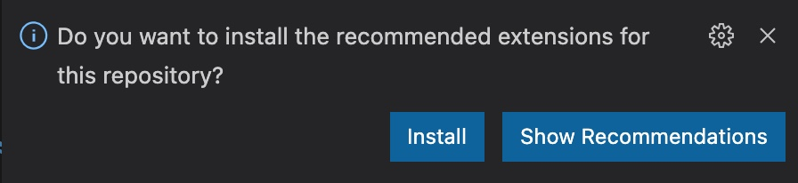
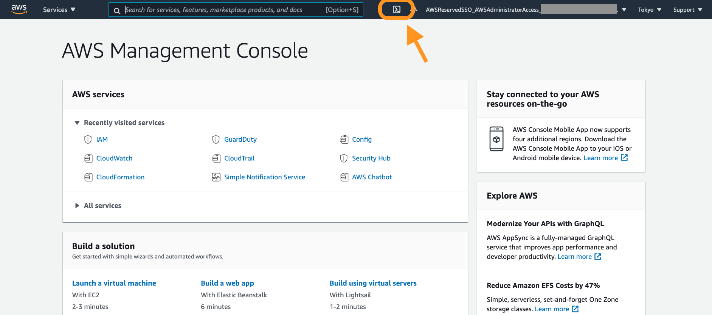
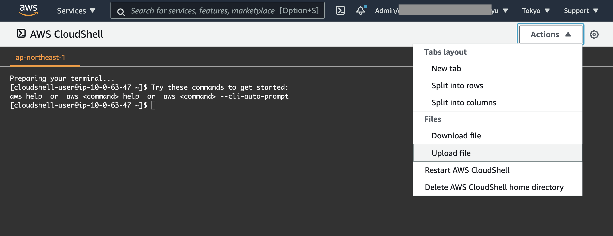

# HowTo

[In English](HowTo.md) | [リポジトリの README に戻る](../README_ja.md)

ここでは各種設定の HowTo について記載します。

- [VisualStudioCode のセットアップ](#VisualStudioCode-のセットアップ)
- [Git の pre-commit hook のセットアップ](#Git-の-pre-commit-hook-のセットアップ)
- [デプロイ時の承認をスキップしロールバックさせない](#デプロイ時の承認をスキップしロールバックさせない)
- [AWSChatbot 用に Slack を設定する](#AWSChatbot-用に-Slack-を設定する)
- [CloudShell によるデプロイメント](#CloudShell-によるデプロイメント)
- [依存パッケージの最新化](#依存パッケージの最新化)
- [通常の開発の流れ](#通常の開発の流れ)
- [セキュリティ指摘事項の修復](#セキュリティ指摘事項の修復)

---

## VisualStudioCode のセットアップ

テキストエディタの選択は任意ですが、ここでは VSCode を使用した場合のセットアップ手順を記述します。他のテキストエディタを使用する場合、以下のツールと連携可能なものを使用することを強く推奨します。

- [EditorConfig](https://editorconfig.org/)
- [Prettier](https://prettier.io/)
- [ESLint](https://eslint.org/)

> NOTE:
>
> コード補完や定義箇所へのジャンプなどは[VSCode のビルトイン機能](https://code.visualstudio.com/docs/languages/typescript)を使って実現されています。他のテキストエディタで同等の機能を使用したい場合は、 [Language Server Protocol (LSP)](https://microsoft.github.io/language-server-protocol/) をサポートするテキストエディタまたはそのプラグインの利用をご検討ください。

### VSCode のインストールと初期設定

[Visual Studio Code](https://code.visualstudio.com/) よりインストールしてください。

macOS の場合、 [Running Visual Studio Code on macOS](https://code.visualstudio.com/docs/setup/mac) の手順に従い、 `code` コマンドがシェルから実行できるように設定してください。Windows では自動で設定されます。

### VSCode Extension のインストール

後続の手順でこのリポジトリを clone して VSCode で開くと、推奨 Extension のインストールを促されます。ここで _Install_ をクリックます。



この推奨 Extension は `.vscode/extensions.json` で定義されています。この機能の詳細は [Managing Extensions in Visual Studio Code](https://code.visualstudio.com/docs/editor/extension-marketplace#_workspace-recommended-extensions) をご参照ください。

### VSCode Extension の設定

`Ctrl + Shift + p` (macOS: `Command + Shift + p`) を押してコマンドパレットを表示し、 `Preferences: Open Settings (JSON)` を選択します。以下の設定を追加します。
これによって保存時にコードの Linting、フォーマッティング等が行われるようになります。

```json
    "editor.codeActionsOnSave": {
        "source.fixAll.eslint": true
    },
    "editor.defaultFormatter": "esbenp.prettier-vscode",
    "editor.formatOnSave": true,
    "prettier.useEditorConfig": true,
```

---

## Git の pre-commit hook のセットアップ

### simple-git-hooks のセットアップ

BLEA ソースコードのトップディレクトリで以下のコマンドを実行します。

```sh
# BLEAのトップディレクトリで
npx simple-git-hooks
```

Git の hook が設定され(.git/hooks/pre-commit) コミット前に lint-staged が実行されるようになります。

### git-secrets のインストールと設定

lint-staged では eslint と prettier によるチェックに加え、git-secrets によるチェックが実行されるよう設定されています(package.json)。

[awslabs/git-secrets - GitHub](https://github.com/awslabs/git-secrets) を README に従いインストールしてください。その後、以下のコマンドを実行して git コマンドと連携させます。

```sh
git secrets --register-aws --global
```

次に、ダミーの値として許可される認証情報のリストを登録します。 `~/.gitconfig` を編集し、上述のコマンドによって生成された `[secrets]` セクションを探して以下を追記します。これらは BLEA のソースコード内でダミーとして使用しているアカウント ID です。

```text
    # Fictitious AWS Account ID
    allowed = 111122223333
    allowed = 444455556666
    allowed = 123456789012
    allowed = 777788889999
    allowed = 000000000000
    allowed = 111111111111
    allowed = 222222222222
    allowed = 333333333333
```

> NOTE
>
> `git secrets install` は実行**しない**でください。本プロジェクトでは `simple-git-hooks`を使用して pre-commit をフックし、ここから git-secrets を呼び出しています。 `git secrets install` を実行するとフックが競合します。

---

## デプロイ時の承認をスキップしロールバックさせない

cdk コマンドにオプションを指定することで、デプロイ時の挙動をコントロールできます。ここではよく利用される便利な設定について記載します。

- See: https://docs.aws.amazon.com/cdk/latest/guide/cli.html#cli-deploy

### デプロイ時の承認をスキップする

通常、CDK によるデプロイを行う場合、承認を求めるプロンプトが表示されますが、cdk のコマンドラインに `--require-approval never` オプションを指定することで確認のプロンプトが表示されなくなります（ただし利用にはご注意ください！）。

### デプロイに失敗してもロールバックさせない

CDK は CloudFormation を使ってデプロイしますが、通常デプロイ時にエラーが発生すると対象スタックはロールバックされ、デプロイを開始する前の状態にまで戻ります。cdk のコマンドラインに`-R`または`--no-rollback`オプションを指定すると、デプロイエラーになったときもロールバックされず、エラーになった時点でデプロイの処理が停止します。エラー内容を修正して再度デプロイすると処理が停止した時点から再開されます。設定の試行錯誤を行う場合に便利です。

### cdk.json に設定する方法

以下のように`requireApproval`と`rollback`を cdk.json に設定することで、コマンドで都度設定する必要が無くなります。

```json
{
  "app": "npx ts-node --prefer-ts-exts bin/blea-guest-ecs-app-sample.ts",
  "requireApproval": "never",
  "rollback": false,
```

---

## AWS Chatbot 用に Slack を設定する

アラームを Slack に送るためには BLEA-ChatbotSecurity および BLEA-ChatbotMonitor stack をデプロイします。これらのスタックをデプロイする前に、AWS Chatbot に対してチャットクライアントのセットアップが必要です。この作業を行なっていないとスタックのデプロイに失敗します。
AWS Chatbot の設定手順は以下の通りです。

### 1. Slack に workspace と channel を作る

(この手順は Slack での操作です) workspace を作り、メッセージを受信したい Slack channel を作ります。Slack channel ID をメモしてください(channel ID はチャネル名を右クリックして"Copy Link"でコピーできます). このリンクは次のようになります。 `https://your-work-space.slack.com/archives/C01XXXXXXXX`. ここで、 `C01XXXXXXXX` が
そのチャネルの channel ID です。

### 2. AWS Chatbot でチャットクライアントをセットアップする

以下の手順の "Step 1: Setting up AWS Chatbot with Slack" の 1〜5 にしたがって、Slack workspace を AWS Chatbot に作成してください。

- See: https://docs.aws.amazon.com/chatbot/latest/adminguide/slack-setup.html

作成した Workspace の ID をメモしてください。`T8XXXXXXX`のようになります。

> Note
>
> Slack のプライベートチャネルを利用する場合は、そのチャネルで `/invite @AWS` コマンドを実行しておく必要があります。

### 3. パラメータファイル (parameter.ts) に workspace ID と channel ID を設定する

各ユースケースにあるパラメータファイル (parameter.ts) に、次のように Slack workspace ID と Channel ID を設定します。セキュリティ用とモニタリング用で Channel は異なるものを指定してください:

セキュリティ用（ガバナンスベース）:

```typescript
export const devParameter: AppParameter = {
  // ...
  securitySlackWorkspaceId: 'T8XXXXXXX',
  securitySlackChannelId: 'C00XXXXXXXX',
  // ...
};
```

モニタリング用（サンプルアプリケーション）:

```typescript
export const devParameter: AppParameter = {
  // ...
  monitoringSlackWorkspaceId: 'T8XXXXXXX',
  monitoringSlackChannelId: 'C00XXXXXYYY',
  // ...
```

| 設定項目                   | 値の取得元                                                                                                                                          |
| -------------------------- | --------------------------------------------------------------------------------------------------------------------------------------------------- |
| securitySlackWorkspaceId   | workSpace ID: AWS Chatbot の Workspace details からコピー - セキュリティアラーム用                                                                  |
| securitySlackChannelId     | Slack App の対象チャネルのリンクから取得 - セキュリティアラーム用                                                                                   |
| monitoringSlackWorkspaceId | workSpace ID: AWS Chatbot の Workspace details からコピー - モニタリングアラーム用（通常はセキュリティ用と同じ workspace を使うことが多いでしょう） |
| monitoringSlackChannelId   | Slack App の対象チャネルのリンクから取得 - モニタリングアラーム用                                                                                   |

---

## CloudShell によるデプロイメント

CloudShell を使い、マネジメントコンソールからこのテンプレートをデプロイすることが可能です。
ただし ClouShell は 120 日間使用しないとセットアップした環境のデータを削除することに注意してください。

see: https://docs.aws.amazon.com/cloudshell/latest/userguide/limits.html

### 1. CloudShell を起動する

- AWS マネジメントコンソールの [>_] アイコンをクリックして CloudShell を起動する (画面右上のアカウント名の隣)
  

### 2. CDK の実行環境をセットアップする

See: https://docs.aws.amazon.com/ja_jp/cdk/latest/guide/getting_started.html

- npm をアップデートする

```sh
sudo npm -g install npm
```

### 3. CDK コードをアップロードする

1. デプロイ対象の CDK コードをダウンロードし、zip 等でアーカイブする。
2. CloudShell の画面から [Action]-[Upload File] をクリックし、アーカイブしたファイルをアップロードする
   

3. アップロードしたファイルを展開する

- リモートリポジトリにアクセスできる場合は、CloudShell で git clone して CDK コードを取得することも可能です

### 4. デプロイ

```sh
cd path/to/source
npm ci
# デプロイしたいusecaseのディレクトリに移動する
cd usecases/blea-uest-serverless-api-sample
npx aws-cdk deploy --all --profile prof_dev
```

---

## 依存パッケージの最新化

最新の CDK を使用する場合は、依存する NPM パッケージをアップデートする必要があります。アップデートの手順は次の通りです。これは BLEA のトップディレクトリで行います。

```sh
# BLEAのトップディレクトリで
npm update --workspaces
```

> NOTE
>
> ここで依存パッケージのバージョン不整合が発生した場合、適宜 package.json を修正します。例えば、`jest` はこのプロジェクトのテストツールとして使用されているため、 package.json に `devDependencies` として記載されています。`aws-cdk` も同様に `jest` に依存しており、 `ncu -u` によって package.json に記載された `jest` のバージョンが `aws-cdk` が必要とするバージョンと一致しなくなるおそれがあります。

---

## 通常の開発の流れ

コードをチェックアウトしたあと、CDK コードを編集してビルド、デプロイする流れは次のようになります。

### 1. コードをチェックアウトし、必要なライブラリをインストールする

> ```sh
> git clone https://github.com/aws-samples/baseline-environment-on-aws.git
> cd baseline-environment-on-aws
> npm ci
> ```

### 2. 単一のユースケースをデプロイ、変更、テストする

```sh
cd usecases/blea-guest-web-app-sample

# 差分を確認する
npx aws-cdk diff --all --profile prof_dev

# 任意のエディタで CDK コードを編集する（Visutal Studio Code を推奨します）
# ....

# linting (体裁を確認)
npm run lint

# formatting (整形)
npm run format

# snapshot testを実行する (see NOTE)
npm run test

# デプロイ（作業迅速化のため、承認を求めず、またロールバックを実行しないオプションを指定しています）

npx aws-cdk deploy --all --profile prof_dev --require-approval never --no-rollback

# 以下、確認、変更、テスト、デプロイを繰り返す

```

NOTE:

> CDK コードを変更した場合、以前とは異なるテンプレートが生成されるため、スナップショットテスト (npm run test) が失敗します
> テンプレートが正しく生成されているならば、次のようにスナップショットの更新が必要です。

```sh
# Update snapshot
npm run test -- -u
```

# 3. BLEA の全ユースケースをまとめて操作する

のユースケースを検証、テストするには `workspaces` を使用して次のように実行します。

```sh
# BLEAのルートディレクトリで実行
npm ci
npm run lint
npm run format
npm run clean --workspaces
npm run test --workspaces -- -u      # update snaphosts
npm run test --workspaces
```

NOTE:

個別のユースケースを workspaces を使用してテストするには次のように実行します。workspaces と workspace の違いに注意してください。

```sh
# BLEAのルートディレクトリで実行
npm run test --workspace usecases/blea-gov-base-standalone
```

# 4. 追加パッケージをインストールする

K コードで追加のパッケージが必要になった場合は、以下のようにインストールします。ここでは `@aws-cdk/aws-glue-alpha` をインストールしています。

```sh
# BLEAのルートディレクトリで実行
npm i -P @aws-cdk/aws-glue-alpha --workspace usecases/blea-guest-ecs-app-sample
```

---

## セキュリティ指摘事項の修復

ガバナンスベースをデプロイした後でも、Security Hub のベンチマークレポートで 重要度が CRITICAL あるいは HIGH のレベルでレポートされる検出項目があります。これらに対しては手動で対応が必要です。

> オプション: Security Hub の 検出項目を無効化することもできます（推奨しません。無効化する場合はセキュリティリスクを十分に評価した上で実施して下さい）。

https://docs.aws.amazon.com/securityhub/latest/userguide/securityhub-standards-enable-disable-controls.html

### 1. ルートユーザに対して MFA を有効化する

ルートユーザに対する MFA の設定は手動で実施する必要があります。ルートユーザとはマネジメントコンソールにログインする際に、E メールアドレスを使ってログインするユーザのことです。

MFA に関連する Security Hub コントロール（CRITICAL レベル）

- [CIS.1.13] Ensure MFA is enabled for the "root" account
  - https://docs.aws.amazon.com/securityhub/latest/userguide/securityhub-cis-controls.html#securityhub-cis-controls-1.13
- [CIS.1.14] Ensure hardware MFA is enabled for the "root" account
  - https://docs.aws.amazon.com/securityhub/latest/userguide/securityhub-cis-controls.html#securityhub-cis-controls-1.14
- [IAM.6] Hardware MFA should be enabled for the root user
  - https://docs.aws.amazon.com/securityhub/latest/userguide/securityhub-standards-fsbp-controls.html#fsbp-iam-6

#### 修復方法

##### 1. Organizations メンバアカウントのルートユーザにアクセスする

- https://docs.aws.amazon.com/organizations/latest/userguide/orgs_manage_accounts_access.html#orgs_manage_accounts_access-as-root

##### 2. ルートユーザに対してハードウェア MFA を有効化する

- https://docs.aws.amazon.com/IAM/latest/UserGuide/id_credentials_mfa_enable_physical.html#enable-hw-mfa-for-root

### 2. EC2 のメタデータアクセスに IMDSv2 を使う

EC2 インスタンスのメタデータアクセスには IDMSv2 のみを使用することが推奨されています。修復については以下のドキュメントを参照してください。

- [EC2.8] EC2 instances should use IMDSv2
  - https://docs.aws.amazon.com/securityhub/latest/userguide/securityhub-standards-fsbp-controls.html#fsbp-ec2-8

### 3. CodeBuild の特権モードに関する通知のステータスを変更する

CodeBuild では Docker イメージをビルドするときにのみ特権モードが有効化されるべきです。以下のコントロールがコンプライアンス違反となった場合には、その CodeBuild プロジェクトが特権モードを有効化する必要があるかを確認し、もし必要だと確認された場合にはワークフローのステータスを SUPPRESSED に変更します。

- [CodeBuild.5] CodeBuild project environments should not have privileged mode enabled
  - https://docs.aws.amazon.com/securityhub/latest/userguide/securityhub-standards-fsbp-controls.html#fsbp-codebuild-5

ワークフローのステータスを変更する方法は以下のドキュメントを参照してください。

https://docs.aws.amazon.com/securityhub/latest/userguide/finding-workflow-status.html
