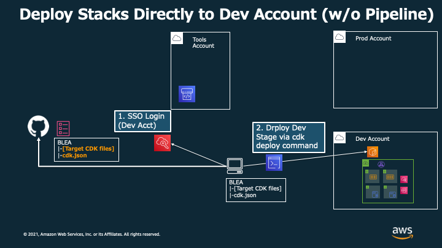

# Deploy CDK Application via CDK Pipelines

[View this page in Japanese (日本語)](README_ja.md) | [Back to Repository README](../../README.md)

As an example of CI/CD with CDK, this document shows how to use sample to deploy CDK Application via CDK Pipelines.

CDK Pipelines is a high-level construct library that makes it easy to set up a continuous deployment pipeline for your CDK applications, powered by AWS CodePipeline. By building pipelines quickly with CDK pipelines, you can simplify application development and focus on areas of greater interest.

A sample has been implemented in `blea-guest-ecsapp-sample-pipeline.ts` that defines the configuration (equivalent to `guest-webapp-sample/bin/blea-guest-ecsapp-sample.ts` ) as Stage (class that defines deployment units in CDK Pipelines) and deploys from the pipeline.

In case you have already deployed the use case `guest-webapp-sample/bin/blea-guest-ecsapp-sample.ts`, you will deploy the same application with a different stack name by following steps below to complete the CDK Pipelines deployment. To avoid duplicate billing and failed deployments, run `npx cdk destroy` to delete stacks that have already been deployed.

## Overview

### (Common) Setup Tools Account for deploying pipeline.


Configure some settings for CodePipeline to access the source code

### Architecture Pattern A - Deploy pipeline and application in the same account


How to deploy both pipelines and applications in the same account is shown. When CodePipeline detects a push to a Git repository, application update is triggered by the pipeline. you can deploy this architecture when you have executed must steps shown below.

### Architecture Pattern B - Deploy CDK application to the different account via pipeline


Deploy CDK application to a different account than the account that has a pipeline (Tools account). You can verify this configuration if you include Appendix A among the steps shown below.

### Architecture Pattern C - Deploy CDK application to multiple account via pipelines


Here's an example of multiple accounts deployment by creating a pipeline for each account. This configuration can be verified by performing the tasks required by Configuration B for each account.

### (Appendix) Deploy CDK application directly without pipeline when developing



You can also deploy applications directly from your local environment without pipeline. The procedure for this configuration can be verified by following the steps shown in Appendix B. DO NOT use this configuration in production.

## Pipeline Deployment

### Prerequisities

- Bootstrapped account (Tools account (ID: `222222222222`)) and region to which the pipeline will be deployed
- An AWS CLI profile with credentials to access the Tools account with Administrator privileges (referred to as `blea-pipeline-tool-exec` in this document)

> **Note** we recommend that you use administrative credentials to an account only to bootstrap it and provision the initial pipeline. Otherwise, access to administrative credentials should be dropped as soon as possible. (Reference : [CDK Pipelines Doc](https://docs.aws.amazon.com/cdk/api/v1/docs/pipelines-readme.html))

### 1. Connect to GitHub using AWS CodeStar Connections

1. Login to Tools account's AWS Console
2. Open [CodePipeline] Service
3. Click [Settings]=>[Connections] on the bottle of left navigation pane. Then click [Create connection]
   
4. Select [GitHub] and input [Connection name]. Click [Connect to GitHub].
   
5. Click [Install a new app] to setup "AWS Connector for GitHub" app
   
6. On [Install AWS Connector for GitHub], Choose your repository and Click [Install]. Then you return to AWS Console.
   
7. On [Connect to GitHub] page, Click [Connect]
   
8. Now you can see Arn for connection, like `arn:aws:codestar-connections:ap-northeast-1:xxxxxxxxxxxx:connection/xxxxxxxx-xxxx-xxxx-xxxx-xxxxxxxxxxxx`. Copy it for later use.
   

### 2. Setup Connections information to `cdk.json`

Update `cdk.json` (in this case, `usecases/guest-webapp-sample/cdk.json`) of target application so CodePipeline can access your BLEA repository and specify a target branch.

```json
    "dev": {
      "envName": "development",

      ~~~~~ (Your App Context) ~~~~~

      "repository": "ownername/repositoryname",
      "branch": "main",
      "connectionArn": "arn:aws:codestar-connections:ap-northeast-1:xxxxxxxxxxxx:connection/xxxxxxxx-xxxx-xxxx-xxxx-xxxxxxxxxxxx"
    },
```

- `dev`: Environment name to specify on CDK command line. ex) `npx cdk deploy -c environment=dev`
- `repository`: GitHub repository name. If your reopsitory URL is 'https://github.com/ownername/repositoryname.git', you can specify `ownername/repositoryname`.
- `branch`: Target branch (When push to this branch, CodePipeline will triggerd).
- `connectionArn`: Connection Arn copied from the previous section.

### 3. Deploy CodePipeline project

#### 3.1. Setup Application to be built in `cdk.json` file

The target file of `cdk synth` or `cdk deploy` is selected by `-a` option or `app` configuration in `cdk.json`. For example, you can deploy sample pipeline by overwrite configuration as following

##### **`usecases/guest-webapp-sample/cdk.json`**

```ts
{
  "app": "npx ts-node --prefer-ts-exts bin/blea-guest-ecsapp-sample-pipeline.ts",
  // ...
```

#### 3.A (Optional) Change deployment environment

In CDK Pipeline , `cdk synth` command is executed in CodeBuild in Tools Account. Here is a example implementation of synth command. You can change deployment environment by Pipeline Stack Prop `environment` (`dev` is set to default).

##### **`usecases/guest-webapp-sample/blea-ecsapp-sample-pipeline-stack.ts`**

```ts
// ...
        commands: [
        ~~~ (Your Build Commands) ~~~
          `npx cdk synth --app "npx ts-node --prefer-ts-exts bin/blea-guest-ecsapp-sample-pipeline.ts" -c environment=${environment}`,
          `npx cdk ls -c environment=${environment}`,
        ],
        // ...
```

> **Note**
> You don't have to select `--profile` option in executing synth command in CodeBuild Project. This is because CodeBuild has enough privileges in its execution role. If you want to run it locally, you can execute it by specifying Profile like `npx cdk synth -c environment=dev --profile xxxxxx`.

##### **`usecases/guest-webapp-sample/bin/blea-guest-ecsapp-sample-pipeline.ts`**

```ts
const prodStack = new BLEAPipeline.BLEAPipelineStack(app, `${pjPrefix}-Prod-Pipeline`, {
  repository: envVals['repository'],
  branch: envVals['branch'],
  connectionArn: envVals['connectionArn'],
  env: procEnv,
  environment: 'prod', // you can change context env.
  deployStage: new BLEAPipelineStage(app, `${pjPrefix}-Prod-Stage`),
});
```

#### 3.2 Deploy pipeline to Tools Account

You can deploy sample pipeline to Tools account by using these commmands from your local machine.

```sh
npm ci
cd usecase/guest-webapp-sample/
npx cdk bootstrap -c environment=prodpipeline --profile your_profile_name  # If you haven't bootstrapped target account
npx cdk deploy -c environment=prodpipeline --profile your_profile_name
```

### 4. Update BLEA codes, push and deploy

Once your pipeline is deployed, you can continue to deploy code changes for BLEA. When the changes are pushed to GitHub, CodePipeline is triggered and retrieves the source code from the Git repository. Inside CodePipeline, CodeBuild synthesizes Cloud Assembly, and then deploy them.

Now, you have deploy CDK Application defined in Stage in `guest-webapp-sample/bin/blea-guest-ecsapp-sample-pipeline.ts` through a pipeline.

> **Note**
> In CDK Pipelines, you can continuously deploy your deployment pipeline as target repository updates by using `SelfMutation`. You can also deploying all stack you define via Tools Account by using it.

---

## Appendix A - Cross Account Deployment

CDK Pipelines is easy way to implement pipelines for deploying applications to multiple accounts.
In this appendix,
how to execute cross account deployment to different account (Prod account (ID: `333333333333`)) from the Tools account is shown.

### Prerequisities

- Production account is registered to Organizations
- Credential can be get via SSO
- Private Git repository that no third party can access to. The account information will be listed in the pipeline stack or `cdk.json`.

> **Note**
> In this usecase, Git repository must be manageed as **PRIVATE**. This is because the account information about application deployment by the pipeline is required in the repository.
> For example, if you are developing on GitHub, you need to create a private repository by cloning and pushing this public repository. If you fork this repository, you will not be able to manage it as a private repository.

### Change in Code

1.Enable cross account deployment by setting `crossAccountKey` to `true`.

**`usecases/guest-webapp-sample/pipeline/blea-ecsapp-sample-pipeline-stack.ts`**

```ts
const pipeline = new pipelines.CodePipeline(this, `${id}-pipeline`, {
    crossAccountKeys: true,
    synth: new pipelines.CodeBuildStep('SynthStep', {
        input: pipelines.CodePipelineSource.connection(props.repository, props.branch, {
```

> **Note**
> When `crossAccountKey` is `true`, account information is evaluated more strictly in the test. Account information must be selected explicitly in the pipeline stack.

### Passing account information in Stage instantiation that is deployed by the pipeline

**`usecases/guest-webapp-sample/bin/blea-guest-ecsapp-sample-pipeline.ts`**

```ts
new BLEAPipelineStack(app, `${pjPrefix}-Pipeline`, {
  repository: envVals['repository'],
  branch: envVals['branch'],
  connectionArn: envVals['connectionArn'],
  env: getProcEnv(),

  deployStage: new BLEAPipelineStage(app, `${pjPrefix}-Pipeline-Deployment`, {
    env: {
      account: envVals['prodEnv']['account'],
      region: envVals['prodEnv']['region'],
    }, // you can change deploy account by changing this value.
  }),
});
```

When adding account information, you have to edit `cdk.json` as following

```json
"dev": {
    "envName": "Production",

    ~~~~~ (Your App Context) ~~~~~

    "repository": "ownername/repositoryname",
    "branch": "main",
    "connectionArn": "arn:aws:codestar-connections:ap-northeast-1:xxxxxxxxxxxx:connection/xxxxxxxx-xxxx-xxxx-xxxx-xxxxxxxxxxxx",
    "prodEnv": {
        "account": "333333333333",
        "region": "ap-northeast-1"
    }
},
```

### Setting up Prod Account

Prerequisity: Profile of Prod Account is set like following

```
[profile blea-pipeline-prod-sso]
sso_start_url = https://xxxxxxxxxxxx.awsapps.com/start#/
sso_region = ap-northeast-1
sso_account_id = 333333333333
sso_role_name = AWSAdministratorAccess
region = ap-northeast-1

[profile blea-pipeline-prod-exec]
credential_process = aws2-wrap --process --profile blea-pipeline-prod-sso
region = ap-northeast-1
```

1. Login to Prod Account via SSO

```sh
aws sso login --profile blea-pipeline-prod-sso
```

2. Bootstrap Prod Account

```sh
npx cdk bootstrap --profile blea-pipeline-prod-exec --cloudformation-execution-policies arn:aws:iam::aws:policy/AdministratorAccess --trust 222222222222 aws://333333333333/ap-northeast-1 -c environment=prod
```

3. Bootstrap Tools Account

```sh
npx cdk bootstrap -c environment=dev --profile blea-pipeline-tool-exec --cloudformation-execution-policies arn:aws:iam::aws:policy/AdministratorAccess aws://222222222222/ap-northeast-1
```

4. Deploy pipeline to Tools account

```sh
npx cdk deploy -c environment=dev --profile blea-pipeline-tool-exec
```

## Appendix B - Deploy copy of application stack to Development Account

When actually developing a system using the CDK, it is necessary to deploy the stack without pipeline to shorten the development cycle. In that case, you can also deploy the stack itself, which is deployed by the pipeline, to the development environment account, instead of the pipeline.

### Prerequisities

- An account is paid out for the development environment (Dev account (ID: `xxxxxxxxxxxx`)) and it is registered in the Organizations.
- Credential can be obtained via SSO.

```json
    "dev": {
      "env": {
        "account": "xxxxxxxxxxxx",
        "region": "ap-northeast-1"
      },
      "envName": "Development",

      ~~~~~ (Your App Context) ~~~~~

      "githubRepository": "ownername/repositoryname",
      "githubTargetBranch": "main",
      "codestarConnectionArn": "arn:aws:codestar-connections:ap-northeast-1:xxxxxxxxxxxx:connection/xxxxxxxx-xxxx-xxxx-xxxx-xxxxxxxxxxxx",
      "prodEnv": {
            "account": "333333333333",
            "region": "ap-northeast-1"
        }
    },
```

```
[profile blea-pipeline-dev-sso]
sso_start_url = https://xxxxxxxxxxxx.awsapps.com/start#/
sso_region = ap-northeast-1
sso_account_id = xxxxxxxxxxxx
sso_role_name = AWSAdministratorAccess
region = ap-northeast-1

[profile blea-pipeline-dev-exec]
credential_process = aws2-wrap --process --profile blea-pipeline-dev-sso
region = ap-northeast-1
```

### Deploy Stack itself directly to the Development environment

For example, if you want to deploy with `BLEA-ECSApp` defined in `BLEA-Dev-Stage`, deploy to the Dev account with the following command

```
npx cdk deploy BLEA-Dev-Stage/BLEA-ECSApp -c environment=dev --profile=blea-pipeline-dev-exec
```

In addition, you can check the list of stacks (e.g. `BLEA-Dev-Stage/BLEA-ECSApp` in the above command) that can be deployed by the following command

```
npx cdk ls -c environment=dev
```
