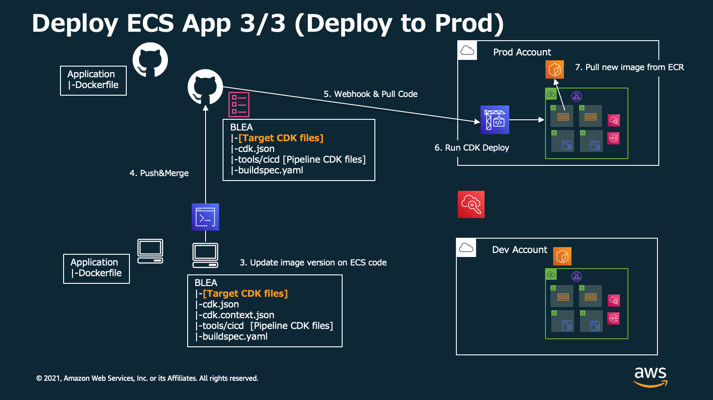

# Deployment pipeline for Baseline Envirionment on AWS with GitHub

[View this page in Japanese (日本語)](README_ja.md) | [Back to Repository README](../../README.md)

This CDK application deploys Simple CodePipeline project to deploy resouces defined in BLEA to the same AWS account.

# Overview

## 1. Setup Tools Account for deploying pipeline.


## 2. Deploy Pipeline and Application in the same account


## 3. Deploy Copy of Application Stack to Development Account from Local Machine (WIP)


## 4. Deploy Application to Production Account via Pipeline (WIP)


# Deployment

## Prerequisities

- You have bootstrapped CDK on the Tools account.
- You have configured AWS CLI environment (credentials) to access Tools account as Administrator.
- You have forked BLEA repository to your GitHub account.

## 1. Connect to GitHub using OAuth

1. Login to Tools account's AWS Console
2. Open `CodePipeline` Service
3. Click `Settings`=>`Connections` on the bottle of left navigation pane. Then click `Create connection`
   
4. Select `GitHub` and input `Connection name`. Click `Connect to GitHub`.
   
5. Click `Install a new app` to setup "AWS Connector for GitHub" app
   
6. On `Install AWS Connector for GitHub`, Choose your repository and Click `Install`. Then you return to AWS Console.
   
7. On `Connect to GitHub` page, Click `Connect`
   
8. Now you can see Arn for connection, like "arn:aws:codestar-connections:ap-northeast-1:xxxxxxxxxxxx:connection/xxxxxxxx-xxxx-xxxx-xxxx-xxxxxxxxxxxx". Copy it for later use.
   

## 2. Setup your CDK Pipelines project configuration

Update `cdk.json` of target application so CodePipeline can access your BLEA repository and specify a target branch.

```json
    "prodpipeline": {
      "env": {
        "account": "222222222222",
        "region": "ap-northeast-1"
      },
      "envName": "Production",

      // ~~~~~ (Your App Context) ~~~~~

      "githubRepository": "ownername/repositoryname",
      "githubTargetBranch": "main",
      "codestarConnectionArn": "arn:aws:codestar-connections:ap-northeast-1:xxxxxxxxxxxx:connection/xxxxxxxx-xxxx-xxxx-xxxx-xxxxxxxxxxxx"
    },
```

- `prodpipeline`: Environment name to specify on CDK command line. In this sample, it should be `-c environment=prodpipeline`
- env: Target account and region you want to deploy pipeline and resources. If your application is deployed to other accounts from Tools Account, target account must be bootstrapped and configured to trust Tools Account.
- envName: Environment name discription.
- githubRepository: GitHub repository name. If your reopsitory URL is 'https://github.com/ownername/repositoryname.git', you can specify `ownername/repositoryname`.
- githubTargetBranch: Target branch (When merged to this branch, CodePipeline will triggerd).
- codestarConnectionArn: Connection Arn copied from the previous section.

### 2.a (Optional) Setup Cross-Account Deployment Configuration (WIP)

### 2.b (Optional) Upload local `cdk.context.json` file to SSM Parameter Store in Tools Account

In CDK Pipelines' Stack, `cdk synth` command is executed in CodeBuild Project. Therefore, we reccomend you to use context defined in `cdk.json` file when Build/Synth your application. In case you can't commit `cdk.json` file to remote repository due to specific requirements, you can deploy your applocation without pushing your account information or other confidential configurations by uploading your local `cdk.context.json` file to SSM Parameter Store in Tools Account. Here is quick example implemented in sample case. CodeBuild Project can get context information by calling SSM API.

#### **`usecases/guest-webapp-sample/blea-ecsapp-sample-pipeline-stack.ts`**

```ts
        installCommands: [
          'n stable',
          'node -v',
          'npm i -g npm@8.3',
          'cd usecases/guest-webapp-sample',
          // If you don't want to commit cdk.json file to remote repo, you can refer it via SSM Parameter Store
          'aws ssm get-parameter --name "/pipeline-context/guest-webapp-sample/cdk.context.json" | jq -r .Parameter.Value > cdk.context.json',
          'cd ../..',
        ],
```

## 3. Deploy CodePipeline project

Currently, sample usecase that deploy `guest-webapp-sample/blea-guest-ecsapp-sample.ts` application via pipeline `guest-webapp-sample/blea-guest-ecsapp-sample-pipeline.ts` is implemented.
You can deploy this pipeline by following

### 3.1. Setup Application to be built in `cdk.json` file

The target file of `cdk build` or `cdk deploy` is selected by `-a` option or `app` configuration in `cdk.json`. For example, you can deploy sample pipeline by overwrite configuration as following

#### **`usecases/guest-webapp-sample/cdk.json`**

```json
{
  "app": "npx ts-node bin/blea-guest-ecsapp-sample-pipeline.ts",
  // ...
```

### 3.2. Confirm Synth Command Definition (at pipeline stack and `package.json` )

In CDK Pipeline Instance, `cdk synth` command is executed in CodeBuild Project in Tools Account. Here is a example implementation of synth command.

#### **`usecases/guest-webapp-sample/blea-ecsapp-sample-pipeline-stack.ts`**

```ts
        // ...
        commands: [
          'echo "node: $(node --version)" ',
          'echo "npm: $(npm --version)" ',
          'npm ci',
          'npm audit',
          'npm run lint',
          // move to repository to be deployed by this pipeline
          'cd usecases/guest-webapp-sample',
          'npm run build',
          'npm run test',
          // 'npx cdk context',
          'npm run synth:dev_context',
          // 'npx cdk ls -c environment=my-dev-multi',
        ],
        // ...
```

You can deploy target application from pipeline by overwriting code `'npm run synth:dev_context',` to your configuration or overwriting/adding appropreate synth command to `script` configuration defined in `package.json`

#### **`usecases/guest-webapp-sample/package.json`**

```json
  // ...
  "scripts": {
    "synth:dev": "npx cdk synth -c environment=dev && npx cdk synth --app \"npx ts-node bin/blea-guest-asgapp-sample.ts\" -c environment=dev && npx cdk synth --app \"npx ts-node bin/blea-guest-ec2app-sample.ts\" -c environment=dev && npx cdk synth --app \"npx ts-node bin/blea-guest-ecsapp-ssl-sample.ts\" -c environment=dev",
    "synth:dev_context": "npx cdk synth -c environment=dev-context && npx cdk synth --app \"npx ts-node bin/blea-guest-asgapp-sample.ts\" -c environment=dev-context && npx cdk synth --app \"npx ts-node bin/blea-guest-ec2app-sample.ts\" -c environment=dev-context && npx cdk synth --app \"npx ts-node bin/blea-guest-ecsapp-ssl-sample.ts\" -c environment=dev-context",
    "synth_dev_context_test": "npx cdk synth -c",
    "depcheck": "npx depcheck --ignore-dirs cdk.out",
    "build": "tsc --build",
    // ...
```

> Notes: You don't have to select `--profile` option in executing synth command in CodeBuild Project. This is because CodeBuild has enough privileges (Administrator privileges in Tools Account) to execute it.

### 3.3 Deploy pipeline to Tools Account

You can deploy sample pipeline to Tools account by using these commmands from your local machine.

```sh
cd usecase/guest-webapp-sample/
npm ci
npm run build
npx cdk bootstrap -c environment=prodpipeline --profile your_profile_name  # If you haven't bootstrapped target account
npx cdk deploy -c environment=prodpipeline --profile your_profile_name
```

## 4. Update BLEA codes, merge and deploy

Now you deploy pipeline, you can add changes to BLEA codes.
When you finished updating codes, you will commit and merge updates into target branch. Don't forget to add buildspec.yaml too.

When you push the changes into GitHub, CodePipeline project will be triggerd automatically then synth and deploy resources you defined in BLEA CDK codes.

> Notes: In CDK Pipelines, you can continuously deploy your deployment pipeline as target repository updates by using `SelfMutation`. You can also deploying technically all stack you define via Tools Account by using it. This feature is disabled in sampkle usecase, but you can immediately enable it by commenting out code `SelfMutation: false` at pipeline stack.

<!-- # Appendix - How to deploy container image from GitHub

## 1. Push container image to ECR on Development environment and Deploy with CDK.


## 2. Commit dockerfile and build image with GitHub Actions then push it to ECR on Prod.


## 3. Commit updated BLEA code to GitHub and ECS pull new container image from ECR.

 -->

# Appendix - Deploy copy of application stack to Development Account(WIP)
