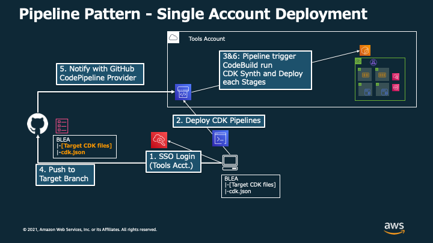

# CDK Pipelines を使用して guest-webapp-sample をデプロイする

[In English](PipelineDeployment.md) | [リポジトリの README に戻る](../README_ja.md)

CDK による CI/CD の一例として、このドキュメントでは [CDK Pipelines](https://docs.aws.amazon.com/cdk/v2/guide/cdk_pipeline.html) を用いてアプリケーションをデプロイするためのサンプルコードの使用方法を示します。

CDK Pipelines は、AWS CodePipeline によって CDK アプリケーションの継続的なデプロイパイプラインを簡単にセットアップできる高レベルのコンストラクトライブラリです。CDK pipelines で迅速にパイプラインを構築することで、アプリケーション開発を簡素化し、より関心の高い部分に注力することができます。

現状、以下のサンプルを提供しています。

- `blea-gov-base-ct`（マルチアカウント版 ベースライン）をデプロイするパイプライン
- `blea-guest-ecs-app-sample`（独自ドメインの SSL 通信を CloudFront を受け付ける ECS アプリケーションのサンプル）をデプロイするパイプライン

稼働環境自体のデプロイはパイプラインが行います。ご自身でデプロイするのはパイプラインです。

すでにそれぞれのユースケース をデプロイ済みの場合、CDK Pipelines によるデプロイを行うと、同じアプリケーションを異なるスタック名でデプロイすることになります。課金の重複やデプロイの失敗を回避するため、すでにデプロイ済みのスタックは`npx cdk destroy` を実行して削除することをお勧めします。

## パイプラインの構成

### セットアップ（共通） - パイプラインに必要な情報を設定


CodePipeline がソースコードを取得するために必要な設定を実施します。

### 構成パターン A：同一アカウント内でパイプラインとアプリケーションをデプロイする



パイプラインとアプリケーションの両方を同一アカウント内にでデプロイします。Git リポジトリに対する Push を 契機としてアプリケーションがパイプラインによってデプロイされます。以降で示される手順のうち、必須のものを実施した場合はこちらの構成となります。

### 構成パターン B：パイプラインから別アカウントに対してアプリケーションをデプロイする


パイプラインを持つアカウント（Tools アカウント）とは別のアカウントに対してアプリケーションをデプロイします。以降で示される手順のうち、Appendix A も含めて実施した場合にこちらの構成となります。

### 構成パターン C：パイプラインから複数のアカウントに対してアプリケーションをデプロイする


複数アカウントにアプリケーションをデプロイする方法の一例として、各アカウントごとにパイプラインを作成している例を示しています。この構成は、各アカウントごとに構成 B で要求される作業を実施することで検証可能です。

## 1. 構成パターン A （同一アカウント内）の ガバナンスベースデプロイ手順

### 構築する環境の概要

- ここでは、マルチアカウント用ガバナンスベース（`usecases/blea-gov-base-ct`）をパイプラインでデプロイする手順を紹介します
- パイプラインと、そこからデプロイするガバナンスベースは同じアカウント `Dev` アカウント ID `123456789012` に作成します。
- パイプラインのパラメータは `devPipelineParameter`、ガバナンスベースのパラメータは `devParameter`とします

### 1-1. GitHub リポジトリに BLEA のコードを登録する

Git リポジトリに BLEA のコードを登録してください。
パイプラインは Git リポジトリを監視し、対象ブランチが更新されたらパイプラインをキックします。

### 1-2. AWS CodeStar Connections を使用して GitHub を接続する

パイプラインが対象 Git リポジトリにアクセスするための Connection を作成します。

1. Tools アカウントの AWS マネジメントコンソールにログインします
2. [CodePipeline] サービスを開きます
3. ナビゲーションペインの左下にある [Settings]=>[Connections] をクリックし、[Create Connection] をクリックします。


4. [GitHub] を選択して、[Connection name] を指定し、 [Connect to GitHub] をクリックします


5. "AWS Connector for GitHub"をインストールするため、[Install a new app] をクリックします


6. [Install AWS Connector for GitHub] の画面で、自身のリポジトリを選択し、[Install] をクリックします。この後画面がマネジメントコンソールに戻ります


7. [Connect to GitHub] のページで、 [Connect] をクリックします


8. 以上で Connection の ARN が画面に表示されます。形式は次のとおりです。 `arn:aws:codestar-connections:ap-northeast-1:xxxxxxxxxxxx:connection/xxxxxxxx-xxxx-xxxx-xxxx-xxxxxxxxxxxx` 後に使用するため、これをコピーします


### 1-3. AWS CLI 認証情報の設定

ゲストアカウント `Dev` にデプロイするための AWS CLI プロファイルを設定します。ここではゲストアカウントの ID を`123456789012`としています。

~/.aws/config

```text
# for Guest Account
[profile ct-guest]
sso_start_url = https://d-90xxxxxxxx.awsapps.com/start#/
sso_region = ap-northeast-1
sso_account_id = 123456789012
sso_role_name = AWSAdministratorAccess
region = ap-northeast-1
```

> **Note** Administrator 権限は CDK のブートストラップを行う際と、パイプラインをデプロイする際に必要な権限となります。セキュリティの観点から、パイプラインのデプロイが完了したら Administrator 権限を外すことが推奨されます（ [CDK Pipelines のドキュメント](https://docs.aws.amazon.com/cdk/api/v1/docs/pipelines-readme.html) より）。

### 1-4. パイプラインのパラメータを設定する

対象のアプリケーションの `parameter.ts` ファイル（今回の場合、`usecases/blea-gov-base-ct/parameters.ts`）を編集して必要な情報を指定します。ここでは CLI の認証情報で指定したゲストアカウントにデプロイすることを想定して、env は明示的に指定しない方法としています。

```typescript
// Parameter for Governance base in Dev account
export const devParameter: AppParameter = {
  envName: 'Development',
  securityNotifyEmail: 'notify-security@example.com',
  securitySlackWorkspaceId: 'T8XXXXXXX',
  securitySlackChannelId: 'C00XXXXXXXX',
  // env: { account: '123456789012', region: 'ap-northeast-1' },
};

// Parameter for Pipeline in Dev account
export const devPipelineParameter: PipelineParameter = {
  env: { account: '123456789012', region: 'ap-northeast-1' },
  envName: 'DevPipeline',
  sourceRepository: 'aws-samples/baseline-environment-on-aws',
  sourceBranch: 'main',
  sourceConnectionArn: 'arn:aws:codestar-connections:ap-northeast-1:xxxxxxxxxxxx:connection/example',
};
```

パイプライン特有のパラメータは以下の通りです。

- `sourceRepository`: GitHub リポジトリの名前。自身のリポジトリ URL が 'https://github.com/ownername/repositoryname.git' である場合、`ownername/repositoryname` を指定する
- `sourceBranch`: パイプラインが参照するブランチ名
- `sourceConnectionArn`: 先のセクションで取得した GitHub Connection の ARN

### 1-5. パイプラインをデプロイする

以下のコマンドをローカル環境から実行することで、パイプラインを 対象アカウントにデプロイします。

```sh
npm ci
cd usecase/blea-gov-base-ct/
npx aws-cdk bootstrap --profile ct-guest  # If you haven't bootstrapped target account
npx aws-cdk deploy --profile ct-guest --app "npx ts-node --prefer-ts-exts bin/blea-gov-base-ct-via-cdk-pipelines.ts"
```

作成されたパイプラインを確認するには、対象アカウントのマネジメントコンソールにアクセスして、CodePipeline の画面をご確認ください。

### 1-6. アプリケーションのコードを更新し変更を Push して、デプロイを実行する

パイプラインのデプロイが完了したら、アプリケーション（ガバナンスベース）のコードを変更して、commit / push します。これによってパイプラインが稼働し、アプリケーション（ガバナンスベース）をデプロイします。

パイプラインの稼働状況は Tools アカウントにアクセスしてご確認ください。

> **Note** CDK Pipelines では、 [SelfMutation](https://aws.amazon.com/jp/blogs/news/deploying-a-cdk-application-using-the-cdk-pipelines-modern-api/) という機能を使用することで、デプロイパイプラインもリポジトリの更新に応じて継続的にデプロイすることが可能です。これにより、Tools アカウントを介して定義されたスタックを全てデプロイすることが可能です。

---

## 2. 構成パターン B クロスアカウントの ECS アプリケーションサンプル（マルチリージョン）デプロイ手順

CDK Pipelines は、アカウントやリージョン間にまたがるアプリケーションをデプロイするパイプラインを手軽に実現することが可能です。
本リポジトリの `usecase/blea-guest-ecs-app-sample` は us-east-1 に CloudFront を、利用者が指定するリージョンに ALB や ECS 等のアプリケーション実行環境をデプロイする、マルチリージョン構成です。

ここでは、クロスアカウントデプロイを行うパイプライン `bin/blea-guest-ecs-app-sample-via-cdk-pipelines.ts` を使用してデプロイする手順を紹介します。
パイプラインを `Pipeline` アカウント `222222222222` に構成し、 ECS アプリケーションサンプルを `Dev` アカウント（ID： `111111111111` にデプロイします。

### 前提条件

- Dev および Pipeline アカウントが Organization に登録されていて、SSO を用いて Credential を取得することができること
- パイプラインをデプロイする Git リポジトリがプライベートリポジトリとして管理され、第三者が `paramter.ts` またはパイプラインのスタック等に記載されているアカウント情報にアクセスできないこと
- Pipeline アカウントにて上記手順 1-1, 1-2 の実施が完了していること

  > **Note** 本サンプルでは、パイプラインがデプロイする際に必要とする、デプロイ先アカウントへの接続情報を、パイプラインのパラメータファイルに記載する必要があります。当該情報を管理する Git リポジトリは セキュリティのため プライベートリポジトリとすることをお勧めします。aws-samples のリポジトリを直接 Fork するとプライベートリポジトリとして管理することができないので、注意してください。例えば GitHub 上で開発を行う場合、公開されている本リポジトリを Clone して Push することで Private なリポジトリを作成する必要があります。

### 2-1. パラメータの設定

クロスアカウントデプロイでは対象のアカウントとリージョンを明示的に指定する必要があります。
`usecase/blea-guest-ecs-app-sample/parameter.ts` のコメントアウトされているアカウント ID を適切に設定します。

```typescript
// Parameters for Dev Account
export const devParameter: AppParameter = {
  env: {
    account: '111111111111', // ここを指定する
    region: 'ap-northeast-1',
  },
  envName: 'Development',
  monitoringNotifyEmail: 'notify-security@example.com',
  monitoringSlackWorkspaceId: 'TXXXXXXXXXX',
  monitoringSlackChannelId: 'CYYYYYYYYYY',
  vpcCidr: '10.100.0.0/16',
  dashboardName: 'BLEA-ECS-App-Sample',
};

// Parameters for Pipeline Account
export const devPipelineParameter: PipelineParameter = {
  env: {
    account: '222222222222', // ここを指定する
    region: 'ap-northeast-1',
  },
  sourceRepository: 'aws-samples/baseline-environment-on-aws',
  sourceBranch: 'main',
  sourceConnectionArn:
    'arn:aws:codestar-connections:us-west-2:222222222222:connection/xxxxxxxx-xxxx-xxxx-xxxx-xxxxxxxxxxxx',
};
```

> **Note** CodePipeline のコンストラクタで `crossAccountKeys` を `true`　にすると、テスト時のアカウント情報に関する評価がより厳密になります。具体的には、パイプラインスタックにおいて明示的に（環境情報を介さずに）アカウント情報を渡す必要があります。

### 2-2. Dev および Pipeline アカウントのセットアップを行う

Pipeline アカウントから Dev アカウントの us-east-1 と ap-northeast-1 へデプロイできるよう、ブートストラップを行います。

1. AWS CLI 認証情報の設定
   Dev および Pipeline アカウントにアクセスできるよう、 ~/.aws/config に Profile を設定します。

```
[profile blea-pipeline-dev]
sso_start_url = https://xxxxxxxxxxxx.awsapps.com/start#/
sso_region = ap-northeast-1
sso_account_id = 111111111111
sso_role_name = AWSAdministratorAccess
region = ap-northeast-1

[profile blea-pipeline-tools]
sso_start_url = https://xxxxxxxxxxxx.awsapps.com/start#/
sso_region = ap-northeast-1
sso_account_id = 222222222222
sso_role_name = AWSAdministratorAccess
region = ap-northeast-1
```

> **Note** Administrator 権限は CDK のブートストラップを行う際と、パイプラインをデプロイする際に必要な権限となります。セキュリティの観点から、パイプラインのデプロイが完了したら Administrator 権限を外すことが推奨されます（ [CDK Pipelines のドキュメント](https://docs.aws.amazon.com/cdk/api/v1/docs/pipelines-readme.html) より）。

2. Dev アカウントに SSO でログインし、ブートストラップを実施する

```sh
aws sso login --profile blea-pipeline-dev
npx aws-cdk bootstrap aws://111111111111/ap-northeast-1 aws://111111111111/us-east-1 --trust 222222222222 --cloudformation-execution-policies arn:aws:iam::aws:policy/AdministratorAccess --profile blea-pipeline-dev
```

3. Pipeline アカウントに SSO でログインし、ブートストラップを実施する

```sh
aws sso login --profile blea-pipeline-tools
npx aws-cdk bootstrap aws://222222222222/ap-northeast-1 --cloudformation-execution-policies arn:aws:iam::aws:policy/AdministratorAccess --profile blea-pipeline-tools
```

### 2-3. パイプラインをデプロイする

Pipeline アカウントに対してパイプラインをデプロイする

```sh
cd usecase/blea-guest-ecs-app-sample
npx aws-cdk deploy --profile blea-pipeline-tools --app "npx ts-node --prefer-ts-exts bin/blea-guest-ecs-app-sample-via-cdk-pipelines.ts"
```

この Pipeline アカウントにデプロイされたパイプラインによって、次のステップでアプリケーションがビルド・デプロイされます。

### 2-4. アプリケーションのコードを更新し変更を Push して、デプロイを実行する

パイプラインのデプロイが完了したら、アプリケーション（ガバナンスベース）のコードを変更して、commit / push します。これによってパイプラインが稼働し、アプリケーション（ガバナンスベース）をデプロイします。

パイプラインの稼働状況は Tools アカウントにアクセスしてご確認ください。

参考情報：https://aws.amazon.com/jp/blogs/news/deploying-a-cdk-application-using-the-cdk-pipelines-modern-api/
