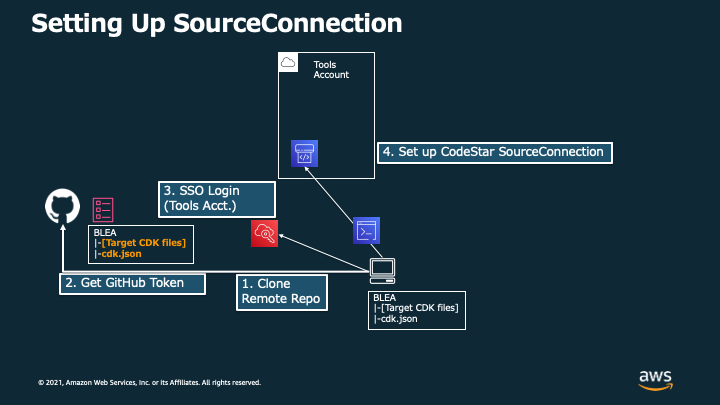
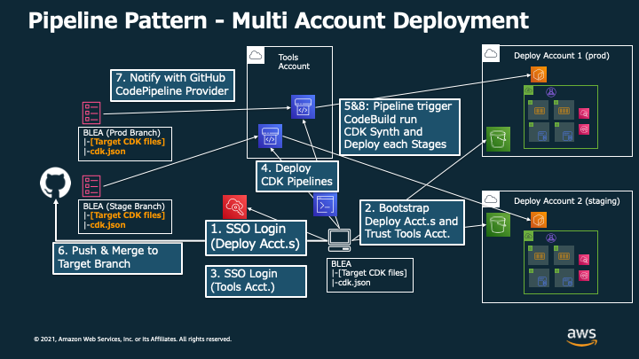

# CDK Pipelines を使用して guest-webapp-sample をデプロイする

[In English](PipelineDeployment.md) | [リポジトリの README に戻る](../../README_ja.md)

CDK による CI/CD の一例として、このドキュメントでは [CDK Pipelines](https://docs.aws.amazon.com/cdk/v2/guide/cdk_pipeline.html) を用いてアプリケーションをデプロイするためのサンプルコードの使用方法を示します。

CDK Pipelines は、AWS CodePipeline によって CDK アプリケーションの継続的なデプロイパイプラインを簡単にセットアップできる高レベルのコンストラクトライブラリです。CDK pipelines で迅速にパイプラインを構築することで、お客様はアプリケーション開発を簡素化し、より関心の高い部分に注力することができます。

`guest-webapp-sample/bin/blea-guest-ecsapp-sample.ts` と同等の構成を `guest-webapp-sample/bin/blea-guest-ecsapp-sample-pipeline.ts` で Stage (CDK Pipelines におけるデプロイ単位を定義するクラス) として定義し、パイプラインからデプロイするサンプルが実装されています。

すでにユースケース `guest-webapp-sample/bin/blea-guest-ecsapp-sample.ts` をデプロイ済みの場合、以下の手順に従って CDK Pipelines によるデプロイを行うと、同じアプリケーションを異なるスタック名でデプロイすることになります。課金の重複やデプロイの失敗を回避するため、`npx cdk destroy` を実行してすでにデプロイ済みのスタックを削除してください。

## パイプラインの構成

### セットアップ（共通） - パイプラインに必要な情報を設定



CodePipeline がソースコードを取得するために必要な設定を実施します。

### 構成パターン A：同一アカウント内でパイプラインとアプリケーションをデプロイする


パイプラインとアプリケーションの両方を同一アカウント内にでデプロイします。Git リポジトリに対する Push を 契機としてアプリケーションがパイプラインによってデプロイされます。以降で示される手順のうち、必須のものを実施した場合はこちらの構成となります。

### 構成パターン B：パイプラインから別アカウントに対してアプリケーションをデプロイする


パイプラインを持つアカウント（Tools アカウント）とは別のアカウントに対してアプリケーションをデプロイします。以降で示される手順のうち、Appendix A も含めて実施した場合にこちらの構成となります。

### 構成パターン C：パイプラインから複数のアカウントに対してアプリケーションをデプロイする



複数アカウントにアプリケーションをデプロイする方法の一例として、各アカウントごとにパイプラインを作成している例を示しています。この構成は、各アカウントごとに構成 B で要求される作業を実施することで検証可能です。

### （Appendix）開発時にパイプラインを経由せず直接アプリケーションをデプロイする


パイプライン構築後の開発時にパイプラインの完了を待たずにデプロイ結果を確認したい場合、Appendix B の手順で直接デプロイを実行することができます。ただし、この手順は本番環境では使用しないでください。

## デプロイ手順

### 前提条件

- パイプラインのデプロイ先のアカウント（以下、 Tools アカウント（ID: `222222222222`））およびリージョンで CDK をブートストラップ済みであること
- Tools アカウントに Administrator 権限でアクセスする認証情報を AWS CLI プロファイルとして設定済みであること（本ドキュメントでは `blea-pipeline-tool-exec` プロファイルを使用）

  > **Note** Administrator 権限は CDK のブートストラップを行う際と、パイプラインをデプロイする際に必要な権限となります。セキュリティの観点から、パイプラインのデプロイが完了したら Administrator 権限を外すことが推奨されます（ [CDK Pipelines のドキュメント](https://docs.aws.amazon.com/cdk/api/v1/docs/pipelines-readme.html) より）。

### 1. AWS CodeStar Connections を使用して GitHub を接続する

はじめに、パイプラインによってデプロイを行う Git リポジトリに対する Connection を作成する必要があります。既に対象の Git リポジトリにアクセスできる Connection を作成済みの場合は手順 1-7 までスキップすることができます。

1. Tools アカウントの AWS マネジメントコンソールにログインします
2. [CodePipeline] サービスを開きます
3. ナビゲーションペインの左下にある [Settings]=>[Connections] をクリックし、[Create Connection] をクリックします。


4. [GitHub] を選択して、[Connection name] を指定し、 [Connect to GitHub] をクリックします


5. "AWS Connector for GitHub"をインストールするため、[Install a new app] をクリックします


6. [Install AWS Connector for GitHub] の画面で、自身のリポジトリを選択し、[Install] をクリックします。この後画面がマネジメントコンソールに戻ります


7. [Connect to GitHub] のページで、 [Connect] をクリックします


8. 以上で Connection の ARN が画面に表示されます。形式は次のとおりです。 `arn:aws:codestar-connections:ap-northeast-1:xxxxxxxxxxxx:connection/xxxxxxxx-xxxx-xxxx-xxxx-xxxxxxxxxxxx` 後に使用するため、これをコピーします


### 2. `cdk.json` に Connection の情報を設定する

デプロイするアプリケーションの `cdk.json` ファイル（今回の場合、`usecases/guest-webapp-sample/cdk.json`）を編集することで、CDK がコンテキスト情報を CodePipeline に引き渡せるように設定します。

```json
    "dev": {
      "envName": "Production",

      ~~~~~ (Your App Context) ~~~~~

      "repository": "ownername/repositoryname",
      "branch": "main",
      "connectionArn": "arn:aws:codestar-connections:ap-northeast-1:xxxxxxxxxxxx:connection/xxxxxxxx-xxxx-xxxx-xxxx-xxxxxxxxxxxx"
    },
```

- `dev`: CDK コマンドの実行時にコンテキストで指定する環境名。例：`npx cdk deploy -c environment=dev`
- `repository`: GitHub リポジトリの名前。自身のリポジトリ URL が 'https://github.com/ownername/repositoryname.git' である場合、`ownername/repositoryname` を指定する
- `branch`: パイプラインが参照するブランチ名
- `connectionArn`: 先のセクションで取得した GitHub Connection の ARN

### 3. パイプラインをデプロイする

#### 3.1. ビルド対象のアプリケーションを `cdk.json` から確認する

`cdk synth` または `cdk deploy` 実行時に参照されるアプリケーションの初期値は、 `cdk.json` の `app` キーに指定されています。各コマンドを実行する際に `--app` オプションを渡すことでオーバーライドすることもできます。パイプラインを使って今後継続的にデプロイを行う場合、以下のように `cdk.json` の設定を書き換えることを推奨します。

##### **`usecases/guest-webapp-sample/cdk.json`**

```ts
{
  "app": "npx ts-node --prefer-ts-exts bin/blea-guest-ecsapp-sample-pipeline.ts",
  // ...
```

#### 3.A （Optional）デプロイ先の環境を変更する場合

CDK Pipelines では、Tools アカウントの CodeBuild において、 `cdk synth` コマンドを実施します。以下は、サンプル実装における Synth コマンドの実装になります。Pipeline Stack の Props の `environment` にデプロイする環境を渡すことができます（デフォルトの設定値は `dev`）。

##### **`usecases/guest-webapp-sample/pipeline/blea-ecsapp-sample-pipeline-stack.ts`**

```ts
        // ...
        commands: [
        ~~~ (Your Build Commands) ~~~
          `npx cdk synth --app "npx ts-node --prefer-ts-exts bin/blea-guest-ecsapp-sample-pipeline.ts" -c environment=${environment}`,
          `npx cdk ls -c environment=${environment}`,
        ],
        // ...
```

> **Note** synth コマンドをパイプライン内部で実行する際は、オプションとして `--profile` を指定する必要はありません。CodeBuild の実行ロールを参照するためです。
> ローカルで実行する場合は、 `npx cdk synth -c environment=dev --profile xxxxxx` のような形で Profile を指定することで実行することができます。

##### **`usecases/guest-webapp-sample/bin/blea-guest-ecsapp-sample-pipeline.ts`**

```ts
const prodStack = new BLEAPipeline.BLEAPipelineStack(app, `${pjPrefix}-Prod-Pipeline`, {
  repository: envVals['repository'],
  branch: envVals['branch'],
  connectionArn: envVals['connectionArn'],
  env: procEnv,
  environment: 'prod', // you can change context env.
  deployStage: new BLEAPipelineStage(app, `${pjPrefix}-Prod-Stage`),
});
```

#### 3.2. アカウントをブートストラップし、パイプラインを Tools アカウントにデプロイする

以下のコマンドをローカル環境から実行することで、パイプラインを Tools アカウントにデプロイすることができます。

```sh
npm ci
cd usecase/guest-webapp-sample/
npx cdk bootstrap -c environment=dev --profile blea-pipeline-tool-exec  # If you haven't bootstrapped target account

npx cdk deploy -c environment=dev --profile blea-pipeline-tool-exec
```

### 4. BLEA のコードを更新し変更を Push することで、デプロイを実行する

パイプラインのデプロイが完了したら、BLEA のコードの変更を継続的にデプロイすることが可能になります。
BLEA のコードを変更して、commit し、対象ブランチへの Push を実行します。

GitHub に変更が push されたら、CodePipeline が起動して Git リポジトリからソースコードを取得します。CodePipeline 内部では CodeBuild が実行されており、 Cloud Assembly を synth した後に、デプロイします。

以上でユースケース `guest-webapp-sample/bin/blea-guest-ecsapp-sample-pipeline.ts` の Stage で定義された CDK アプリケーションがパイプラインを通じてデプロイされました。

> **Note** CDK Pipelines では、 [SelfMutation](https://aws.amazon.com/jp/blogs/news/deploying-a-cdk-application-using-the-cdk-pipelines-modern-api/) という機能を使用することで、デプロイパイプラインもリポジトリの更新に応じて継続的にデプロイすることが可能です。これにより、Tools アカウントを介して定義されたスタックを全てデプロイすることが可能です。

---

## Appendix A - クロスアカウントに対するデプロイ

CDK Pipelines は、アカウント間にまたがるアプリケーションをデプロイするパイプラインを手軽に実現することが可能です。
本項目では、Tools アカウントから CDK アプリケーションをデプロイする先のアカウント（以下、Prod アカウント（ID： `333333333333` ））に対してクロスアカウントなアプリケーションのデプロイを実施する手順を示します。

### 前提条件

- Prod アカウントが Organization に登録されていて、SSO を用いて Credential を取得することができること
- パイプラインをデプロイする Git リポジトリがプライベートリポジトリとして管理され、第三者が `cdk.json` またはパイプラインのスタック等に記載されているアカウント情報にアクセスできないこと

  > **Note** 本サンプルでは、パイプラインがデプロイするスタックのデプロイ先となるアカウントの接続情報を記載する必要があるため、当該情報を管理する Git リポジトリは Private である必要があります。例えば GitHub 上で開発を行う場合、公開されている本リポジトリを Clone して Push することで Private なリポジトリを作成する必要があります。この際本リポジトリを Fork するとプライベートリポジトリとして管理することができないので、注意が必要です。

### コードの変更

1. CDK Pipelines の `crossAccountKeys` を `true` に設定して有効化する

##### **`usecases/guest-webapp-sample/pipeline/blea-ecsapp-sample-pipeline-stack.ts`**

```ts
const pipeline = new pipelines.CodePipeline(this, `${id}-pipeline`, {
    crossAccountKeys: true,
    synth: new pipelines.CodeBuildStep('SynthStep', {
        input: pipelines.CodePipelineSource.connection(props.repository, props.branch, {
```

> **Note** `crossAccountKeys` を `true`　にすると、テスト時のアカウント情報に関する評価がより厳密になります。具体的には、パイプラインスタックにおいて明示的に（環境情報を介さずに）アカウント情報を渡す必要があります。このためには `cdk.json` の設定値を介してアカウント情報を渡す、などといった手段が考えられます。

2. Pipeline がデプロイする Stage をインスタンスかする際に、デプロイ先のアカウント情報を　`env` に渡す。

##### **`usecases/guest-webapp-sample/bin/blea-guest-ecsapp-sample-pipeline.ts`**

```ts
new BLEAPipelineStack(app, `${pjPrefix}-Pipeline`, {
  repository: envVals['repository'],
  branch: envVals['branch'],
  connectionArn: envVals['connectionArn'],
  env: getProcEnv(),

  deployStage: new BLEAPipelineStage(app, `${pjPrefix}-Pipeline-Deployment`, {
    env: {
      account: envVals['prodEnv']['account'],
      region: envVals['prodEnv']['region'],
    }, // you can change deploy account by changing this value.
  }),
});
```

アカウント情報を記載する際は、`cdk.json` に接続情報を以下のような形で追記する必要があります。

```json
    "dev": {
      "envName": "Production",

      ~~~~~ (Your App Context) ~~~~~

      "repository": "ownername/repositoryname",
      "branch": "main",
      "connectionArn": "arn:aws:codestar-connections:ap-northeast-1:xxxxxxxxxxxx:connection/xxxxxxxx-xxxx-xxxx-xxxx-xxxxxxxxxxxx",
      "prodEnv": {
        "account": "333333333333",
        "region": "ap-northeast-1"
      }
    },
```

### Prod アカウントのセットアップを行う

以下のような形で、Prod アカウントの Profile が設定されているとします。

```
[profile blea-pipeline-prod-sso]
sso_start_url = https://xxxxxxxxxxxx.awsapps.com/start#/
sso_region = ap-northeast-1
sso_account_id = 333333333333
sso_role_name = AWSAdministratorAccess
region = ap-northeast-1

[profile blea-pipeline-prod-exec]
credential_process = aws2-wrap --process --profile blea-pipeline-prod-sso
region = ap-northeast-1
```

次のとおり手順を実施することで、Tools アカウントから Prod アカウントに対してクロスアカウントなアプリケーションのデプロイを実施することが可能になります。

1. Prod アカウントに SSO でログインする

```sh
aws sso login --profile blea-pipeline-prod-sso
```

2. Prod アカウントのブートストラップを実施する

```sh
npx cdk bootstrap --profile blea-pipeline-dev-exec --cloudformation-execution-policies arn:aws:iam::aws:policy/AdministratorAccess --trust 222222222222 aws://333333333333/ap-northeast-1 -c environment=prod
```

3. Tools アカウントのブートストラップを実施する

```sh
npx cdk bootstrap -c environment=dev --profile blea-pipeline-tool-exec --cloudformation-execution-policies arn:aws:iam::aws:policy/AdministratorAccess aws://222222222222/ap-northeast-1
```

4. Tools アカウントに対してパイプラインをデプロイする

```sh
npx cdk deploy -c environment=dev --profile blea-pipeline-tool-exec
```

この Tools アカウントにデプロイされたパイプラインによりアプリケーションがビルド・デプロイされます。

参考情報：https://aws.amazon.com/jp/blogs/news/deploying-a-cdk-application-using-the-cdk-pipelines-modern-api/

## Appendix B - 開発環境へのアプリケーションスタックのデプロイ

実際にシステムを CDK を用いて開発する際には、パイプラインを介さずにスタックをデプロイして検証サイクルを短くすることが必要になることがあります。そのような場合は開発環境用のアカウントに向けて、パイプライン経由ではなく、特定のスタックを直接デプロイすることも可能です。ただし、デプロイ元のコードと実際構成されるシステムの構成を一致させるため、本番環境ではこのような直接的なデプロイは避けるようにしてください。

前提：以下に示されているような形で開発環境用に払い出されたアカウント（以下、Dev アカウント（ID: `xxxxxxxxxxxx`））が、Organization に登録されていて、SSO 経由で Credential を取得できること

```json
    "dev": {
      "env": {
        "account": "xxxxxxxxxxxx",
        "region": "ap-northeast-1"
      },
      "envName": "Development",

      ~~~~~ (Your App Context) ~~~~~

      "githubRepository": "ownername/repositoryname",
      "githubTargetBranch": "main",
      "codestarConnectionArn": "arn:aws:codestar-connections:ap-northeast-1:xxxxxxxxxxxx:connection/xxxxxxxx-xxxx-xxxx-xxxx-xxxxxxxxxxxx"
    },
```

```
[profile blea-pipeline-dev-sso]
sso_start_url = https://xxxxxxxxxxxx.awsapps.com/start#/
sso_region = ap-northeast-1
sso_account_id = xxxxxxxxxxxx
sso_role_name = AWSAdministratorAccess
region = ap-northeast-1

[profile blea-pipeline-dev-exec]
credential_process = aws2-wrap --process --profile blea-pipeline-dev-sso
region = ap-northeast-1
```

### 開発環境にスタックを直接デプロイする

例えば、`BLEA-Dev-Stage` 中で定義されている `BLEA-ECSApp` を指定してデプロイしたい場合は以下のコマンドによって Dev アカウントにデプロイすることができます。

```
npx cdk deploy BLEA-Dev-Stage/BLEA-ECSApp -c environment=dev --profile=blea-pipeline-dev-exec
```

なお、以下のようなコマンドによってデプロイできるスタック (上記コマンドにおける`BLEA-Dev-Stage/BLEA-ECSApp`に相当するもの) の一覧を確認することができます

```
npx cdk ls -c environment=dev
```
