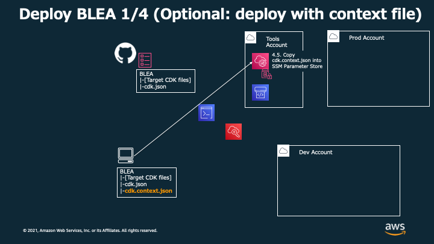
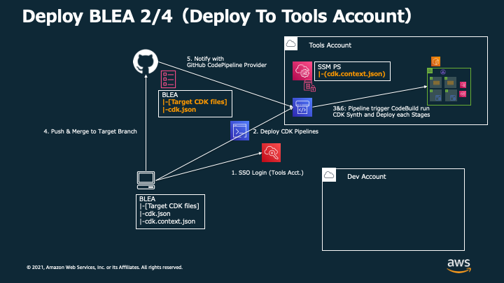
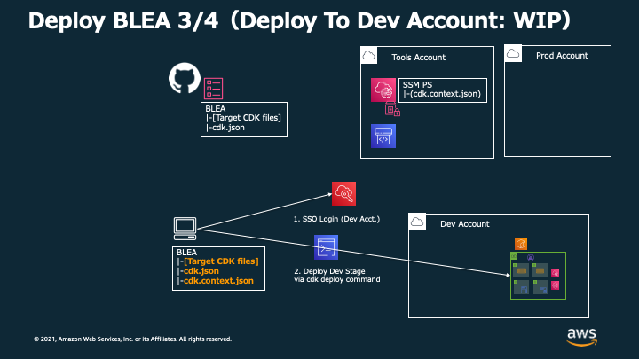
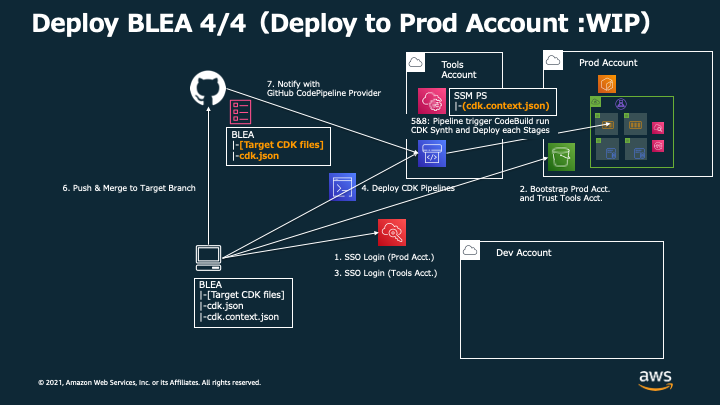

# Baseline Envirionment on AWS デプロイパイプライン (GitHub 版)

[In English](PipelineDeployment.md) | [リポジトリの README に戻る](../../README_ja.md)

ユースケースサンプルとして提供されている CDK アプリケーションは GitHub に置かれた Baseline Environment on AWS (BLEA) CDK Pipelines によるパイプラインをデプロイします。

# デプロイの概要

## 1. パイプラインに必要な情報をセットアップする




## 2. アプリケーションとパイプラインを同一アカウント内でデプロイする



## 3. ローカル環境から開発環境用にアプリケーションスタックのコピーをデプロイする（WIP）



## 4. パイプラインから本番環境用のアカウントにデプロイする（WIP）



# デプロイメント

## 前提条件

- パイプラインのデプロイ先のアカウント（以下、 Tools アカウント）およびリージョンで CDK をブートストラップ済みであること
- Tools アカウントに Administrator 権限でアクセスする認証情報を AWS CLI プロファイルとして設定済みであること
- BLEA リポジトリを自身の GitHub アカウントに fork していること（これを元に開発を行なっていることを想定）

## 1. OAuth で GitHub に接続する

1. Tools アカウントの AWS マネジメントコンソールにログインします
2. `CodePipeline` サービスを開きます
3. ナビゲーションペインの左下にある `Settings`=>`Connections` をクリックし、`Create connection` をクリックします
   
4. `GitHub` を選択して、`Connection name` を指定し、 `Connect to GitHub`をクリックします
   
5. "AWS Connector for GitHub"をインストールするため、`Install a new app` をクリックします
   
6. `Install AWS Connector for GitHub`の画面で、自身のリポジトリを選択し、`Install`をクリックします。この後画面がマネジメントコンソールに戻ります
   
7. `Connect to GitHub` のページで、 `Connect`をクリックします
   
8. 以上で Connection の ARN が画面に表示されます。形式は次のとおりです。 "arn:aws:codestar-connections:ap-northeast-1:xxxxxxxxxxxx:connection/xxxxxxxx-xxxx-xxxx-xxxx-xxxxxxxxxxxx" 後に使用するため、これをコピーします
   

## 2. CDK Pipelines プロジェクトを設定する

CodePipeline が自身の BLEA リポジトリの対象ブランチにアクセスできるようにするため、デプロイするアプリケーションの cdk.json ファイルを編集する。

```json
    "prodpipeline": {
      "env": {
        "account": "222222222222",
        "region": "ap-northeast-1"
      },
      "envName": "Production",

      // ~~~~~ (Your App Context) ~~~~~

      "githubRepository": "ownername/repositoryname",
      "githubTargetBranch": "main",
      "codestarConnectionArn": "arn:aws:codestar-connections:ap-northeast-1:xxxxxxxxxxxx:connection/xxxxxxxx-xxxx-xxxx-xxxx-xxxxxxxxxxxx"
    },
```

- `prodpipeline`: このあと CDK コマンドラインで指定する環境名。このサンプルの場合は `-c environment=prodpipeline` のように指定することになる
- `env`: パイプラインと BLEA リソースのデプロイターゲットとなるアカウントとリージョン。 Tools アカウントと異なるアカウントにデプロイする場合、デプロイ先のアカウントであらかじめ Bootstrapping と、Tools アカウントの信頼を設定する必要がある。
- `envName`: 環境名の解説。デプロイ対象のリソースタグに付与される
- `githubRepository`: GitHub リポジトリの名前。自身のリポジトリ URL が 'https://github.com/ownername/repositoryname.git' である場合、`ownername/repositoryname` を指定する
- `githubTargetBranch`: ターゲットブランチ（このブランチにマージするとパイプラインが起動する）
- `codestarConnectionArn`: 先のセクションで取得した GitHub Connection の AR

### 2.a (Optional) クロスアカウントでデプロイを行う際、デプロイ先のアカウントのセットアップを行う（WIP）

参考情報：https://aws.amazon.com/jp/blogs/news/deploying-a-cdk-application-using-the-cdk-pipelines-modern-api/

### 2.b (Optional) `cdk.context.json` を Tools アカウントの SSM Parameter Store にアップロードする

CDK Pipelines では、Tools アカウントの CodeBuild において、 `cdk synth` コマンドを実施します。したがって、基本的には `cdk.json` で定義されたコンテキストで　 Build/Synth を実施することを推奨します。一方で、何らかの要件でリモートレポジトリにこれらの設定ファイルを後悔したくない場合、 Tools アカウントの SSM Parameter Store に `cdk.context.json` を置くことで、リモートレポジトリにアカウントや各種設定情報を公開することなくデプロイ対象のアプリケーションをデプロイすることができます。以下は、SSM の API を介して CodeBuild にコンテキスト情報を渡している実装例になります。

#### **`usecases/guest-webapp-sample/blea-ecsapp-sample-pipeline-stack.ts`**

```ts
        installCommands: [
          'n stable',
          'node -v',
          'npm i -g npm@8.3',
          'cd usecases/guest-webapp-sample',
          // If you don't want to commit cdk.json file to remote repo, you can refer it via SSM Parameter Store
          'aws ssm get-parameter --name "/pipeline-context/guest-webapp-sample/cdk.context.json" | jq -r .Parameter.Value > cdk.context.json',
          'cd ../..',
        ],
```

## 3. CodePipeline project のデプロイ

現在 `guest-webapp-sample/blea-guest-ecsapp-sample.ts` をパイプライン `guest-webapp-sample/blea-guest-ecsapp-sample-pipeline.ts` からデプロイするサンプルが実装されている。これをデプロイする際には以下の手順を実施する。

### 3.1. ビルド対象のアプリケーションを `cdk.json` から確認する

`cdk build` あるいは `cdk deploy` されるファイルは `cdk.json` で指定するか、各コマンドを実行する際に `-a` オプションで指定することができます。例えば、現在実装されているサンプルパイプラインをデプロイしてみる場合、以下のように設定を書き換える必要があります。

#### **`usecases/guest-webapp-sample/cdk.json`**

```ts
{
  "app": "npx ts-node bin/blea-guest-ecsapp-sample-pipeline.ts",
  // ...
```

### 3.2. Synth コマンドの定義を確認する（pipeline Stack および、 `package.json` ）

CDK Pipelines では、Tools アカウントの CodeBuild において、 `cdk synth` コマンドを実施します。以下は、サンプル実装における Synth コマンドの実装例になります。

#### **`usecases/guest-webapp-sample/blea-ecsapp-sample-pipeline-stack.ts`**

```ts
        // ...
        commands: [
          'echo "node: $(node --version)" ',
          'echo "npm: $(npm --version)" ',
          'npm ci',
          'npm audit',
          'npm run lint',
          // move to repository to be deployed by this pipeline
          'cd usecases/guest-webapp-sample',
          'npm run build',
          'npm run test',
          // 'npx cdk context',
          'npm run synth:dev_context',
          // 'npx cdk ls -c environment=my-dev-multi',
        ],
        // ...
```

`'npm run synth:dev_context',` の部分を実体に即した synth コマンドに書き換えるか、または以下のように `package.json` で定義される scripts にデプロイパイプラインに即した Synth コマンドを追記・上書きすることも可能です。

#### **`usecases/guest-webapp-sample/package.json`**

```json
  // ...
  "scripts": {
    "synth:dev": "npx cdk synth -c environment=dev && npx cdk synth --app \"npx ts-node bin/blea-guest-asgapp-sample.ts\" -c environment=dev && npx cdk synth --app \"npx ts-node bin/blea-guest-ec2app-sample.ts\" -c environment=dev && npx cdk synth --app \"npx ts-node bin/blea-guest-ecsapp-ssl-sample.ts\" -c environment=dev",
    "synth:dev_context": "npx cdk synth -c environment=dev-context && npx cdk synth --app \"npx ts-node bin/blea-guest-asgapp-sample.ts\" -c environment=dev-context && npx cdk synth --app \"npx ts-node bin/blea-guest-ec2app-sample.ts\" -c environment=dev-context && npx cdk synth --app \"npx ts-node bin/blea-guest-ecsapp-ssl-sample.ts\" -c environment=dev-context",
    "synth_dev_context_test": "npx cdk synth -c",
    "depcheck": "npx depcheck --ignore-dirs cdk.out",
    "build": "tsc --build",
    // ...
```

> Notes: synth コマンドを実行する際にオプションとして --profile を指定する必要はありません。CodeBuild は適切な権限( Tools アカウントの Administrator 権限)を保持しているためです。

### 3.3. 以下のコマンドによってパイプラインを Tools アカウントにデプロイする

以下のコマンドをローカル環境から実行することで、サンプルパイプラインを Tools アカウントにデプロイすることができます。

```sh
cd usecase/guest-webapp-sample/
npm ci
npm run build
npx cdk bootstrap -c environment=prodpipeline --profile your_profile_name  # If you haven't bootstrapped target account
npx cdk deploy -c environment=prodpipeline --profile your_profile_name
```

## 4. BLEA のコードをアップデートおよびマージすることで、デプロイを実行する

パイプラインのデプロイが完了したら、BLEA のコードの変更を継続的にデプロイすることが可能になります。
BLEA のコードを変更して、commit し、対象ブランチへのマージを実行します。

GitHub に変更が push されたら、CodePipeline プロジェクトが起動され、その中で CodeBuild が実行されます。CodeBuild はご自身の GitHub リポジトリから BLEA ソースコードを取得し、CloudFormation テンプレートを synth した後に、デプロイします。

以上で BLEA のコードがパイプラインを通じてデプロイされました。

> Notes: CDK Pipelines では、 [SelfMutation](https://aws.amazon.com/jp/blogs/news/deploying-a-cdk-application-using-the-cdk-pipelines-modern-api/) という機能を使用することで、デプロイパイプラインもレポジトリの更新に応じて継続的にデプロイすることが可能です。これにより、技術的には Tools アカウントを介して定義されたスタックを全てデプロイすることが可能です。現在サンプルではこの機能が有効化されていませんが、pipeline Stack の `SelfMutation: false` と記述されているコードをコメントアウトすることで有効化できます。

<!-- # Appendix.1 - コンテナイメージのデプロイの流れ

ECS サンプルアプリケーションでは GitHub に push された Dockerfile を元に、GitHub Actions でコンテナイメージをビルドし、ECR に Push されることを想定しています。ここではコンテナイメージの一連のデプロイの流れを概説します。

## 1. 開発環境へのデプロイ

開発環境の ECR へコンテナイメージを push します。デプロイは CDK で実施します。


## 2. 本番環境へのコンテナイメージ Push

GitHub に Dockerfile を push します。GitHub Actions でビルドを実行し、本番環境の ECR へイメージを push します。


## 3. 本番環境の ECS へのデプロイ

BLEA コードをアップデート（最新のコンテナイメージを指すように変更する）して GitHub へ push します。ECS は ECR から最新のイメージを取得します。

 -->

# Appendix - 開発環境へのアプリケーションスタックのデプロイ（WIP）
