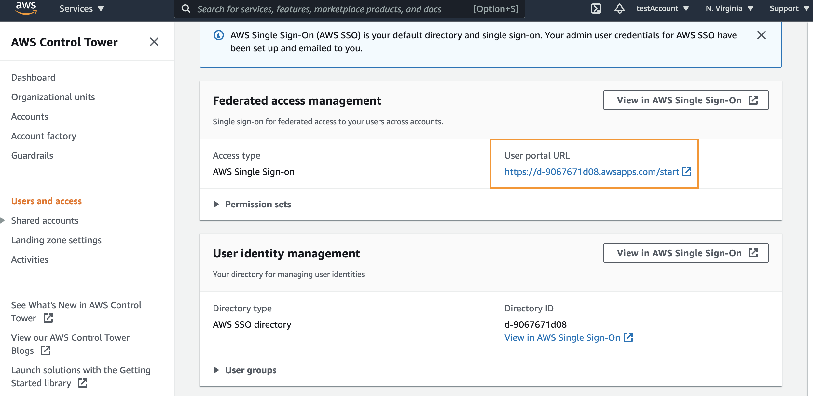
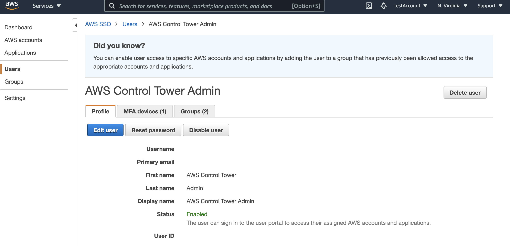
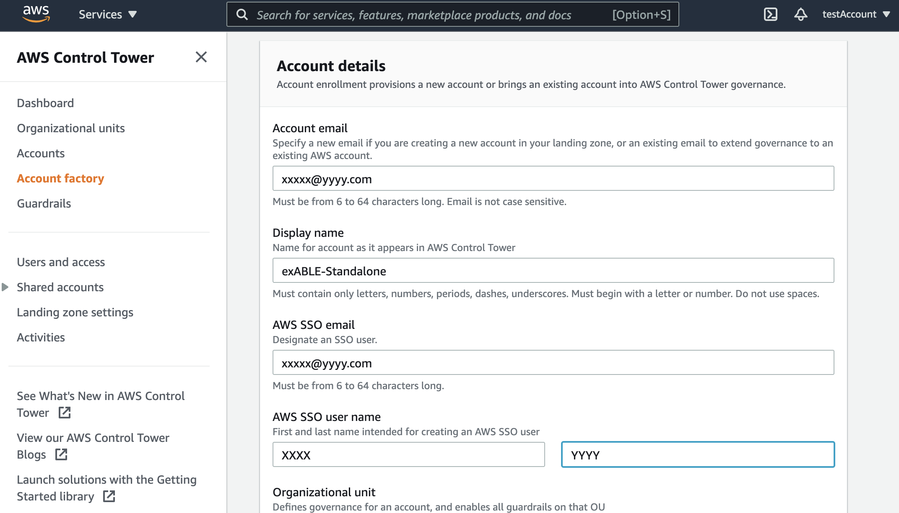

# Migrate BLEA Standalone to BLEA Multi-Account

[View this page in Japanese (日本語)](Standalone2ControlTower_ja.md) | [Back to README](../README.md)

You can enroll an AWS account managed by Baseline Environment on AWS(Standalone) into OU managed by ControlTower with BLEA Multi-Account. Guest Base and Guest System on the enroll account are not changed, but the systems may be affected by Organizations Service Control Policies (SCPs) after enrollment. So we recommend to test the SCPs before enrollment.

On this procedure, we named accounts listed below:

- Management account: an account setup Baseline Environment on AWS (Multi-Account) with ControlTower
- Target account: an account setup Baseline Environment on AWS (Standalone), will enroll into OU managed by ControlTower.

# Prerequisities

On Management account, You need to have setup Baseline Environment on AWS with Multi-Account Governance. Details are below:

1. Setup Control Tower

   Refer: https://docs.aws.amazon.com/controltower/latest/userguide/setting-up.html

2. Enabled trusted access using the AWS CloudFormation Stacksets console

   Refer: https://docs.aws.amazon.com/AWSCloudFormation/latest/UserGuide/stacksets-orgs-enable-trusted-access.html

3. Enabled Security Hub and automatically enabling new organization accounts

   Refer: https://docs.aws.amazon.com/securityhub/latest/userguide/accounts-orgs-auto-enable.html

4. Enable GuardDuty and automatically enabling new organization accounts

   Refer: https://docs.aws.amazon.com/guardduty/latest/ug/guardduty_organizations.html

5. Enable Inspector and automatically enabling new organization accounts

   Refer: https://docs.aws.amazon.com/inspector/latest/user/adding-member-accounts.html

# 1. Invite Target account to Management account Organizations

## 1.1. [Management Account] Invite account

1. Login to Management account as administrator
2. In the AWS Organizations Console, click [Add Account] button
3. Click [Invite Account]
4. Fill email address or account ID of Target account and click [invite]

- Notice: you need to verify your email address before you invite

## 1.2. [Target Account] Approve invitation

1. Invitation will be sent to administrator's email address of Target Account. Follow instruction and approve invitation.

# 2. [Target Account] Prepare to enroll ControlTower

You should be setup AWS Config on Target account, and AWS Config should to be disabled before enroll into ControlTower.

## 2.1. Delete AWS Config delivery channel

1. Login to the Target account’s management console and launch CloudShell with [>_] icon
   
2. Get delivery channel name and configuration recorder name

   ```
   aws configservice describe-delivery-channels
   aws configservice describe-configuration-recorders
   ```

   Command results are like these.

   ```
   $ aws configservice describe-delivery-channels
   {

       "DeliveryChannels": [

           {

               "name": "BLEA-Config-ConfigDeliveryChannel-XXXXXXXXXXX”,

               "s3BucketName": "able-config-configbucketxxxxxxxxxxxxxx”

           }

       ]

   }
   $ aws configservice describe-configuration-recorders
   {

       "ConfigurationRecorders": [

           {

               "name": "BLEA-Config-ConfigRecorder-XXXXXXXXXXXXXX”,

               "roleARN": "arn:aws:iam::xxxxxxxxxxxx:role/BLEA-Config-ConfigRoleXXXXXXXXXXXXXXXXXX”,

               "recordingGroup": {

                   "allSupported": true,

                   "includeGlobalResourceTypes": true,

                   "resourceTypes": []

               }

           }

       ]

   }
   ```

3. Delete configuration recorder and delivery channel

   With these command, you can delete configuration recorder and delivery channel. Specify each name from the result of previous procedure.

   ```
   aws configservice delete-configuration-recorder --configuration-recorder-name BLEA-Config-ConfigRecorder-XXXXXXXXXXXXXX

   aws configservice delete-delivery-channel --delivery-channel-name BLEA-Config-ConfigDeliveryChannel-XXXXXXXXXXX
   ```

## 2.2. Create AWSControlTowerExecution Role

You need to create IAM Role for managing by ControlTower. The procedure is described at "Prerequisites for Enrollment - step 3" in the page below.

Refer: https://docs.aws.amazon.com/controltower/latest/userguide/enroll-account.html

1. Open IAM console
2. Select [Roles]-[Create Role]
3. Select [Another AWS account] and fill Control Tower Admin's AWS account ID
4. Click [Next: Permissions]
5. Select 'AdministratorAccess' policy and click [Next: Tags]-[Next: Review]
6. Type 'AWSControlTowerExecution' in the Role name text box and click [Create role] button

# 3. [Management account] Enroll Target account to the Control Tower

On Management account, Enroll Target account.

Refer: https://docs.aws.amazon.com/controltower/latest/userguide/enroll-account.html

1. Login to Management account via AWS SSO

   - You can find SSO portal URL on [Users and Access] menu in the Control Tower Console
     
   - You can reset password in the AWS SSO Console [Users] tab and click user.
     

2. Open Control Tower console
3. Click [Account Factory] on navigation menu
4. Click [Enroll account] and fill information of Target account and click [Enroll Account] button. Account enroll process will be started.
   
5. You can check enroll progress status on Service Catalog. Go to service console and select [Provisioned Products]

# 4. Finished enrollment

Now your Target account enrolled to Control Tower on your Management account. Security Hub and Guard Duty on Target account are managed by Organizations.
