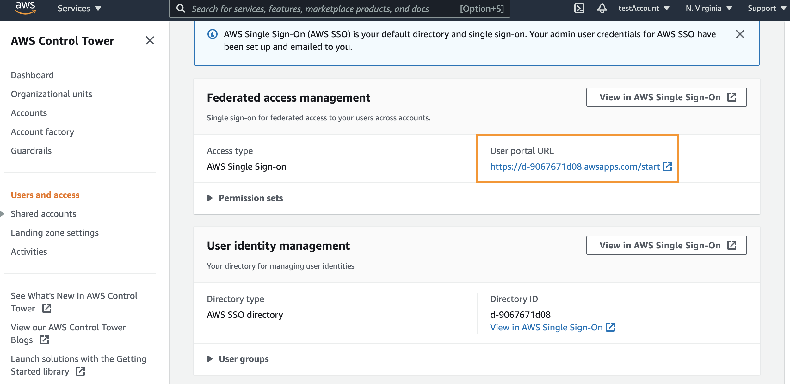
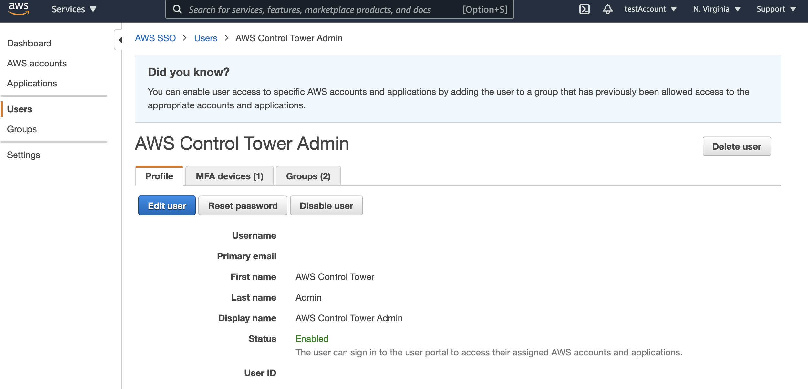
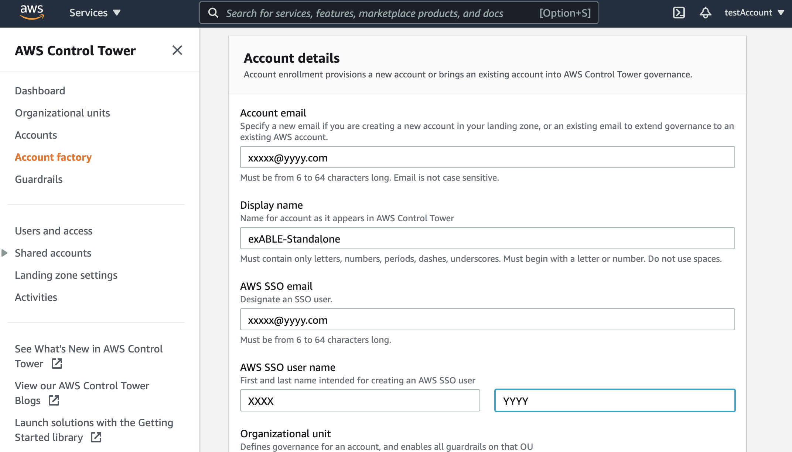

# Baseline Environment on AWS Standalone 版管理下のアカウントを マルチアカウント版管理下へ移行する

[In English](Standalone2ControlTower.md) | [README に戻る](../README_ja.md)

Baseline Environment on AWS の Standalone 版でセットアップしたアカウントを、マルチアカウント版（Control Tower）管理下へ移行することができます。
この手順を通して、Standalone 版でセットアップしたアカウントの Guest Base および Guest System は変更しませんが、Control Tower 管理下に入ることで Organizations Service Control Policy の影響を受ける点に注意して、十分なテストの上で移行を行なってください。

以下の手順では Standalone 版でセットアップしたアカウントを 「ターゲットアカウント」、Control Tower をセットアップしたアカウントを「マネジメントアカウント」と呼びます。

# 前提条件

移行先のマネジメントアカウント（およびその Organizations）で Baseline Environment on AWS マルチアカウント版による管理が有効になっている必要があります。具体的には以下の点です。

1. AWS ControlTower がセットアップ済みである

   参照: https://docs.aws.amazon.com/controltower/latest/userguide/setting-up.html

2. AWS CloudFormation Stacksets で 信頼されたアクセスが有効化されている

   参照: https://docs.aws.amazon.com/AWSCloudFormation/latest/UserGuide/stacksets-orgs-enable-trusted-access.html

3. AWS Security Hub で 新しい組織アカウントが自動有効化されている

   参照: https://docs.aws.amazon.com/securityhub/latest/userguide/accounts-orgs-auto-enable.html

4. Amazon GuardDuty で 新しい組織アカウントが自動有効化されている

   参照: https://docs.aws.amazon.com/guardduty/latest/ug/guardduty_organizations.html

5. Amazon Inspectorで新しい組織アカウントが自動有効化されている

   参照: https://docs.aws.amazon.com/inspector/latest/user/adding-member-accounts.html

# 1. ターゲットアカウントを マネジメントアカウントの Organizations へ招待する

ターゲットアカウントを マネジメントアカウントの Organizations へ招待します。

## 1.1 [マネジメントアカウント] アカウントを招待する

1. Organizations マネジメントアカウントへ管理者権限でログインする
2. AWS Organizations コンソールで [AWS アカウントを追加] をクリックする
3. [既存の AWS アカウントを招待] をクリックする
4. ターゲットアカウントの管理者の E メールアドレスまたはアカウント ID を入力し、[招待を送信]をクリックする

- 注: このメールアドレスは事前に承認しておく必要があります

## 1.2. [ターゲットアカウント] アカウントの招待を承認する

1. ターゲットアカウントの管理者にメールが届きます。記載の手順にしたがって招待リクエストを承認します。

# 2. [ターゲットアカウント] ControlTower の管理下に入るための準備を行う

ターゲットアカウントには AWS Config が設定済みですが、以後 ControlTower で管理することになります。BLEA Standalone 版 でセットアップした AWS Config の設定を削除します。

## 2.1. AWS Config delivery channel を削除する

1. ターゲットアカウントのマネジメントコンソールにログインし、CloudShell を起動します。
   
2. AWS Config の Delivery channel 名 と Configuration recorder 名を取得します

```
aws configservice describe-delivery-channels
aws configservice describe-configuration-recorders
```

それぞれ以下のような結果が得られます。

```
$ aws configservice describe-delivery-channels
{

    "DeliveryChannels": [

        {

            "name": "BLEA-Config-ConfigDeliveryChannel-XXXXXXXXXXX”,

            "s3BucketName": "able-config-configbucketxxxxxxxxxxxxxx”

        }

    ]

}
$ aws configservice describe-configuration-recorders
{

    "ConfigurationRecorders": [

        {

            "name": "BLEA-Config-ConfigRecorder-XXXXXXXXXXXXXX”,

            "roleARN": "arn:aws:iam::xxxxxxxxxxxx:role/BLEA-Config-ConfigRoleXXXXXXXXXXXXXXXXXX”,

            "recordingGroup": {

                "allSupported": true,

                "includeGlobalResourceTypes": true,

                "resourceTypes": []

            }

        }

    ]

}
```

3. Configuration recorder と Delivery channel を削除します

それぞれ上記のコマンドで得られた名前を指定して、設定を削除します。

```
aws configservice delete-configuration-recorder --configuration-recorder-name BLEA-Config-ConfigRecorder-XXXXXXXXXXXXXX
aws configservice delete-delivery-channel --delivery-channel-name BLEA-Config-ConfigDeliveryChannel-XXXXXXXXXXX
```

## 2.2. AWSControlTowerExecution ロールを作成する

アカウントを ControlTower 管理下に移行するために必要な前提条件として、IAM ロールを作成します。以下の URL の「登録の前提条件」の 3 の内容です。

参照: https://docs.aws.amazon.com/controltower/latest/userguide/enroll-account.html

1. IAM コンソールを開きます
2. [ロール]-[ロールの作成]をクリックします
3. [別の AWS アカウント] を選択し、[アカウント ID] に Control Tower のマネジメントアカウントのアカウント ID を入力します
4. [次のステップ: アクセス権限] をクリックします
5. 'AdministratorAccess' ポリシーを選択し、[次のステップ: タグ]、[次のステップ: レビュー]を順にクリックします
6. ロール名に 'AWSControlTowerExecution' を入力し、[ロール作成] ボタンをクリックします

# 3. [マネジメントアカウント] ターゲットアカウントを Control Tower へ移行する

マネジメントアカウントでの作業です。以下の手順にしたがってアカウントを移行します。

    参照: https://docs.aws.amazon.com/controltower/latest/userguide/enroll-account.html

1. AWS SSO を使用してマネジメントアカウントのマネジメントコンソールにログインする

- SSO ポータルの URL は Control Tower コンソールの [Users and Access] メニューで確認できます
  
- パスワードをリセットするには AWS SSO コンソールの [Users] メニューからユーザを指定して行います
  

2. ControlTower コンソールを開きます
3. ナビゲーションメニューから[Account Factory]を選択します
4. [アカウントの登録] をクリックし、ターゲットアカウントの情報を入力して、 [アカウントの登録] ボタンをクリックします。アカウントの移行が開始されます。
   
5. アカウント移行の進捗を確認するには、 Service Catalog のコンソールにアクセスし、ナビゲーションメニューから[プロビジョニングされた製品] を選択することで確認できます

# 4. 移行の完了

以上で ターゲットアカウントが マネジメントアカウントの Control Tower の管理下に入ります。ターゲットアカウントの Security Hub および Guard Duty は Organizations 全体の管理下に入ります。
