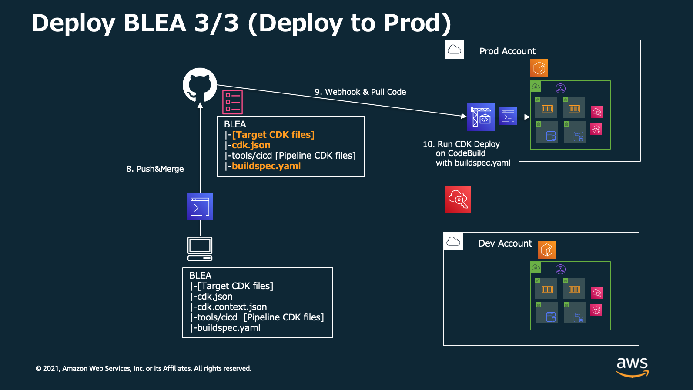
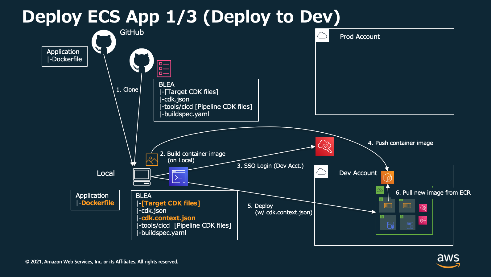
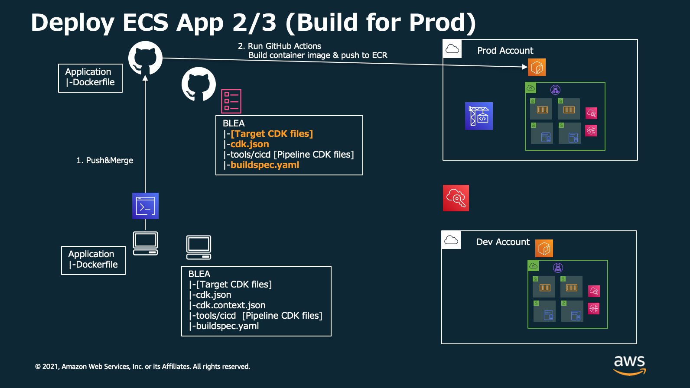

# Deployment pipeline for Baseline Envirionment on AWS with GitHub

[View this page in Japanese (日本語)](README_ja.md) | [Back to Repository README](../../README.md)

This CDK application deploys Simple CodePipeline project to deploy resouces defined in BLEA to the same AWS account.

# Overview

## 1. Deploy to Development environment (from your local computer)


## 2. Setup pipeline to Production environment (from your local computer)


## 3. Commit BLEA and deploy to Production environment (from GitHub)



# Deployment

## Prerequisities

- You have bootstrapped CDK on the account
- You have configured AWS CLI environment (credentials) to access target account as Administrator.
- You have forked BLEA repository to your GitHub account.

## 1. Connect to GitHub using OAuth

1. Login to target account's AWS Console
2. Open `CodePipeline` Service
3. Click `Settings`=>`Connections` on the bottle of left navigation pane. Then click `Create connection`
   
4. Select `GitHub` and input `Connection name`. Click `Connect to GitHub`.
   
5. Click `Install a new app` to setup "AWS Connector for GitHub" app
   
6. On `Install AWS Connector for GitHub`, Choose your repository and Click `Install`. Then you return to AWS Console.
   
7. On `Connect to GitHub` page, Click `Connect`
   
8. Now you can see Arn for connection, like "arn:aws:codestar-connections:ap-northeast-1:xxxxxxxxxxxx:connection/xxxxxxxx-xxxx-xxxx-xxxx-xxxxxxxxxxxx". Copy it for later use.
   

## 2. Setup your CodePipeline project configuration

Update tools/cicd/cdk.json so CodePipeline can access your BLEA repository and specify a target branch.

```
    "prodpipeline": {
      "env": {
        "account": "222222222222",
        "region": "ap-northeast-1"
      },
      "envName": "Production",
      "githubRepositoryOwner": "ownername",
      "githubRepositoryName": "repositoryname",
      "githubTargetBranch": "main"
      "codestarConnectionArn": "arn:aws:codestar-connections:ap-northeast-1:xxxxxxxxxxxx:connection/xxxxxxxx-xxxx-xxxx-xxxx-xxxxxxxxxxxx"
    },
```

- `prodpipeline`: Environment name to specify on CDK command line. In this sample, it should be `-c environment=prodpipeline`
- env: Target account and region you want to deploy pipeline and resources. This account should be the same as "environment" defined on "cdk deploy" command in buildspec.yaml.
- envName: Environment name discription.
- githubRepositoryOwner: GitHub repository owner name. If your reopsitory URL is 'https://github.com/ownername/repositoryname.git', you can specify `ownername`.
- githubRepositoryName: GitHub repository name. `repositoryname` on the sample above.
- githubTargetBranch: Target branch (When merged to this branch, CodePipeline will triggerd).
- codestarConnectionArn: Connection Arn copied from the previous section.

## 3. Deploy CodePipeline project

```
cd tools/cicd/
npm ci
npx cdk bootstrap -c environment=prodpipeline --profile your_profile_name  # If you haven't bootstrapped target account
npx cdk deploy -c environment=prodpipeline --profile your_profile_name
```

## 4. Update buildspec.yaml

You need to specify CDK deploy command on buildspec.yaml.
This is example, when you want to deploy `BLEA-MonitorAlarm` stack with `prod` environment variables on cdk.json. This is not in this directory but in root directory of Baseline Environment on AWS. your buildspec.yaml will be like this.

```
version: 0.2

phases:
  install:
    commands:
      # requires npm >=8.1.0
      - npm i -g npm
  pre_build:
    commands:
      - npm ci
  build:
    commands:
      - npm audit
      - npm run lint
      - npm run build --workspace usecases/guest-webapp-sample
      - npm run test --workspace usecases/guest-webapp-sample
      # You can specify CDK deployment commands.
      # Usually, you may want to deploy all of resources in the app.
      # If you want to do so, please specify `"*"`
      - cd usecases/guest-webapp-sample
      - npx cdk deploy BLEA-MonitorAlarm -c environment=dev --require-approval never
```

> Notes: You can add another commands to build stage for deploying another stacks.
> Notes: You don't need to specify --profile on commandline. Because we already add sufficient role (Administrator) to CodeBuild.

## 5. Update BLEA codes, merge and deploy

Now you set up buildspec.yaml, you can add changes to BLEA codes.
When you finished updating codes, you will commit and merge updates into target branch. Don't forget to add buildspec.yaml too.

When you push the changes into GitHub, CodePipeline project will be triggerd automatically then deploy resources you defined in BLEA CDK codes.

# Appendix - How to deploy container image from GitHub

## 1. Push container image to ECR on Development environment and Deploy with CDK.



## 2. Commit dockerfile and build image with GitHub Actions then push it to ECR on Prod.



## 3. Commit updated BLEA code to GitHub and ECS pull new container image from ECR.


