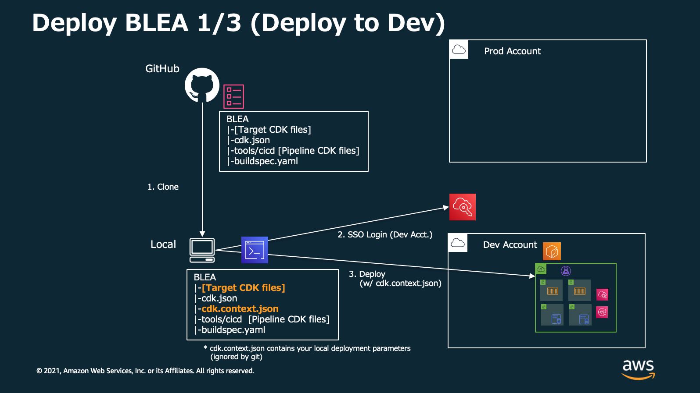
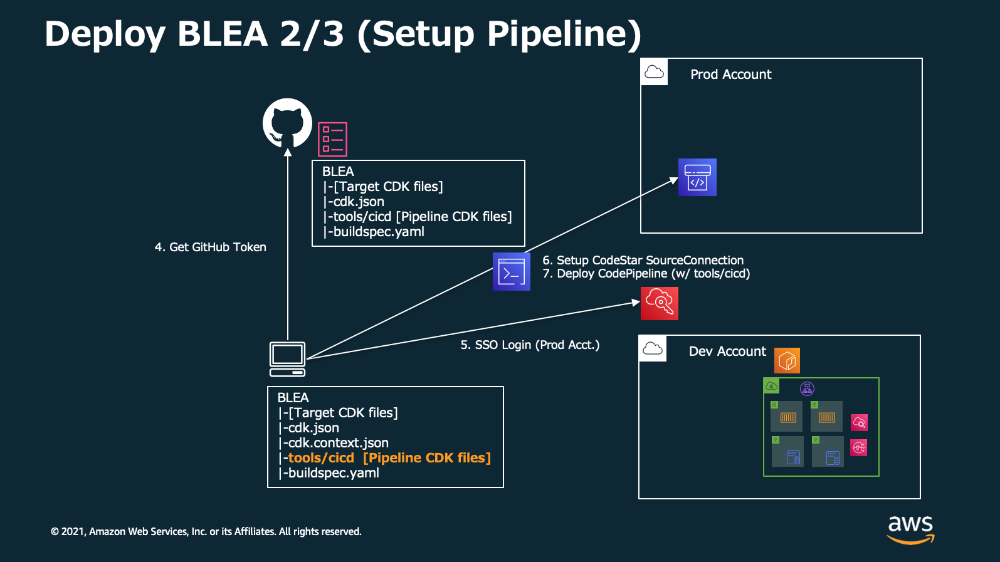
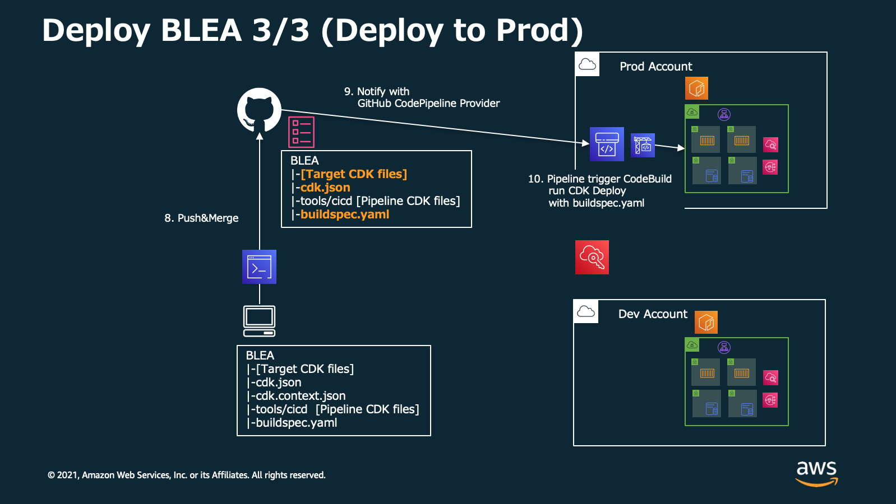
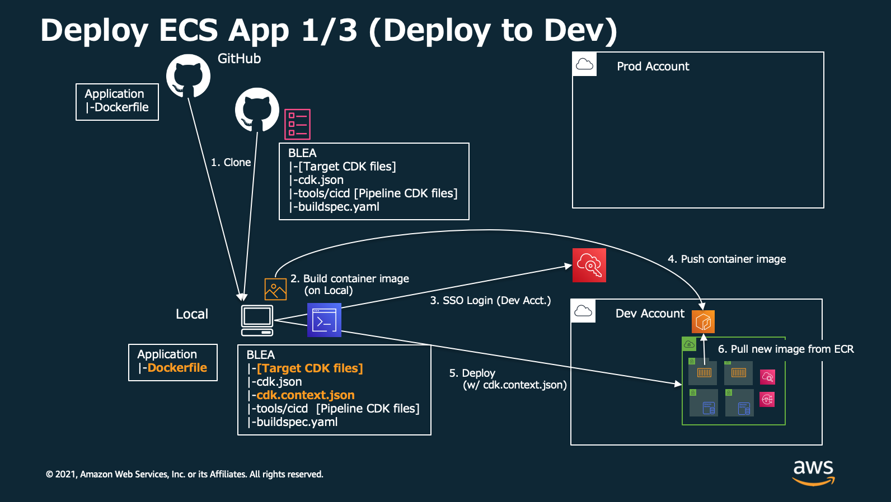
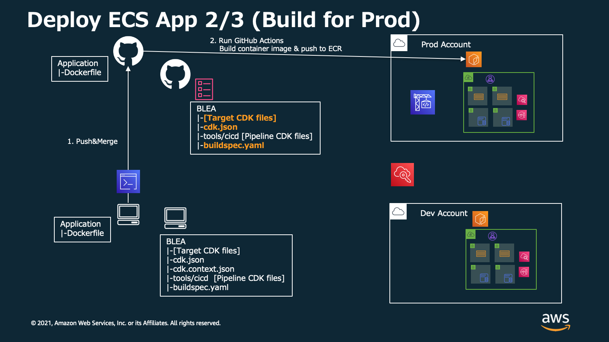
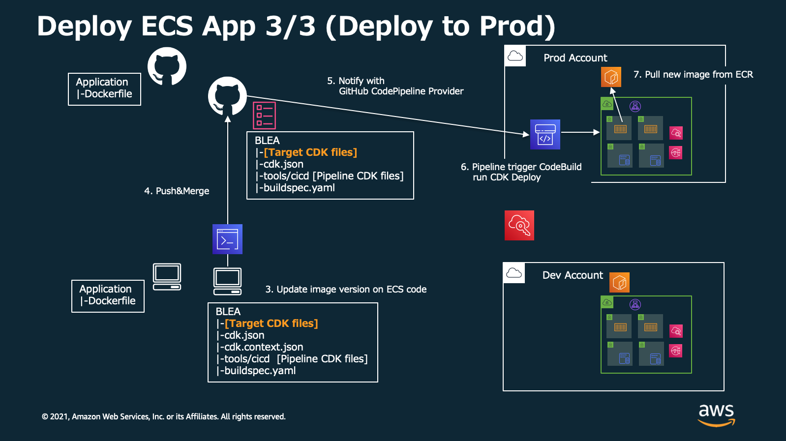

# Baseline Envirionment on AWS デプロイパイプライン (GitHub 版)

[In English](README.md) | [リポジトリの README に戻る](../../README_ja.md)

tools/cicd ディレクトリにある CDK アプリケーションは GitHub に置かれた Baseline Environment on AWS (BLEA) アプリケーションをデプロイするための、CodePipeline パイプラインをデプロイします。

# デプロイの概要

## 1. BLEA を直接開発環境にデプロイする (手元の PC から)



## 2. 本番環境にデプロイするパイプラインを このアプリケーションでセットアップする （手元の PC から）



## 3. BLEA コードを GitHub に commit して本番環境へデプロイする



# デプロイメント

## 前提条件

- 対象アカウントおよびリージョンで CDK をブートストラップ済みであること
- 対象アカウントに Administrator 権限でアクセスする認証情報を AWS CLI プロファイルとして設定済みであること
- BLEA リポジトリを自身の GitHub アカウントに fork していること（これを元に開発を行なっていることを想定）

## 1. OAuth で GitHub に接続する

1. ターゲットアカウントの AWS マネジメントコンソールにログインします
2. `CodePipeline` サービスを開きます
3. ナビゲーションペインの左下にある `Settings`=>`Connections` をクリックし、`Create connection` をクリックします
   
4. `GitHub` を選択して、`Connection name` を指定し、 `Connect to GitHub`をクリックします
   
5. "AWS Connector for GitHub"をインストールするため、`Install a new app` をクリックします
   
6. `Install AWS Connector for GitHub`の画面で、自身のリポジトリを選択し、`Install`をクリックします。この後画面がマネジメントコンソールに戻ります
   
7. `Connect to GitHub` のページで、 `Connect`をクリックします
   
8. 以上で Connection の ARN が画面に表示されます。形式は次のとおりです。 "arn:aws:codestar-connections:ap-northeast-1:xxxxxxxxxxxx:connection/xxxxxxxx-xxxx-xxxx-xxxx-xxxxxxxxxxxx" 後に使用するため、これをコピーします
   

## 2. CodePipeline プロジェクトを設定する

CodePipeline が自身の BLEA リポジトリの対象ブランチにアクセスできるようにするため、このディレクトリにある cdk.json ファイル（tools/cicd/cdk.json） を編集する。

```
    "prodpipeline": {
      "env": {
        "account": "222222222222",
        "region": "ap-northeast-1"
      },
      "envName": "Production",
      "githubRepositoryOwner": "ownername",
      "githubRepositoryName": "repositoryname",
      "githubTargetBranch": "main"
      "codestarConnectionArn": "arn:aws:codestar-connections:ap-northeast-1:xxxxxxxxxxxx:connection/xxxxxxxx-xxxx-xxxx-xxxx-xxxxxxxxxxxx"
    },
```

- `prodpipeline`: このあと CDK コマンドラインで指定する環境名。このサンプルの場合は `-c environment=prodpipeline` のように指定することになる
- `env`: パイプラインと BLEA リソースのデプロイターゲットとなるアカウントとリージョン
- `envName`: 環境名の解説。デプロイ対象のリソースタグに付与される
- `githubRepositoryOwner`: GitHub リポジトリオーナーの名前。自身のリポジトリ URL が 'https://github.com/ownername/repositoryname.git' である場合、`ownername` を指定する
- `githubRepositoryName`: GitHub リポジトリ名。上記 URL の例では `repositoryname` を指定する
- `githubTargetBranch`: ターゲットブランチ（このブランチにマージするとパイプラインが起動する）
- `codestarConnectionArn`: 先のセクションで取得した GitHub Connection の ARN

## 3. CodePipeline project のデプロイ

```
cd tools/cicd/
npm ci
npx cdk bootstrap -c environment=prodpipeline --profile your_profile_name  # If you haven't bootstrapped target account
npx cdk deploy -c environment=prodpipeline --profile your_profile_name
```

## 4. buildspec.yaml のアップデート

buildspec.yaml で CDK のデプロイコマンドを指定します。
例えば、cdk.json で定義した `prod` 環境へ、スタック`BLEA-MonitorAlarm`をデプロイしたい場合の例を示します。
buildspec.yaml はこのディレクトリではなく、BLEA ソースコードのルートディレクトリにあります。

```
version: 0.2

phases:
  install:
    commands:
      # requires npm >=8.1.0
      - npm i -g npm
  pre_build:
    commands:
      - npm ci
  build:
    commands:
      - npm audit
      - npm run lint
      - npm run build --workspace usecases/guest-webapp-sample
      - npm run test --workspace usecases/guest-webapp-sample
      # You can specify CDK deployment commands.
      # Usually, you may want to deploy all of resources in the app.
      # If you want to do so, please specify `"*"`
      - cd usecases/guest-webapp-sample
      - npx cdk deploy BLEA-MonitorAlarm -c environment=dev --require-approval never
```

> Notes: 他のスタックをデプロイしたい場合は build フェーズに他のコマンドを追加することができます。

> Notes: コマンドラインで --profile を指定する必要はありません。CodeBuild は適切な権限(ターゲットアカウントの Administrator 権限)を保持しているためです。

## 5. BLEA のコードをアップデートおよびマージすることで、デプロイを実行する

buildspec.yaml をセットアップしたら、BLEA のコードを変更してデプロイすることが可能になります。
BLEA のコードを変更して、commit し、対象ブランチへのマージを実行します。buildspec.yaml も忘れずに commit してください。

GitHub に変更が push されたら、CodePipeline プロジェクトが起動され、その中で CodeBuild が実行されます。CodeBuild はご自身の GitHub リポジトリから BLEA ソースコードを取得し、ターゲットアカウントへリソースをデプロイします。

以上で BLEA のコードがパイプラインを通じてデプロイされました。

# Appendix - コンテナイメージのデプロイの流れ

ECS サンプルアプリケーションでは GitHub に push された Dockerfile を元に、GitHub Actions でコンテナイメージをビルドし、ECR に Push されることを想定しています。ここではコンテナイメージの一連のデプロイの流れを概説します。

## 1. 開発環境へのデプロイ

開発環境の ECR へコンテナイメージを push します。デプロイは CDK で実施します。



## 2. 本番環境へのコンテナイメージ Push

GitHub に Dockerfile を push します。GitHub Actions でビルドを実行し、本番環境の ECR へイメージを push します。



## 3. 本番環境の ECS へのデプロイ

BLEA コードをアップデート（最新のコンテナイメージを指すように変更する）して GitHub へ push します。ECS は ECR から最新のイメージを取得します。


