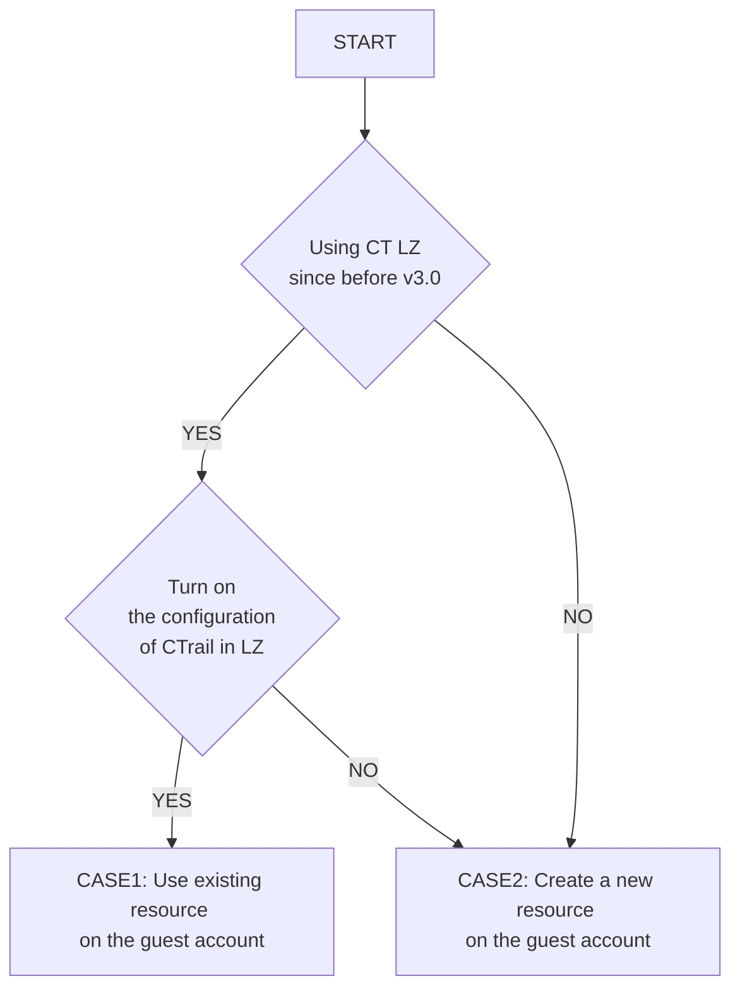

# Notification about the updates of AWS Control Tower landing zone ver3.0

You may need to fix the code of base-ct-guest to deploy it to your environment because of the updates of AWS Control Tower landing zone.

## The impact caused by this update to BLEA

If you turn on the configuration of CloudTrail in AWS Control Tower landing zone ver.3.0, the logs of CloudTrail are gathered to AWS CloudWatch Logs in ManagementAccount.

- Ref：https://docs.aws.amazon.com/controltower/latest/userguide/2022-all.html#version-3.0

In the result, the LogGroup isn't created newrly in GuestAccount and you could not deploy the chatbot notification that was called by GuestAccount's CloudTrail.

## BLEA's updates to fit the landing zone ver.3.0

BLEA thinks that GuestAccount administrators should monitor the logs of GuestAccount's all logs.

So, BLEA will provision the CloudTrail and CloudWatch LogGroup instead of AWS Control Tower landing zone.
NOTICE:
However, depending on the settings of the AWS Control Tower landing zone, existing resources may remain, so it is necessary to partially modify the source code according to your environment.

## How to fix

Follow the flow chart below, you check the case how to fix `blea-base-ct-guest.ts` suitable for your environment.

Abbreviations in the figure are as follows:

- CT: Control Tower
- LZ: Landing Zone
- CTrail: CloudTrail



### CASE1: Use existing resource on the guest account

You continue to use the code of `blea-base-ct-guest.ts` like below.

```
const logGroupName = 'aws-controltower/CloudTrailLogs';
```

### CASE2: Create a new resource on the guest account

You uncomment the import statement on line 6 of `blea-base-ct-guest.ts` and the code on lines 58 and 59, and comment out the code on line 51.
The code on lines 58 and 59 is below.

```
const trail = new BLEATrailStack(app, `${pjPrefix}-Trail`, { env: getProcEnv() });
const logGroupName = trail.cloudTrailLogGroup.logGroupName;
```

## Note

- In the AWS Control Tower landing zone ver.3.0, once the AWS CloudTrail setting is disabled, the previously created AWS CloudTrail and AWS CloudWatch Logs resources will be deleted.
- If you want to re-enable it after disabling, please check the CASE2 and create a new resource.
