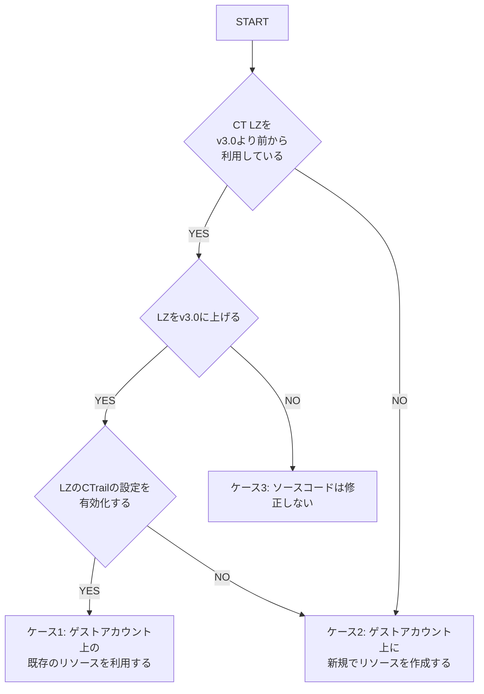

# AWS Control Tower landing zone ver3.0 のアップデートに関する注意事項

AWS Control Tower landing zone のバージョンアップに伴い、base-ct-guest のデプロイ前に、ご自身の環境に合わせ、base-ct-guest のソースコードを修正していただく必要があります。

## アップデートによる BLEA への影響

AWS Control Tower landing zone ver.3.0 より、CloudTrail の設定を有効化した場合の CloudTrail のログは、ManagementAccount の AWS CloudWatch Logs に集約されるようになりました。

- ご参考：https://docs.aws.amazon.com/controltower/latest/userguide/2022-all.html#version-3.0

その結果、これまでゲストアカウント上に存在していた CloudTrail のログが出力されていた CloudWatch Logs の LogGroup が新たに作成されなくなり、base-ct-guest でデプロイされていた AWS CloudTrail のログを監視する通知がデプロイできなくなりました。

## BLEA の対応方針

BLEA では、ゲストアカウントのログ監視は、ゲストアカウントの管理者が実施すべきと考えます。

そのため、これまで AWS Control Tower landing zone が作成していた AWS CloudTrail と AWS CloudWatch Logs のリソースは、BLEA 側で生成するように修正しました。

※ただし、AWS Control Tower landing zone の設定によっては、既存リソースが残る可能性があるため、ご自身の環境に合わせ、ソースコードを一部修正いただく必要があります。

## ソースコードの修正方法

以下のフローチャートに従い、ご自身の環境に適した`blea-base-ct-guest.ts`のソースコードの修正方針を確認してください。

図中の略語は以下の通りです。

- CT: Control Tower
- LZ: Landing Zone
- CTrail: CloudTrail



### ケース 1: ゲストアカウント上の既存のリソースを利用する

`blea-base-ct-guest.ts`の 51 行目にあるコードをそのままご利用ください。
過去の AWS Control Tower landing zone が作成したリソースが存在するため、Baseline の構成を変更する必要がないためです。

```
const logGroupName = 'aws-controltower/CloudTrailLogs';
```

### ケース 2: ゲストアカウント上に新規でリソースを作成する

`blea-base-ct-guest.ts`の 6 行目の import 文と、58, 59 行目にあるコードのコメントを外し、51 行目のコードをコメントアウトしてください。
ゲストアカウント上に AWS CloudTrail と AWS CloudWatch Logs のリソースが存在しないため、`blea-trail-stack.ts`で定義される`BLEATrailStack`によって必要なリソースを作成します。

```
const trail = new BLEATrailStack(app, `${pjPrefix}-Trail`, { env: getProcEnv() });
const logGroupName = trail.cloudTrailLogGroup.logGroupName;
```

### ケース 3: ソースは修正しない

LandingZone のバージョンを上げないのであれば、対応は不要になります。
バージョンを上げる際に、再度本ドキュメントを参照してください。

## 備考

- AWS Control Tower landing zone の ver.3.0 において、一度でも AWS CloudTrail の設定を無効化すると、過去に生成されていた AWS CloudTrail と AWS CloudWatch Logs のリソースは削除されます。
- もし、無効化してしまったあとに、再度有効化したくなった場合には、対応 2 の修正を行い、新規でリソースを作成してください。
