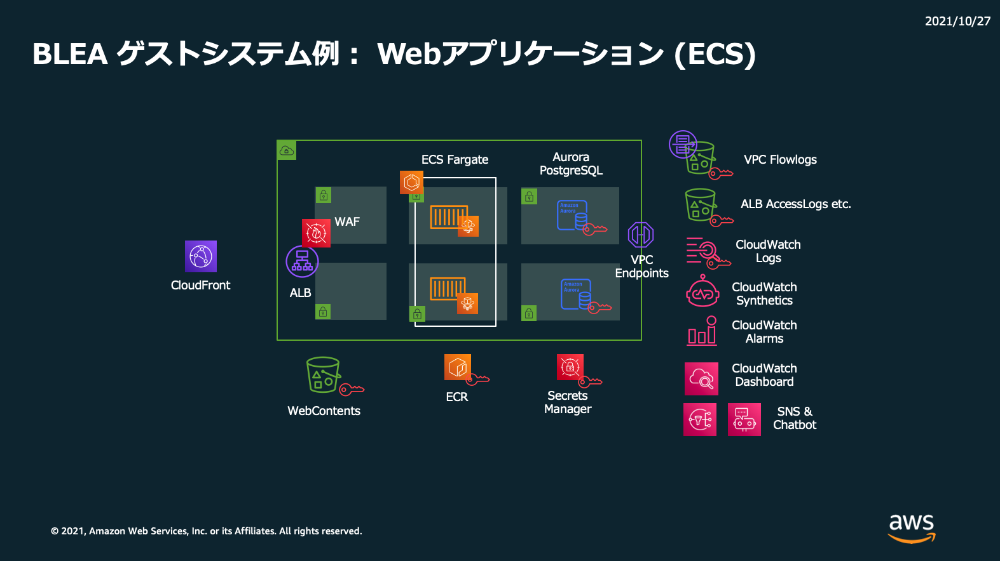
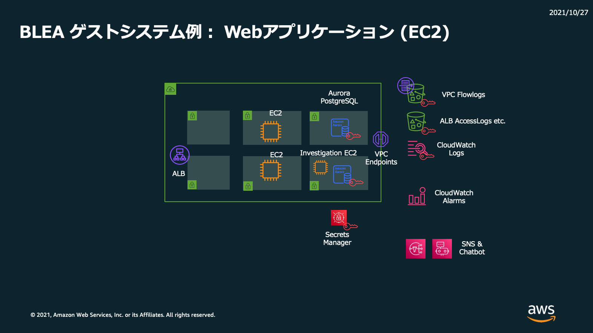

# Sample Web application - Architecture diagram

## Sample Web application (ECS)

- bin/blea-guest-ecsapp-sample.ts
  - ECS/Fargate + AuroraPostgreSQL
- bin/blea-guest-ecsapp-sample-pipeline.ts
  - CI/CD of this system by CDK Pipelines.
  - [How to deploy](../../doc/PipelineDeployment.md)

## Sample Web application (ECS+SSL)

- bin/blea-guest-ecsapp-ssl-sample.ts
  - ECS/Fargate + AuroraPostgreSQL
  - With SSL Certificate for your domain

## Sample Web application (Autoscaling Group)

- bin/blea-guest-asgapp-sample.ts
  - EC2 Autoscaling Group + Aurora PostgreSQL

## Sample Web application (EC2)

- bin/blea-guest-ec2app-sample.ts
  - EC2 + AuroraPostgreSQL
