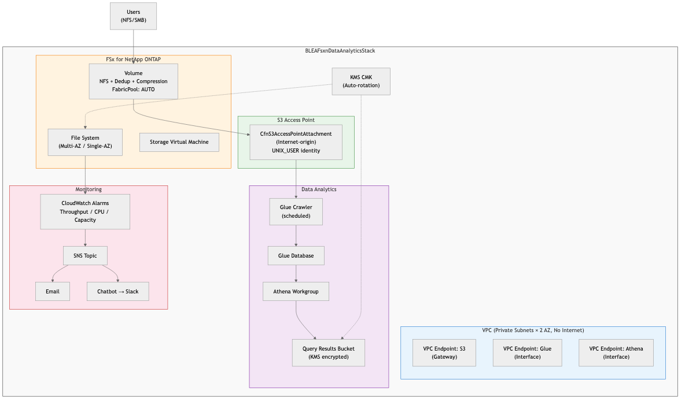

# BLEA Guest System: FSx for NetApp ONTAP Data Analytics Sample

## Overview

This use case provides enterprise file storage with Amazon FSx for NetApp ONTAP integrated with AWS Glue and Amazon Athena via S3 Access Points. It enables SQL-based analysis of file data without data duplication.

## Architecture



```
┌────────────────────────────────────────────────────────────────────┐
│ BLEAFsxnDataAnalyticsStack                                          │
│                                                                     │
│  ┌───────────────────────────────────────────────────────────────┐  │
│  │ VPC (Private Subnets × 2 AZ, No Internet Access)              │  │
│  │  VPC Endpoints: S3 (Gateway), Glue, Athena                    │  │
│  └───────────────────────────────────────────────────────────────┘  │
│                                                                     │
│  ┌─────────────────────┐   ┌──────────────────────────────────┐   │
│  │ FSx for ONTAP        │   │ S3 Access Point                  │   │
│  │  ├── File System     │──►│  (Internet-origin)               │   │
│  │  │   (Multi-AZ)      │   │  UNIX_USER identity              │   │
│  │  ├── SVM             │   └──────────────┬───────────────────┘   │
│  │  └── Volume (NFS)    │                  │                       │
│  │      Dedup + Compress │                  ▼                       │
│  │      FabricPool       │   ┌──────────────────────────────────┐   │
│  └─────────────────────┘   │ Data Analytics                    │   │
│                             │  Glue Crawler → Data Catalog       │   │
│                             │  Athena Workgroup → SQL Queries    │   │
│                             │  Results → S3 Bucket (KMS enc.)   │   │
│                             └──────────────────────────────────┘   │
│                                                                     │
│  ┌───────────────────────────────────────────────────────────────┐  │
│  │ Monitoring                                                     │  │
│  │  CloudWatch Alarms → SNS → Email + Chatbot (Slack)            │  │
│  │  Metrics: Throughput, CPU, Storage Capacity                    │  │
│  └───────────────────────────────────────────────────────────────┘  │
└────────────────────────────────────────────────────────────────────┘
```

### Data Flow

1. Users write files to FSxN via NFS/SMB
2. S3 Access Point exposes volume data as S3 objects
3. Glue Crawler discovers data schema via S3 AP → registers in Data Catalog
4. Athena queries Data Catalog → reads data via S3 AP → outputs results to S3 bucket

## Prerequisites

- AWS CLI v2 installed
- Node.js >= 20.x, npm >= 8.1.0
- AWS CDK CLI (`npm install -g aws-cdk`)
- CDK Bootstrap completed in the target account
- BLEA governance base deployed (standalone or Control Tower)

## Parameter Configuration

Edit `parameter.ts` to set environment-specific values.

| Parameter | Description | Dev Default | Prod Recommended |
|-----------|-------------|-------------|-----------------|
| `envName` | Environment name (used in tags) | Development | Production |
| `vpcCidr` | VPC CIDR block | 10.0.0.0/16 | 10.0.0.0/16 |
| `fsxnStorageCapacityGiB` | FSxN storage capacity (GiB) | 1024 | 2048+ |
| `fsxnThroughputCapacityMBps` | FSxN throughput (MBps) | 128 | 512+ |
| `fsxnDeploymentType` | Deployment type | SINGLE_AZ_1 | MULTI_AZ_1 |
| `s3AccessPointName` | S3 AP name (3-50 chars, lowercase alphanumeric + hyphen) | fsxn-analytics-dev | fsxn-analytics-prod |
| `s3ApFileSystemIdentityUser` | UNIX user for S3 AP access | nobody | analytics-svc |
| `monitoringNotifyEmail` | Alarm notification email | - | Ops team email |
| `monitoringSlackWorkspaceId` | Slack workspace ID | - | Chatbot configured ID |
| `monitoringSlackChannelId` | Slack channel ID | - | Ops notification channel |

### File System Identity

The `s3ApFileSystemIdentityUser` determines which UNIX user's permissions are used when Athena/Glue access files through the S3 AP.

- **Development**: `nobody` (uid=65534) — read access to all files
- **Production**: Use a dedicated service account (e.g., `analytics-svc`) registered in the FSxN SVM's name service with appropriate file permissions

## Deployment

### 1. Install dependencies

```bash
npm ci
```

### 2. CDK Bootstrap (first time only)

```bash
npx cdk bootstrap --profile <your-profile>
```

### 3. Configure parameters

Edit `parameter.ts` with your environment-specific values.

### 4. Deploy

```bash
npx cdk deploy --all --profile <your-profile>
```

### 5. Run Glue Crawler

After deploying and placing data on the FSxN volume, run the Glue Crawler manually:

```bash
aws glue start-crawler --name fsxn-data-crawler --profile <your-profile>
```

### 6. Query with Athena

Open Athena in the AWS Console, select the `fsxn-analytics` workgroup, and execute queries.

## Cleanup

```bash
npx cdk destroy --all --profile <your-profile>
```

> ⚠️ FSxN file system, volumes, and KMS key have `RemovalPolicy.RETAIN` and will persist after stack deletion. Delete manually via AWS Console or CLI if needed.

## Cost Estimate

| Configuration | Monthly Cost (USD) | Breakdown |
|---------------|-------------------|-----------|
| Dev (SINGLE_AZ, 128MBps, 1TiB) | ~$500 | FSxN SSD $200 + throughput $180 + capacity pool $15 + VPC Endpoints $50 + Glue/Athena usage |
| Prod (MULTI_AZ, 512MBps, 2TiB) | ~$1,500 | FSxN SSD $400 + throughput $720 + capacity pool $30 + VPC Endpoints $50 + Glue/Athena usage |

> Estimates are for ap-northeast-1 (Tokyo). Actual costs vary by data volume, query frequency, and FabricPool tiering ratio. See [FSx for ONTAP Pricing](https://aws.amazon.com/fsx/netapp-ontap/pricing/).

## Shared Throughput Considerations

FSx for ONTAP throughput is shared across all protocols (NFS, SMB, S3 Access Point).

- Glue Crawler execution generates S3 AP reads that impact NFS/SMB client throughput
- Default Crawler schedule (`cron(0 2 * * ? *)`) runs at 2:00 AM to minimize impact
- For production, size throughput to accommodate NFS peak usage + analytics workload

## S3 Access Point Limitations

| Feature | Support |
|---------|---------|
| GetObject, PutObject, ListObjectsV2, DeleteObject | ✅ Supported |
| Multipart Upload | ✅ Supported |
| Athena, Glue, Bedrock KB, SageMaker | ✅ Supported (Internet-origin AP) |
| Lambda (in VPC) | ✅ Supported (VPC-origin AP) |
| S3 Event Notifications | ❌ Not supported |
| S3 Select | ❌ Not supported |
| Conditional Writes | ❌ Not supported |
| Apache Iceberg / Delta Lake / Hudi (table writes) | ❌ Not supported (no atomic rename) |

## Security

- VPC has no internet access (no IGW/NAT)
- All data encrypted at rest with KMS CMK (auto-rotation enabled)
- FSxN security group allows VPC-internal traffic only
- IAM roles follow least-privilege, scoped to specific resources
- S3 results bucket has Block Public Access + versioning enabled

## Related Links

- [FSx for ONTAP S3 Access Points (Dec 2025 GA)](https://aws.amazon.com/about-aws/whats-new/2025/12/amazon-fsx-netapp-ontap-s3-access/)
- [AWS::FSx::S3AccessPointAttachment (CloudFormation)](https://docs.aws.amazon.com/AWSCloudFormation/latest/TemplateReference/aws-resource-fsx-s3accesspointattachment.html)
- [Using Access Points with AWS Services](https://docs.aws.amazon.com/fsx/latest/ONTAPGuide/using-access-points-with-aws-services.html)
- [Baseline Environment on AWS (BLEA)](https://github.com/aws-samples/baseline-environment-on-aws)
