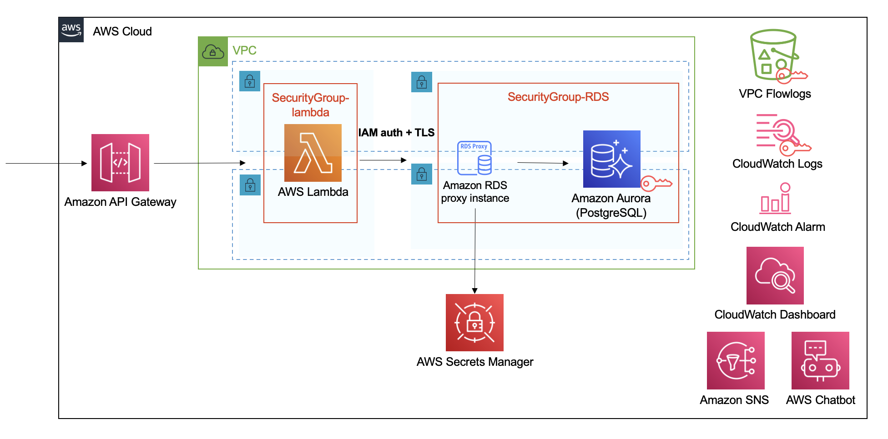

# Guest RDS Proxy Sample application

## Architecture diagram

- bin/blea-guest-rdsproxy-python-sample.ts
  - Lambda + RDS Proxy + Aurora PostgreSQL
  - DB Secrets stored in Secrets Manager
  - Lambda function in Python to confirm that it can connect to RDS instance

## Prerequisite (Python)

- Install Python in the version which is the same as the one configured in Lambda runtime, because you run `pip install xxx` on your local environment when you install the libraries and dependencies to create Lambda layer. (lib/blea-setup-lambda-layer-python.ts)
  - Python's virtual environment tools make this easier such as pyenv, virtualenv, etc.
  - https://github.com/pyenv/pyenv
- Download the Amazon root CA 1 trust store from Amazon Trust Services https://docs.aws.amazon.com/AmazonRDS/latest/UserGuide/rds-proxy.howitworks.html#rds-proxy-security.tls
  - Amazon Root CA 1 certificate is necessary for Lambda's IAM authentication and SSL connection.
  - You need to locate this certificate `.pem` file in the path `lambda/python/layer/python/data/RootCA1.pem`.

## Options for connecting to the RDS Proxy

You have two options for security to connect to RDS Proxy. (https://docs.aws.amazon.com/ja_jp/AmazonRDS/latest/UserGuide/rds-proxy-setup.html#rds-proxy-connecting)

1. **use IAM authentication. This is recommended** because it can remove the need to embed or read credentials in your function code). In this CDK template we use IAM authentication.
2. use your native database credentials stored in Secrets Manager. If you want to implement in this way, you have to create IAM policy that allows Lambda function to access DB credentials in Secrets Manager.

## Next Steps

- DB shema initialization
- Create DB user account that can use an AWS authentication token and can have only necessary permissions (avoid using DB master user)

  - https://aws.amazon.com/premiumsupport/knowledge-center/users-connect-rds-iam/?nc1=h_ls

- Create Lambda functions for DB operation
